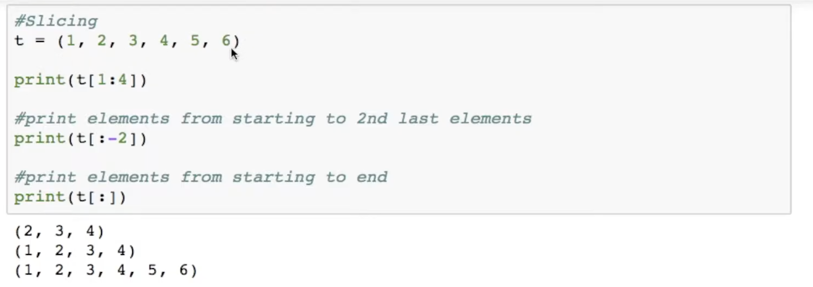

# Tuples

Main functions of a tuple

- `len(tuple)` -> length of a **tuple** 
- `del tuple` -> delete the **tuple** 
- `tuple.count(elt)` -> count the no. of occurrences of **elt** in the **tuple** 
- `tuple.index(elt)` -> find the index of the first occurrence of **elt** 
- `sum(tuple)` , `max(tuple)` , `min(tuple)` -> find the max, sum & min of the tuple 
- `tuple1 + tuple2` -> appending 2 tuples. `.append()` function won't work 
- `sorted(tuple)` -> sorts a **tuple** and returns a **list**. Then change it to tuple by `tuple(list)`

---

