#Sets

Main functionalities of sets

- `set.add(elt)` -> add the **elt** to the **set**
- `set.update([elts])` -> add many elements in the input **list of elts** to the **set**
- `set.discard(elt)` -> removes an **elt** if that element **presents or not** in the set
- `set.rermove(elt)` -> removes the **elt** only if the element presents in the set. If not, **throw error**
- `set.pop()` -> removes a random element from set
- `set.clear()` -> remove all the elements

Set operations

- `s1.union(s2)` or `s1 | s2` -> union of two sets (i.e.) all the elements will be put together
- `s1.intersection(s2)` or `s1 & s2` -> Intersection of two sets (i.e) common elements
- `s1.difference(s2)` or `s1 - s2` -> elements in s1 but not in s2
- `s1.symmetric_difference(s2)` or `s1 ^ s2` -> all elements in s1&s2 but not the common elements
- `s1.issubset(s2)` -> Boolean : true if all elements in s1 present in s2
- `s1.isdisjoint(s2)` -> Boolean : true if no elements in s1 present in s2

`frozenset()` -> no addition/removal of the keys are allowed. All other operations are allowed

---

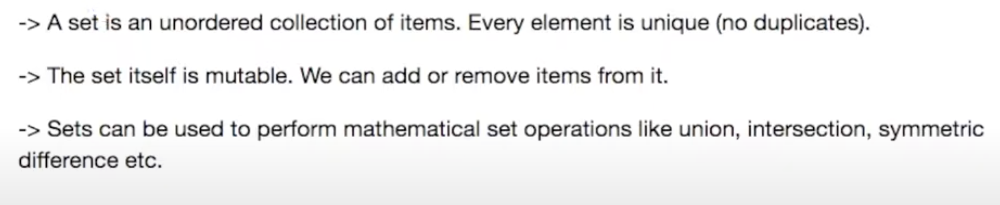
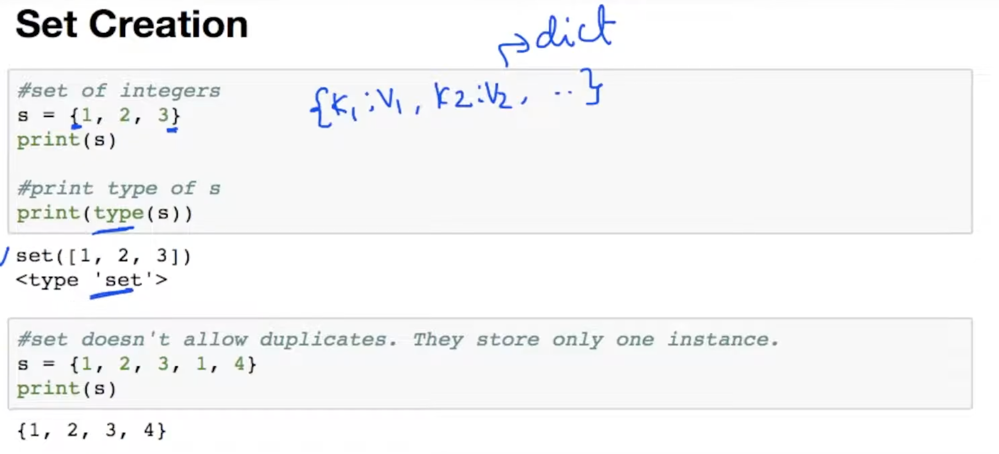
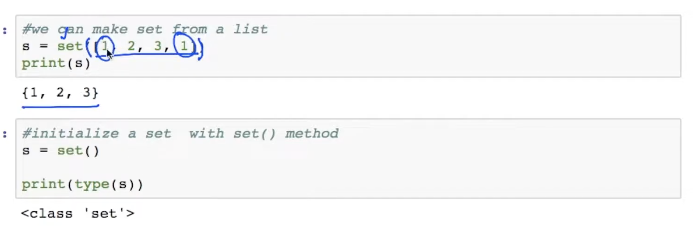
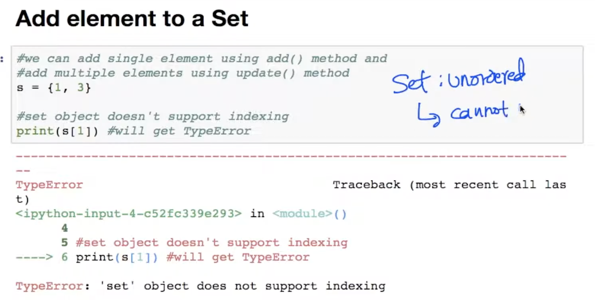
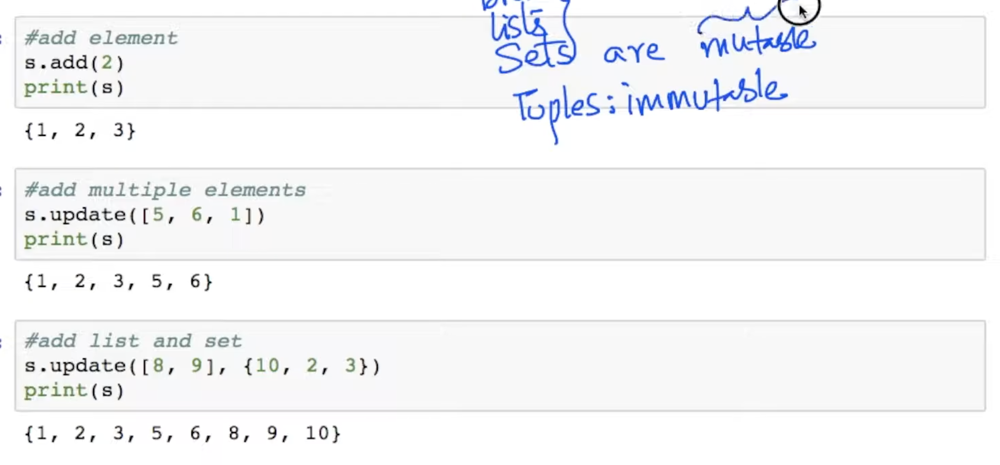
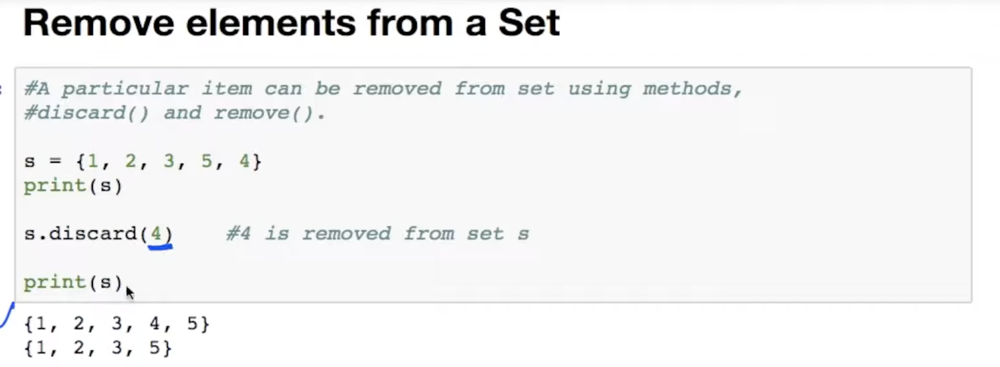
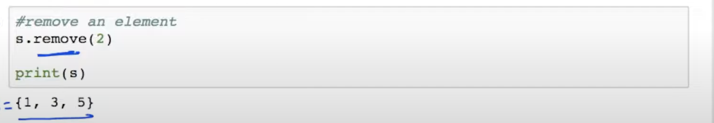
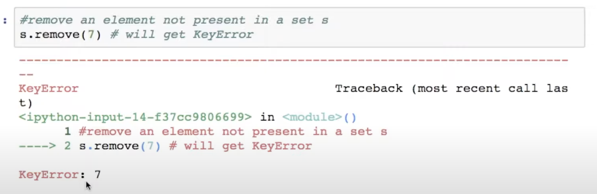
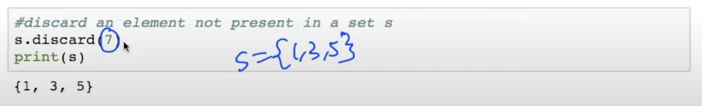
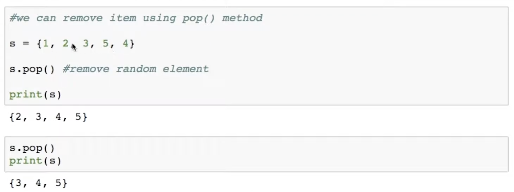
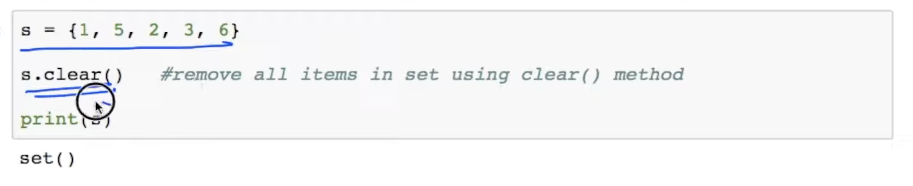
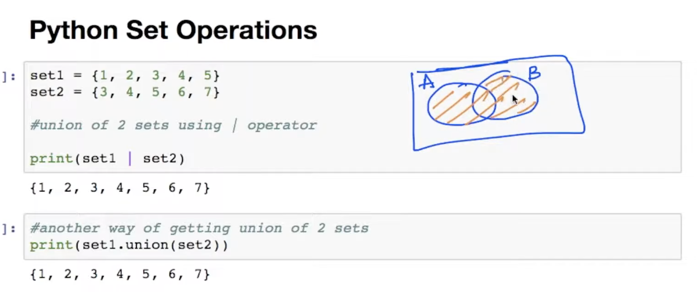
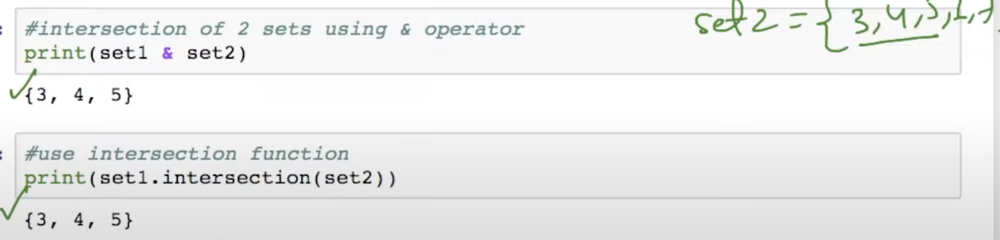
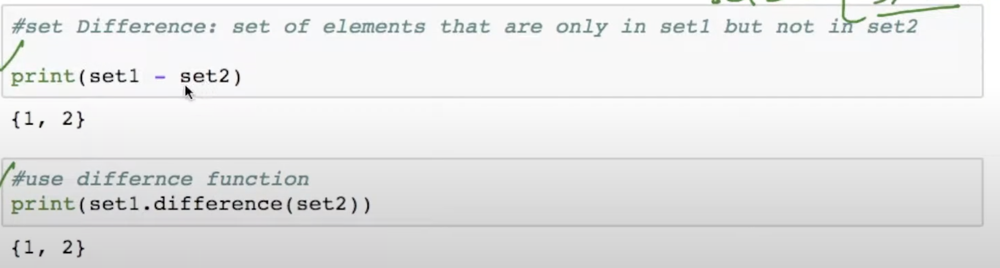
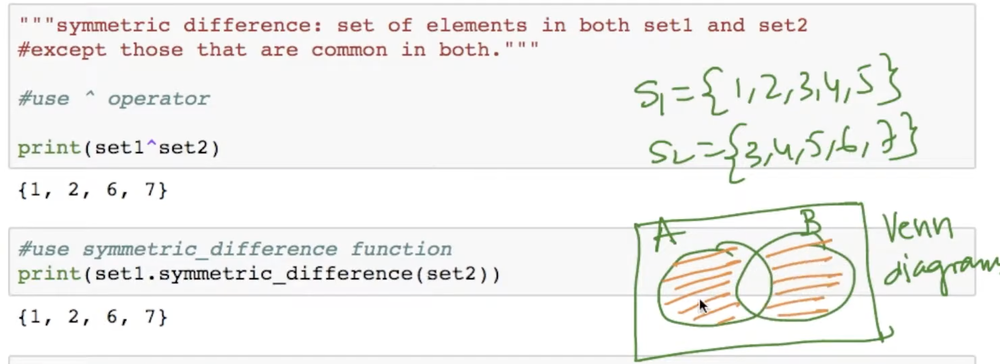
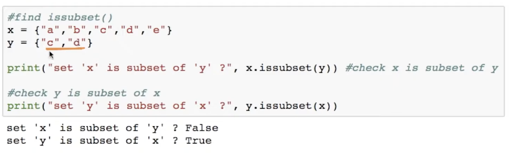
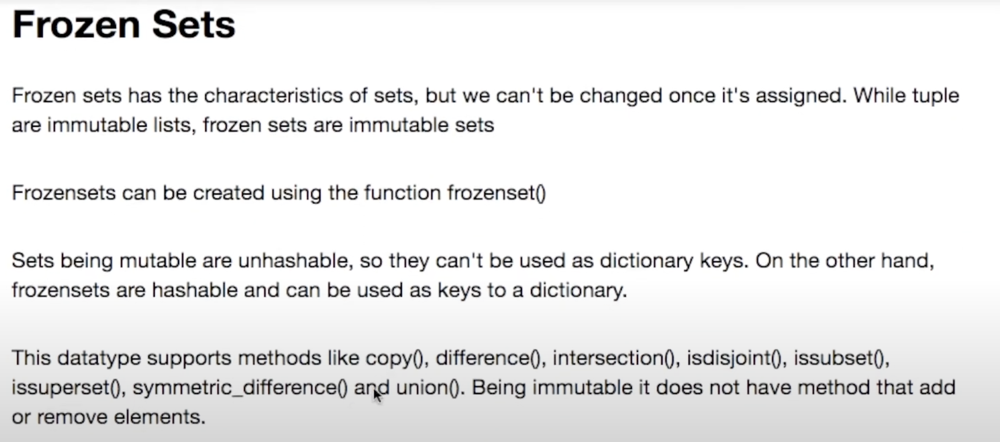
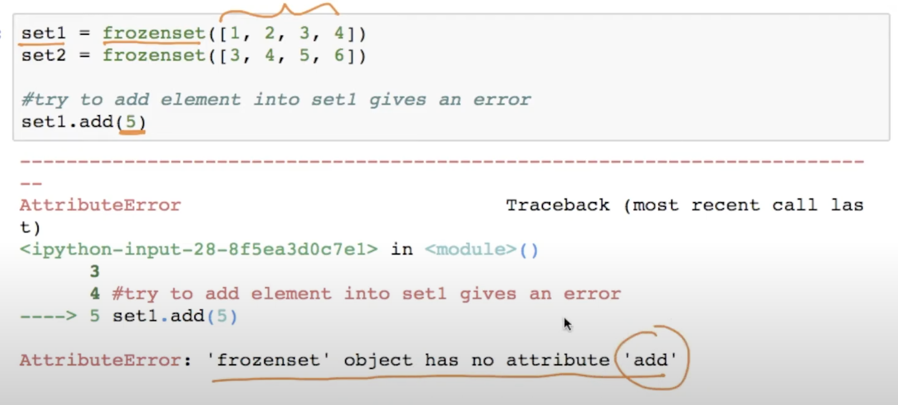
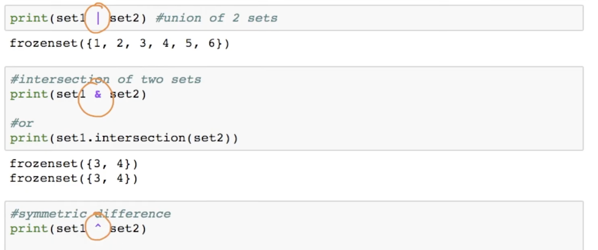
