# Dictionary

Main functionalities of Dictionary

- `d.get(key)` or `d[key]` -> get the **value** in the **key** . If not present, `[]` notation will throw error but `.get()` notation will return `None`
- `d[newkey]=value` or `d[key]=newvalue` -> to update or add new key in the dictionary
- `del d[key]` or `d.pop(key)` -> remove a key
- `d.popitem()` -> randomnly removes a key value pair
- `d.clear()` -> removes all elements in the dictionary
- `d.items()` -> return all pairs of items
- `d.keys()` -> return all keys
- `d.values()` -> return all values

---

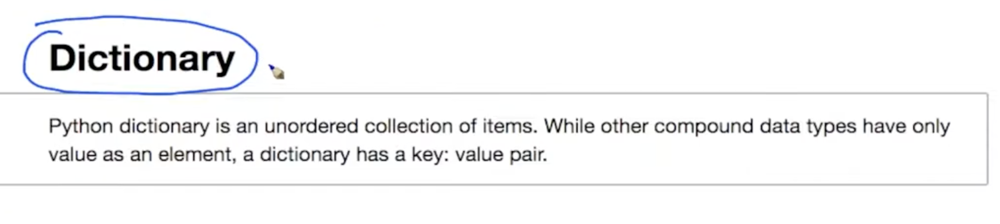
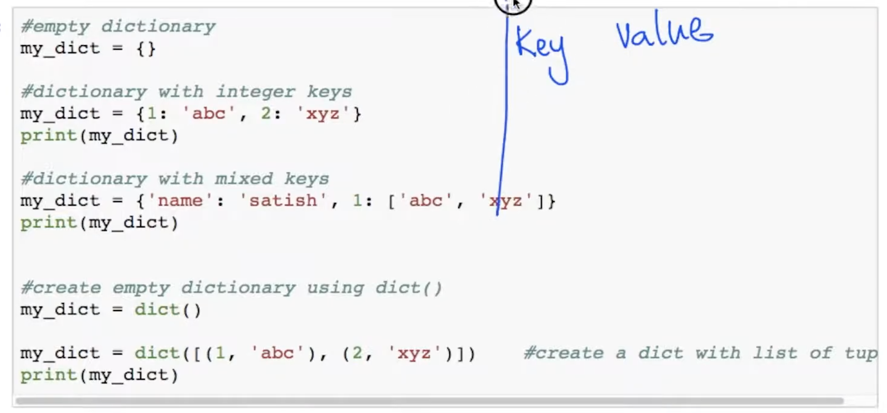
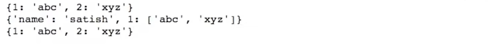
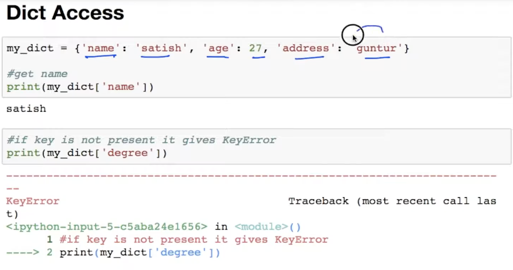
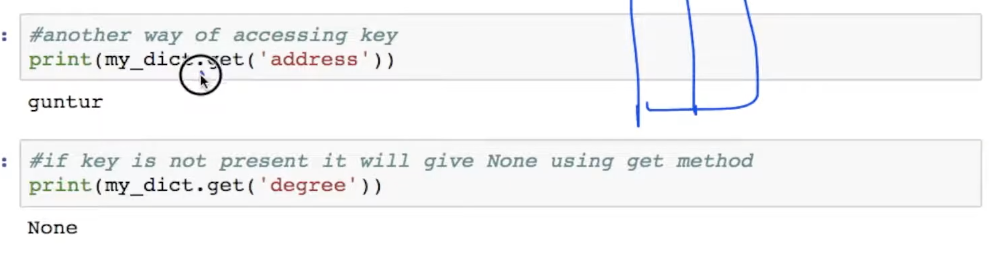
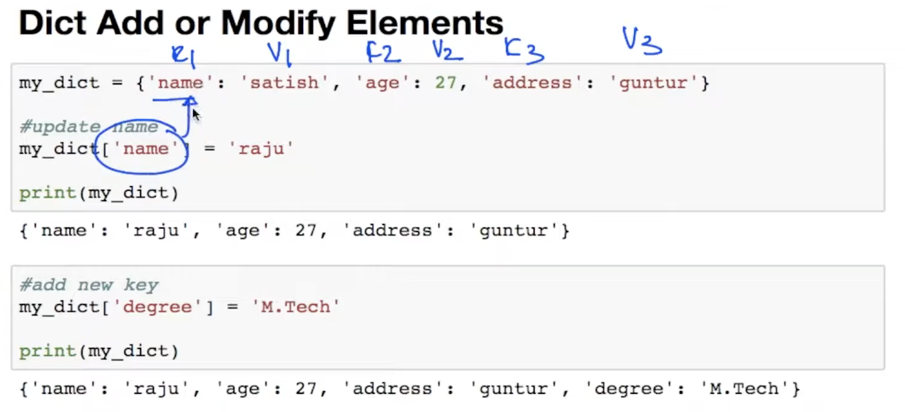
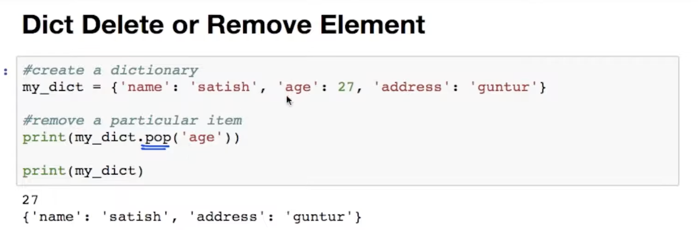
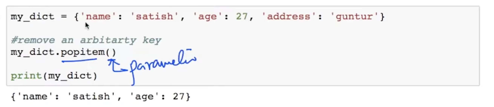
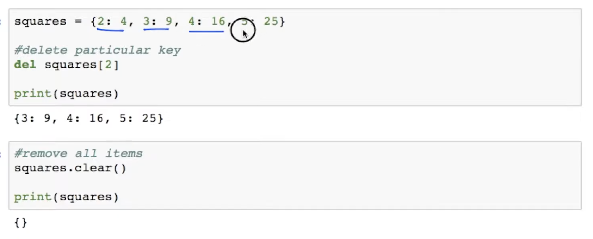
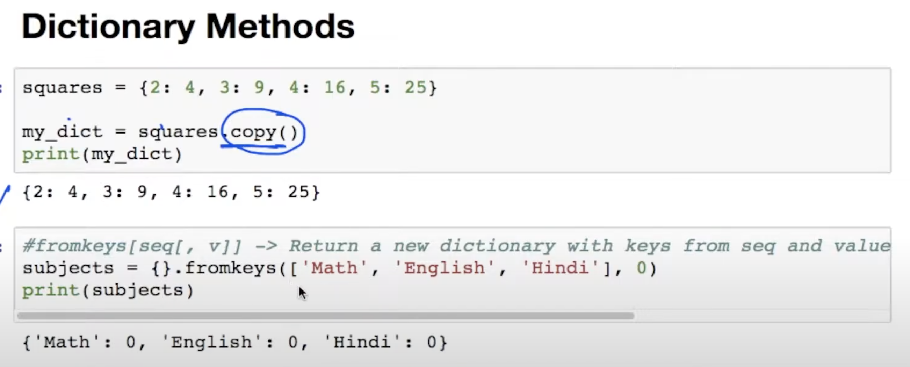
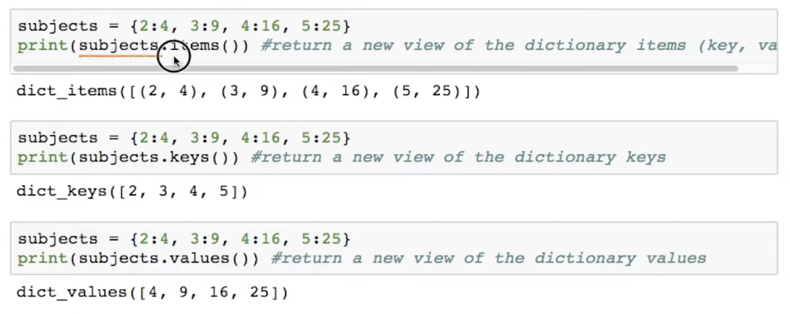
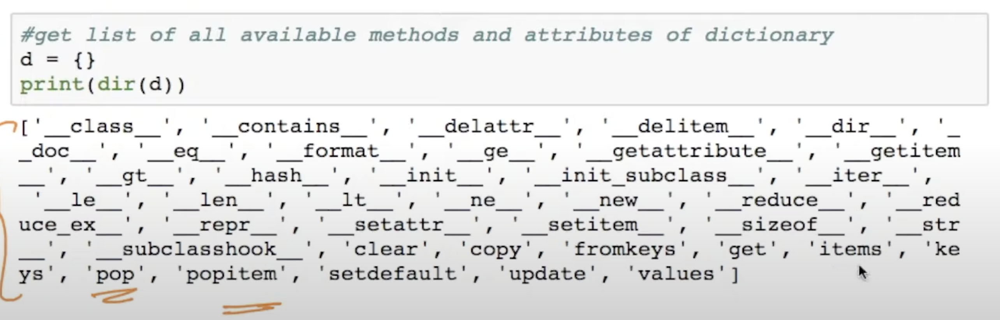
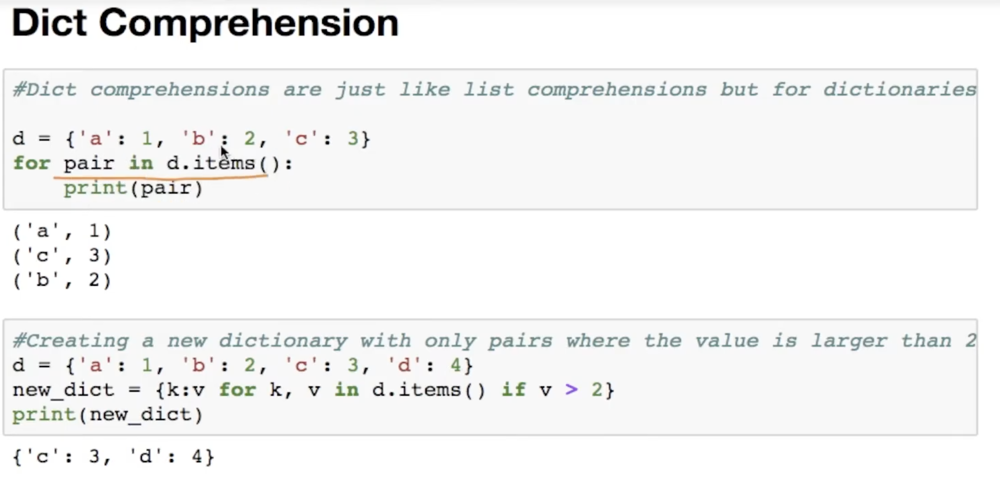
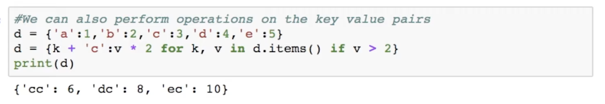
