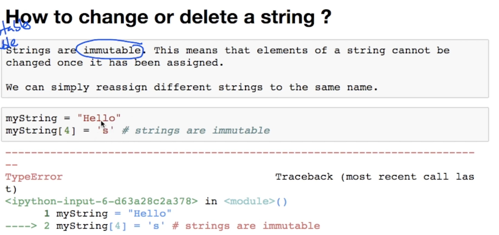

#Strings

Some functionalities for string

- `s1 + s2` -> concatenates two strings
- `s.split(char)` -> splits a word into list of words based on the input **char** . If the argument is empty, it'll be split based on **(space)**
- `"char".join[lst]` -> join the list of strings available in **lst** using the **char**
- `s.upper()` -> transform the word into uppercase
- `s.lower()` -> transform the word into lowercase
- `s.replace(a,b)` -> find the string **a** in the input string **s** and replace it with **b**
- `s.find(str)` -> find the index of the first occurrence of **str** in the word **s**
- `"str" in word` -> Boolean : true if **str** is a substring of **word**
- `for w in word:` -> iterating a word using it's characters

##Functions

