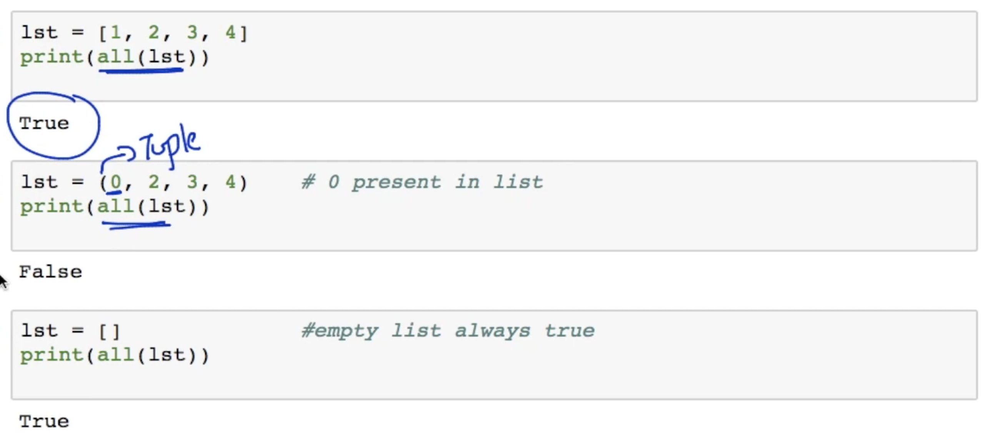
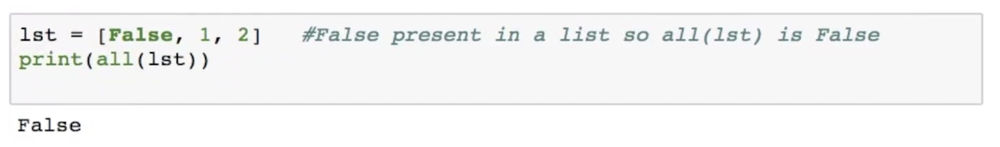
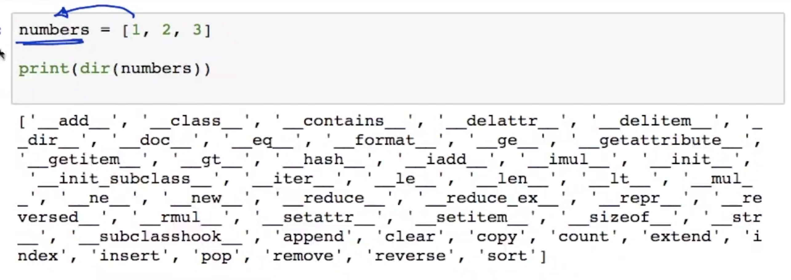
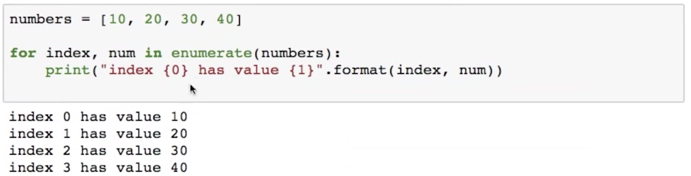
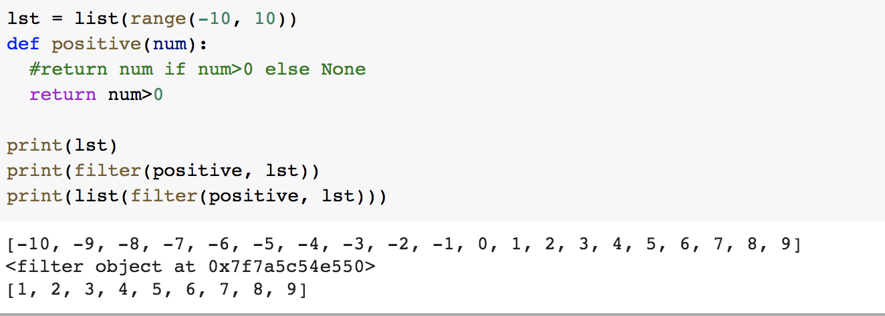
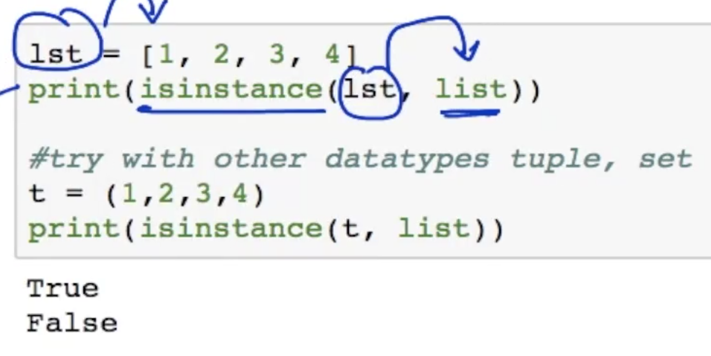
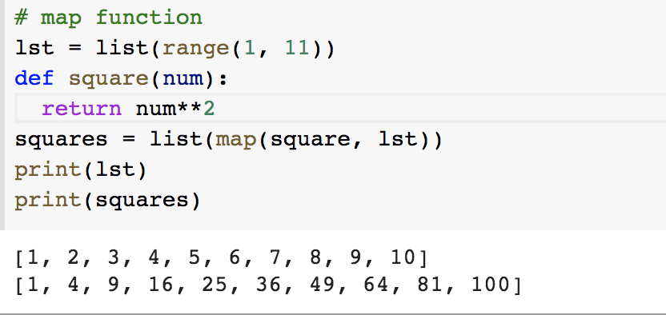
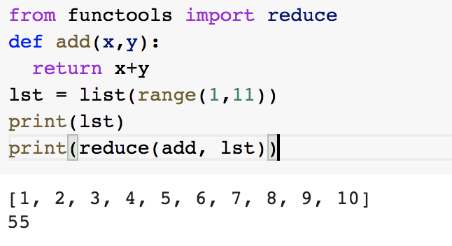

# Functions, Files, Exception Handling

##Function declaration

Original ipynb : [https://drive.google.com/open?id=0BwNkduBnePt2RTR5VTRkYTBaemM](https://drive.google.com/open?id=0BwNkduBnePt2RTR5VTRkYTBaemM)

```
def function_name(arguments):
"""
Doc String
"""

Function statement(s)
Global variables (declared outside) can be accessed inside this function

return {var}
```

Executed as :
```
function_name(1,2)
```

Print the doc of the function
```
print(function_name.__doc__)
```

If no `return` statement, python returns `None` by default;

## Default arguments
```
def fname(arg1, arg2=True):
	"""
	First argument is mandatory. If the second one is not given, then value 'True' will be taken. 
	Have default value arguments at the end of mandatory arguments.
	"""
	
fname("test")
fname("test", False)
fname() # throws error
```

## Keyword arguments
```
def greet(**kwargs):
  if kwargs:
    print("Hello {}, your dob is {}".format(kwargs["name"], kwargs["dob"]))
greet(name="Raghu", dob="24 Apr,1993")

Output:
Hello Raghu, your dob is 24 Apr,1993
	
```

## Arbitrary arguments
```
def greet(*names):
  """
  No of arguments is not known
  """
  for name in names:
    print("Hello {0}".format(name))
greet("Raghu", "Vivek", "Bhavi")

Output:
Hello Raghu
Hello Vivek
Hello Bhavi

```

## Built-in Functions

| Function name | Description |
|---------|---------|
| `abs(num)` | returns the absolute value of a number|
|`all(var)`| returns `True` if all the elements in **var** are iterable. Eg: for **list** of elements, it'll return `True` if they are all non-zero or not-false.  |
| `dir(var)` | returns the list of valid attributes of the object **var**   |
| `divmod(dividend, divisor)` | returns the **quotiend** and **remainder** as tuple. Eg `divmod(9,2)` returns `(4,1)` |
| `enumerate(var, start=0)` | adds index to the iterable and returns it. Note: start is a non-mandatory parameter.  |
| `filter(function,iterable)` |  |
| `isinstance(var, datatype)` |  |
| `map(function, iterable)` |  |
| <code>from functools import reduce<br>reduce(function, iterable)</code> | It applies the rolling computation for the sequential pairs of values in a list.  |


## Lambda function
Anoymous functions with no name

```
sqr = lambda x : x**2
print(sqr(2))
```

```
from functools import reduce
lst = list(range(1, 21))
print(lst)
print("Filtered List (only even numbers) : "+str(list(filter(lambda x : x%2==0, lst))))
print("Squared list : "+str(list(map(lambda x: x**2, lst))))
print("Reduced list (summation) : "+str(reduce(lambda x,y : x+y, lst)))

Output:
[1, 2, 3, 4, 5, 6, 7, 8, 9, 10, 11, 12, 13, 14, 15, 16, 17, 18, 19, 20]
Filtered List (only even numbers) : [2, 4, 6, 8, 10, 12, 14, 16, 18, 20]
Squared list : [1, 4, 9, 16, 25, 36, 49, 64, 81, 100, 121, 144, 169, 196, 225, 256, 289, 324, 361, 400]
Reduced list (summation) : 210
```

## Modules
Modules refers to a file containing python statements and definitions. Eg: aby.py is a file and it's module is `abc`

```
import example 
#imports all the functions and variables from the python file 'example.py'

example.add(1,2) #calls the function in the example.py file
```

```
from example import add
#import only one function/variable from the whole module 'example'

add(1,2)
```

below code snippet behave as above and inaddition all the variables and functions will be imported.

```
from example import *  
add(1,2)
```

## Packages
Grouping modules into packages. Each package(folder) needs to have `_init_.py` file


We can have init file as empty or with some initialization code.

Load the `open` module

```
import Game.Image.open
```


## File I/O
File Opening modes

1. `r` - open in readonly mode
2. `w` - open in write mode. Create new file if the file doesn't exist. If exists, overwrite the file
3. `x` - open only for write mode. If a file exists, it'll throw error
4. `a` - append mode
5. `t` - only for text (default mode)
6. `b` - binary mode (storing lists of data, matrix and so on)
7. `+` - open for updating (reading & updating)

Functionalities available

- `f = open(filename, mode)` - open file in the mentioned mode
- `f = open(filename, encoding='utf-8')` - open with our necessary encoding
- `f.write('String contents')` - write contents to the file
- `f.close()` - close the file (use it with try/catch/finally)
- `f.read()` or `f.read(int)` - reads the content of the file character by character from the current cursor position
- `f.seek(int)` - move the cursor to what location in file
- `f.tell()` - returns the current cursor location
- `f.readline()` - reads the file line by line
- `f.readlines()` - returns the list of lines

`import os` functionalities

- `os.getcwd()` - get current working directory
- `os.chdir(path)` - change the current working directory
- `os.rename(file1, file2)` - rename the **file1** to **file2**
- `os.rmdir(dir)` - remove the **empty directory**
- `os.listdir(dir)` - list the contents of the directory **dir**
- `os.mkdir(dir)` - creates a new directory
- <code>import shutil<br>shutil.rmtree('test1')</code> - removes the **non-empty directory**

```
f = open('example.txt')
f.close()
```

Safer way to close the file

```
try:
	f = open('example.txt', 'w')
	#some code for file operations
	f.write('Line 1\n')
	f.write('Line 2')
finally:
	f.close()
```

Open a file with encoding choice

```
f = open('example.txt', encoding='utf-8')
```

## Exception handling

```
import sys
lst = ['b', 0, 2, -1]
for item in lst:
  try:

    if item < 0:
      raise ValueError("item less than zero")

    val = 1/item
    print('Division of 1/', item, ' is ', val)
  except(TypeError):
    print("Type Error for ", item)
  except ValueError as e:
    print("Value Error with message {", e, '}')
  except:
    print("Exception ", sys.exc_info()[0], ' ', sys.exc_info()[1],' occurred')
  finally:
    print('**** NEXT ITEM ****')
    
Output:
Type Error for  b
**** NEXT ITEM ****
Exception  <class 'ZeroDivisionError'>   division by zero  occurred
**** NEXT ITEM ****
Division of 1/ 2  is  0.5
**** NEXT ITEM ****
Value Error with message { item less than zero }
**** NEXT ITEM ****
```

