# Matplotlib

`import matplotlib.pyplot as plt`

```
plt.plot([2,4,6,4])
plt.xlabel("x")
plt.ylabel("y")
plt.title("PLOT")
plt.show()
```
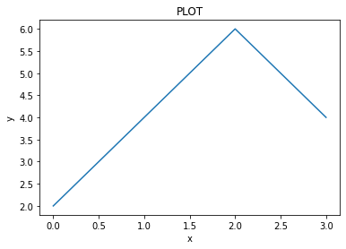

```
plt.plot([1,2,3,4,5,6],[1,4,9,16,25,36], 'ro')
plt.xlabel("number")
plt.ylabel("squares")
plt.grid()
plt.title("PLOT")
plt.show()
```
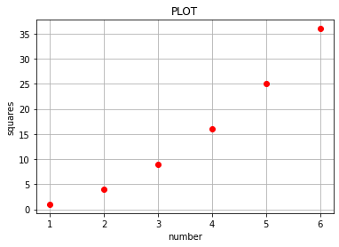

```
import numpy as np

a = np.arange(0,5,0.2)

plt.plot(a, a**2, 'b--' ,label="^2")
plt.plot(a, a**2.2, 'rs' ,label="^2.2")
plt.plot(a, a**2.4, 'g^' ,label="^2.4")
plt.xlabel("x")
plt.legend()
plt.show()
```
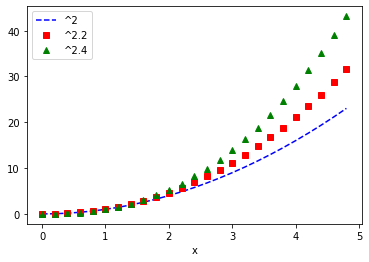

```
x1 = np.array([1, 2, 3, 4])
y1 = x1**2
x2 = np.array([1, 2, 3, 4])
y2 = x2*2

lines = plt.plot(x1, y1, x2, y2)
plt.setp(lines[0], color='r', linewidth=2.0)
plt.setp(lines[1], 'color', 'g', 'linewidth', 1.5)
plt.show()
```
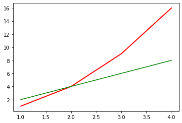

```
def f(t):
  return np.exp(-t) * np.cos(2*np.pi*t)

t1 = np.arange(0, 5, 0.1)
t2 = np.arange(0, 5, 0.02)

plt.figure(1)
plt.subplot(2,1,1)
plt.grid()
plt.plot(t1, f(t1), 'b-')

plt.subplot(2,1,2)
plt.plot(t2, np.cos(2*np.pi*t2), 'r--')

plt.show()
```
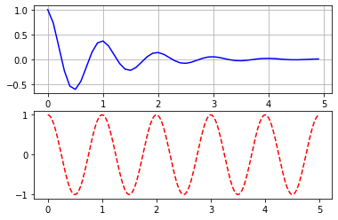

```
plt.figure(1)
plt.subplot(2,1,1)
plt.plot([1,2,3,4])
plt.subplot(2,1,2)
plt.plot([6,7,8,9,9,9,9,10,12])

plt.figure(2)
plt.plot(np.arange(0, 100, 10))

plt.figure(1) #switches to the 1st figure
plt.subplot(2,1,1)
plt.title('title')

plt.show()
```
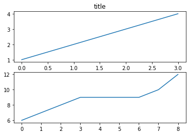

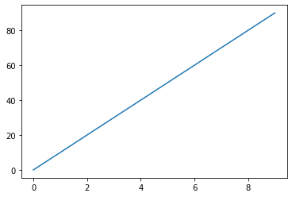

## Using sns (seaborn)

### Histogram (for classification)

```
sns.set_style('whitegrid')
sns.FacetGrid(data=hm, hue='status', height=5)\
	.map(sns.histplot, 'age', bins=30)\
	.add_legend()
```


### Box-Plot & violin Plot with subplots

```
fig, axes = plt.subplots(2,2, figsize=(12,12))
sns.boxplot(data=hm, x='status', y='age', ax=axes[0,0])
sns.boxplot(data=hm, x='status', y='node', ax=axes[0,1])
sns.violinplot(data=hm, x='status', y='age', ax=axes[1,0])
sns.violinplot(data=hm, x='status', y='node', ax=axes[1,1])
plt.legend()
plt.show()
```

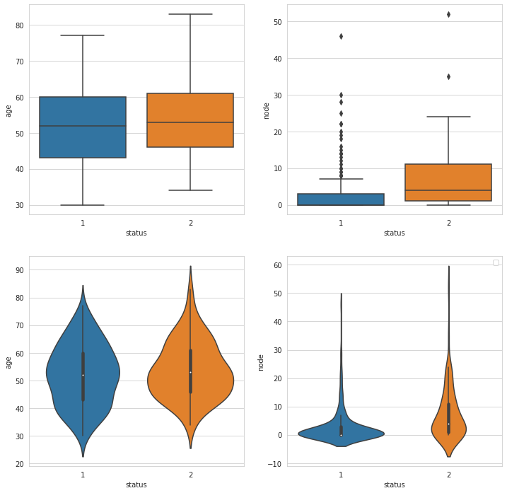

### 2D scatter plot

```
sns.set_style('whitegrid')
sns.FacetGrid(hm, hue='status', height=4)\
    .map(plt.scatter, 'age', 'node')\
    .add_legend()
plt.show()
```


sns.pairplot(data=hm, hue='status', kind='scatter')
plt.show()
```

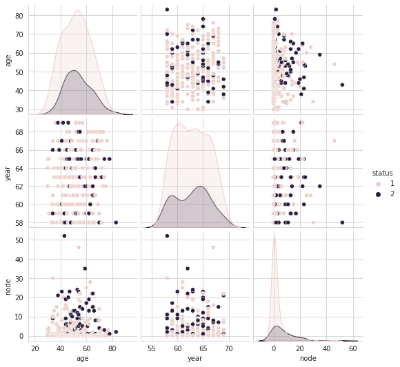

### Joint Plot

```
sns.jointplot(x="age", y="node", data=hm, hue='status', kind="kde");
plt.show();
```

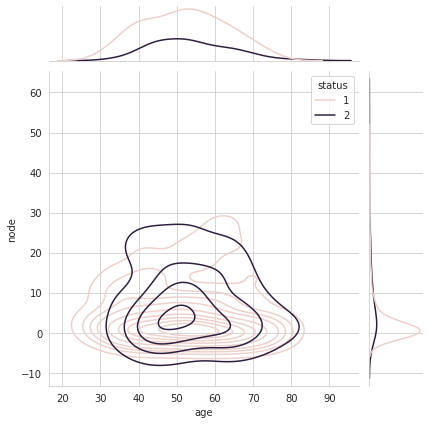

## 3D Plot
```
import plotly.express as px
fig = px.scatter_3d(hm, x='year', y='node', z='age',
              color='status')
fig.show()
```

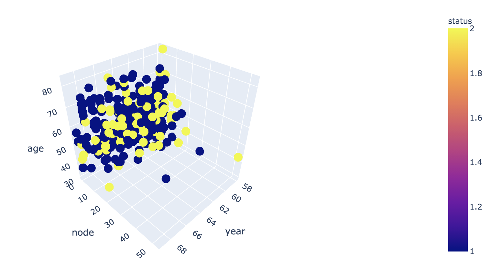