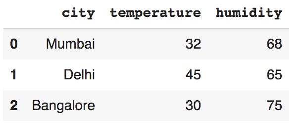
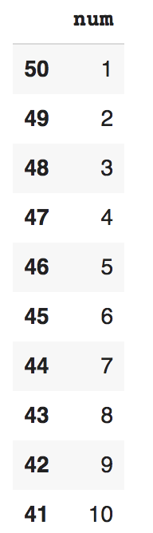

# Pandas

`import pandas as pd`

Reading the csv or xls/xlsx

`pd.read_csv()`   -> returns **DataFrame**
`pd.read_excel("excel file") ` install package `#pip3 install xlrd`

---

Exporting to csv or xls

`df.to_csv('file.csv', index=False)`
`df.to_excel('excel.xlsx')` install package  `#pip3 install openpyxl`
`xldf = pd.read_excel("excel.xlsx")`
`xldf = pd.read_excel("excel.xlsx", index_col=0, sheet_name='Sheet1')`

---

Create DataFrame

- `df = pd.DataFrame(data={array of tuples}, columns=['','',''])`
- `df = pd.DataFrame({"col1":["val1", "val2", "val3"], "col2":[val1,val2,val3], "col3":[val1, val2, val3]})`

---

DataFrame's Attributes & Functions

- `df.shape` - returns the shape in the `tuple`
- `df.columns` - returns the columns array
- `df.index` - returns the index
- `df.head()` or `df.head(5)` -> returns the top rows
- `df.tail()` or `df.tail(5)` -> returns the bottom rows
- `df.info()` - summary of basic information
- `df.describe()` - returns the statistical variables (mean/std/median & so on) of the numerical columnns
- `df['newindex'] = [val1, val2, val3, ...]` - to add a new row with index
- `df.append({col1:val1, col2:val2}, ignoreIndex=True)` - add a new row with just data
- `df.drop('indexname')` - drop a row by index
- `df.iloc[]` - indexing similar to the array indexinng
- `df.loc[]` - indexing done based on the **custom index** passed
- `df.drop_duplicates(subset={"UserId",	"ProfileName", "Time", "Text"}, keep='first', inplace=False)` - check duplicates with that column and drop others
- `g = df.group_by('col1')` - returns the iterable `col1` and it's `df`
- `df['col'].replace(['oldval1', 'oldval2'], ['newval1', 'newval2'])` - replacing values
- `df.sort_values(by=[col1, col2])` - sorting the dataframe
- `g.max()` , `g.mean()` , `g.describe()` - operations on the numerical columns

---

Functions on DataFrame's Column

- `df['col'].mean()` - find the average of that column
- `df['col'].max()` - max value of that column
- `df['col'].isna()` - to get the True/False value for data with `NaN` values

---

Filtering

- `df[df[col1] == df[col1].max()]['col2']` - fetch the `col2` data where `col1` has the max value

---
Operations

- `pd.concat([df1, df2], ignore_index=True)` - concate 2 dataframes
- `pd.concat([df1, df2], ignore_index=True, axis=1)` - concate 2 dataframes horizontally
- `pd.merge(df1, df2, on="col")` - inner join performed on 2 dataframes
- `pd.merge(df1, df2, on="col", how="right/left/outer/inner")` - other join options

---

```
#construct using list of tuples
tuples = [("1/1/2017",32,6,"Rain"),
("1/2/2017",35,7,"Sunny"),
("1/3/2017",28,2,"Snow"),
("1/4/2017",24,7,"Snow"),
("1/5/2017",32,4,"Rain"),
("1/6/2017",31,2,"Sunny")]
df = pd.DataFrame(data=tuples, columns=['day', 'temperature', 'windspeed', 'event'])
df
```


```
df.shape

(6,4)
```

```
df.describe()
```


```
df.columns

Index(['day', 'temperature', 'windspeed', 'event'], dtype='object')
```

```
df.index

RangeIndex(start=0, stop=6, step=1)
```

```
df['temperature'].max()

35
```

```
# Get the data with max temperature
df[df['temperature'] == df['temperature'].max()]


```


```
df[df['temperature'] == df['temperature'].max()]['day'] == '1/2/2017'

True
```

## Groupby
```
group = df.groupby("city")
for g, df in group:
print(g)
print(df)
print("----------------------------------------------------------")
```
```
group.get_group('new york') #prints the particular dataframe
```

```
group.max()
group.mean()
group.describe()
```


## Concatenation
```
india_weather = pd.DataFrame({"city":["Mumbai", "Delhi", "Bangalore"], "temperature":[32,45,30], "humidity":[80, 60,78]})
us_weather_tuples = [("new york", 68, 21), ("chicago", 65, 14), ("orlando", 75, 35)]
us_weather = pd.DataFrame(data=us_weather_tuples, columns=["city", "temperature", "humidity"])
df = pd.concat([india_weather, us_weather], ignore_index=True)
df
```


## Merging
```
temperature_df = pd.DataFrame({"city":["Mumbai", "Delhi", "Bangalore", "Hyderabad"], 'temperature':[32,45,30,40]});
humidity_df = pd.DataFrame({"city":["Mumbai", "Delhi", "Bangalore", "Chennai"], 'humidity':[68,65,75,80]});
df = pd.merge(temperature_df, humidity_df, on="city")
df
```


```
df = pd.merge(temperature_df, humidity_df, on="city", how="outer")
df
```


## Indexing
```
df = pd.DataFrame(data=[1,2,3,4,5,6,7,8,9,10], index=[50,49,48,47,46,45,44,43,42,41], columns=['num'])
df
```


```
df.loc[44] #by our given index

7
```

```
df.iloc[3] #by the row

4
```

```
df.iloc[:3] #row 0, 1, 2 excluding 3
```


```
df.loc[44:42] #from index '44' to '42'
```


```
df.iloc[1:4] #from 1st to excluding 4th row
```

