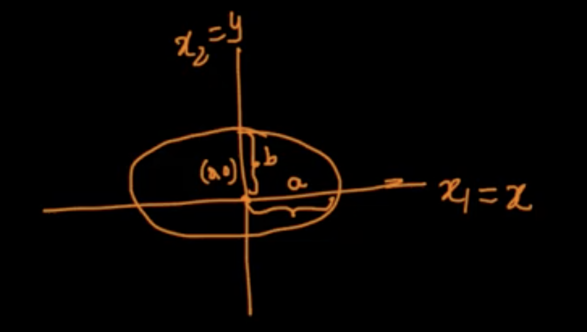

#Linear Algebra

We'll use it to solve specific type of problems in ML. It provides tools to do learnings on n-dimensional vectors (features)

## Point/Vector
Represent a point as vector. If point is `2` in x1 axis and `3` in x2 axis, it is represented as 2D vector `[2, 3]` where 2, 3 are x1, x2 components. 

In 3D, it'll be like `[2, 3, 5]` with x1=2, x2=3, x3=5.

But what about n-dimensional point, it is `[x1, x2, ... xn]` where x1 to xn are components in n-dimensional space.

**A point an n-dimensional space where each component of the n-components in the vector is the perpendicular distance of the point from each axis.**

## Distance of a point from origin
Distance of a point from origin (0,0) is  $\sqrt(x_1^2+x_2^2)$  in 2D.

Distance of a point from origin (0,0,0) is $\sqrt(x_1^2+x_2^2+x_3^2)$ in 3D.

Distance of a point from origin (0,0,....0) is $\sqrt(x_1^2+x_2^2+ .. +x_n^2)$ in nD.

## Distance between points
p = [$a_1$, $a_2$]
q = [$b_1$, $b_2$]
distance in 2D = $\sqrt( (a_1-b_1)^2 + (a_2-b_2)^2)$

Apply the same for n dimensions.
distance in nD = $\sqrt( (a_1-b_1)^2 + (a_2-b_2)^2 + ... + (a_n-b_n)^2)$

## Row & column vector

Row vector :
A = [$a_1$, $a_2$ ... $a_n$] of size (1xn)

Column vector :
B =   [$b_1$, $b_2$ ... $b_n$]
of size (nx1)

**If nothing is told about a vector, it is normally assumed as column vector**

## Mathematical Operation on Row vectors
a = [$a_1$, $a_2$, ... $a_n$]
b = [$b_1$, $b_2$, ... $b_n$]

a+b = [ ($a_1$+$b_1$), ($a_2$+$b_2$), ... ($a_n$+$b_n$) ]

### Dot product
a and b are assumed to be **column vectors**

$a.b$ = ($a_1.b_1$) + ($a_2.b_2$) + .... + ($a_n.b_n$)

$a.b$ = $a.T * b$ = $\sum_{i-1}^n (a_i * b_i)$

Geometrically what does it mean?

$\theta$ is the angle between 2 vectors

if $\theta$ is **90**, then both vectors are perpendicular to each other (ie) **dot product is zero**

$a.a = ||a||$

### Cross product (not used much in ML)

##Projection and Unit Vector

Vector `a`, `b` and angle between is $\theta$. Perpendicular projection of `a` on `b` and we get distance, it is `d`.

It is also call the vector component of $\vec{a}$ along $\vec{b}$.

The definition of **scalar projection** is simply the length of the vector projection.  When the scalar projection is positive it means that the angle between the two vectors is less than 90∘.  When the scalar projection is negative it means that the two vectors are heading in opposite directions. 

Unit vector is a vector in the same direction of the original vector. But it's magnitude is `1`

$\hat{a} = \frac{a}{||a||} $

**Vector projection** of a onto b = **scalar projection** x $\hat{a}$

More details on projection, read [https://flexbooks.ck12.org/cbook/ck-12-precalculus-concepts-2.0/section/7.5/primary/lesson/vector-projection-pcalc](https://flexbooks.ck12.org/cbook/ck-12-precalculus-concepts-2.0/section/7.5/primary/lesson/vector-projection-pcalc)

## Line

Equation of line : `y=mx+c`

Line In 2D : $ax_1 + bx_2 + c = 0$
2D in general : $w_1a_1 + w_2a_2 + w_0 = 0$
3D in general (Plane) : $w_1a_1 + w_2a_2 + w_3a_3 + w_0 = 0$

nD in general (Hyperplane) : $w_1a_1 + w_2a_2 + .... + w_{n}a_{n} + w_0 = 0$

Simpler way ::: $w_0 + \sum_{i=1}^{n} w_ia_i$

In vector notation :
W = [$w_1$, $w_2$ ... $w_n$] ==> (column vector)
X = [$x_1$, $x_2$ ... $x_n$] ==> (column vector)

hyperplane eqn is
$w_0 + W.T*X$

What is $w_0$?

if $w_0$ = 0, then the plane passes through the origin. And vector $\vec{W}$ is perpendicular to $\vec{X}$ at origin

We can shift the x-axis such that $w_0$ is `0`

## Distance of a point from a Plane/Hyperplane, Half-Spaces

We'll draw perpendicular line from point to plane.

Importance of **dot product** is that we will know **in which half space the point lie**, which can be used in classification. Because for a point $\vec{p}$ and plane with $W$ & $X$ such that $W^T.X = 0$, then the distance `d` of $\vec{p}$ on to that place is

  $d = \frac{\vec{W}.\vec{p}}{||\vec{w}||}$ 
  
The +ve or -ve symbol will tell in which half space the point lie.

## Equations

### Circle, sphere, hyper sphere

with center as `(0,0)`, the equation is $x^2 + y^2 = r^2$ where $r$ is the radius of the circle. If the center is `(h,k)`, then the eqn is $(x-h)^2 + (y-k)^2 = r^2$. For simplicity, we'll use the centre `(0,0)`

If a point ($x_1$, $x_2$) lies  
- **inside the circle**, then $x_1^2 + x_2^2 < r^2$  
- **outside the circle**, then $x_1^2 + x_2^2 > r^2$  
- **on the circle**, then $x_1^2 + x_2^2 = r^2$

Same concept can be extended to 3D (sphere) and nD (hyper sphere)

In generic,  
$\sum_{i=1}^n x_i^2 < r^2$ ==> point inside the hypersphere  
$\sum_{i=1}^n x_i^2 > r^2$ ==> point outside the hypersphere  
$\sum_{i=1}^n x_i^2 = r^2$ ==> point on the hypersphere  

### Ellipse, ellipsoid, hyper ellipsoid

Equation is $\frac{x^2}{a^2} + \frac{y^2}{b^2} = 1$ centered at `(0,0)`

If a point ($x_1$, $x_2$) lies  
- **inside the ellipse**, then $\frac{x_1^2}{a^2} + \frac{y_1^2}{b^2} < 1$  
- **outside the ellipse**, then $\frac{x_1^2}{a^2} + \frac{y_1^2}{b^2} > 1$  
- **on the ellipse**, then $\frac{x_1^2}{a^2} + \frac{y_1^2}{b^2} = 1$

Same concept for 3D (ellipsoid) and nD (hyper ellipsoid)

Let's say `a` as $a_1$ and `b` as $a_2$. So in generically, we can write as  
- **inside the hyper ellipse**, then $\sum_{i=1}^{n} \frac{x_i^2}{a_i^2} < 1$  
- **outside the hyper ellipse**, then $\sum_{i=1}^{n} \frac{x_i^2}{a_i^2} > 1$  
- **on the hyper ellipse**, then $\sum_{i=1}^{n} \frac{x_i^2}{a_i^2} = 1$

### Square & Rectangle, Hyper Cube & Hyper Cuboid

We'll see only axis parallel square/rectangle.

For hyper cube and hyper cuboid, extend the same which we followed for 2D.

Eg: if the point is [1,2,3,4] we can compare it with each hyperplane and take decision.