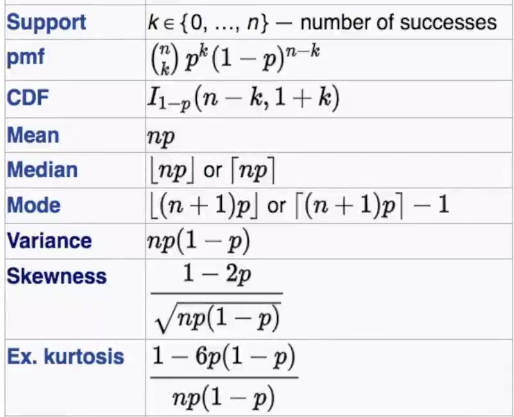

#Probability and Statistics

## Types of statistics

### Descriptive
It describes data in an informative way. Eg : When am I losing sales?

### Inferential
Calculate average salary of data scientists. So collect data first and find the mean of it. But it's hard. Take sample and see trend. Fit the model (gaussian, power law etc) and take decision.

### Predictive
Look at this data. Tell me what will happen when I change a factor. Eg : If I reduce a price on a product, will the sales increase?

### Prescription
How do we get a result?

## Random Variable
X - outcome of a random experiment

**_Example 1_**
Event : rolling of a dice {1,2,3,4,5,6}

P(X=1) = P(1) = 1/6

P(X is even) = P(X=2) + P(X=6) + P(X=6) = 1/2
P(X is odd) = P(1) + P(3) + P(5) = 1/2

It is a **discrete random variable**. We'll have **Probability Mass Function (PMF)**  for it. It is same probability of picking a value in dice.

**_Example 2_**
Event : height of a randomnly picked student
Y = between 120 cm and 190 cm

So, Y could be 132.62 or 162.45 or any real number. Here Y is **continuous random variable**. We'll have **Probability Density Function (PDF)** for this r.v. (random variable)

_Outlier_ outcome can come be due to human error, fault in observation, genuine outlier and so on.

## Population & Sample

_Question :_ Estimate the average height $\mu$ of the human.

We have 7 billion people in the world. But we can't take all of their heights and take average. So we can take a **random sample of size 1000**

$\bar{x} = \frac{\sum_{i=1}^{n}height_i}{n} \ \ with\ n = 1000$

Note : As $n$ increases, $\bar{x}$ equals the population mean $\mu$.

## Distributions for types of rv

Continous RV
1. Normal 
2. Gaussian
3. Power law
4. log normal
5. pareto
6. student's t

Discrete RV
1. Bernoulli
2. Binomial

## Gaussian/Normal Distribution and it's PDF & CDF

_It has 2 parameters :_ $\mu$ (mean) and $\sigma$ (stanndard deviation)

It is a bell-shaped curve. It is PDF (Probability Distribution Function) of a Gaussian distributed random variable.

**X - continuous random variable.**
X - has PDF looked like bell shaped curve. Then it is **Gaussian/Normally distributed**. Lot of things in nature follows this distribution (like height, weight of the people).

Parameters of gaussian distribution : $\mu$ (mean) and $\sigma^2$  (variance)

**Written as $X$ ~ $ N(\mu,\sigma^2) $**

_Why learn about this?_
- Simple models of nature's behaviour. It can summarize so many properties of the random variable. If we know the $\mu$ (mean) and $\sigma^2$  (variance) of a variable following gaussian distribution, then we can think how the curve will look like (without even observing the data points)


### PDF

The **PDF at a given point** gives the **probability density** and not the probability at that point itself. We need to think about the probability that _x is close to a single number_. _If the probability density around a point x is large_, that means the _random variable X is likely to be close to x_. If, on the other hand, ρ(x)=0 in some interval, then X won't be **in that interval**. That is why for a continuous distribution, probability is calculated for a range and not a single discrete value and the probability that X takes a single discrete value is 0.

PDF(X=x) = ρ(x) = $\frac{1}{\sqrt{2\pi}\ \sigma}\ e^{-\frac{(x-\mu)^2}{2\sigma^2}}$

More details on [mathinsight.org probability density function idea](https://mathinsight.org/probability_density_function_idea)

Conclusions:
1. As $x$ moves away from $\mu$, $y$ decreases (i.e.) probability density reduces exponentially
2. Symmetric in both sides of the curve

### CDF


CDF of a random variable tells the probability itself. Consider the blue S-shaped line,
let's say x = 0.4, then CDF is 0.8 (i.e) probability that random value X takes value below 0.4 is 80%. Written as $P(X<=0.4) = 0.8$. However, $P(X=0.4) = 0$


**68-95-99.7 Rule**
If X is a random cont. variable (of student's height) following Gaussion/Normal distribution with $\mu$ as 150 cm of height and $\sigma^2$ as 625 (ie) $\sigma$ is 25, then in the range of 125 to 175 cm, I can find 68% of students with the height range. Also for the range 100 to 200, there are 95% of students.

**To check if a distribution is Gaussian or not,**
Change values to $\frac{x_i-\mu}{\sigma}$. If this is roughly equals to N(0,1), then it is a gaussian distribution.

## Symmetric Distribution, Skewness and Kurtosis

Help us understand the shape of PDF.

**Symmetric Distribution :** like Gaussian Distribution. symmetric on both sides of the mean.

**Skewness :**


_Right / Positive skew :_ long tail on the right side. The right side of the symmetric distribution is being skewed
_Left / Negative skew :_ long tail on the left side. The left side of the symmetric distribution is being skewed

Skewness estimator :


```
def skewness(data):
  mu = data.mean()
  m3 = sum((data - mu)**3)/len(data)
  s3 = (sum((data - mu)**2)/(len(data)-1))**(3/2)
  return m3/s3
```

Why this formula is useful? How (right/left) tailed in which direction.

**Kurtosis :**

Measure of **tailedness** of PDF.

The kurtosis of any _univariate normal distribution is 3_. It is common to compare the kurtosis of a distribution to this value. We can find how different the shape of the distribution from the Gaussian distribution Distributions with kurtosis **less than 3 are said to be platykurtic**, although this does not imply the distribution is "flat-topped" as is sometimes stated. Rather, it means the distribution produces **fewer and less extreme outliers than does the normal distribution**. An example of a platykurtic distribution is the uniform distribution, which does not produce outliers. Distributions with **kurtosis greater than 3 are said to be leptokurtic**. An example of a leptokurtic distribution is the _Laplace distribution_, which has tails that asymptotically approach zero more slowly than a Gaussian, and therefore produces **more outliers than the normal distribution**. It is also common practice to use an adjusted version of Pearson's kurtosis, ***the excess kurtosis, which is the kurtosis minus 3***, to provide the comparison to the standard normal distribution.


```
Excess Kurtosis = Kurtosis-3
```


N=0 (which is Excess Kurtosis value. This refers to normal distribution)

So it tells me the **problem of outliers** in the data.


## Standard normal variate (Z) and Standardization

Z ~ N(0,1) with mean 0 and variance 1

Suppose, we have X ~ N($\mu$, $\sigma^2$), we can convert it to the standard normal variate using the below formula
$X' = \frac{X-\mu}{\sigma}$

Now, $X'$ will have mean `0` and variance `1`. This process is called **standardization** of the data. This can be interpreted by ***68, 95, 99 percent rule***.


## Kernel Density Estimation
We know that from histogram bars, we can find the PDF using smoothing. It'll be done by **kernel density estimate (kde)**. At each data point, a kernel is built. A kernel is a gaussian distribution withe that _data point as mean_ and _bandwidth as variance_. The bandwidth will be chosen optimally by the `sns` library till we get a decent smooth PDF. Then at each point of the plot, we add the kernel's value and use the final value as curve's value.


## Sampling Distribution & Central Limit Theorem (CLT)


As $n$ reaches infinity, mean of sample distribution of sample means will be same as $\mu$. But in real life, it'll happen as soon as n >= 30.

$\bar{x}$ ~ $N(\mu,\ \frac{\sigma}{\sqrt{n}})$

**_IMPORTANCE_**:
The Central Limit Theorem is important for statistics because it allows us to safely assume that the sampling distribution of the mean will be normal in most cases. This means that we can take advantage of statistical techniques that assume a normal distribution, to take _confidence intervals_, _t-test_, _ANOVA_.

Refer [https://statisticsbyjim.com/basics/central-limit-theorem/](https://statisticsbyjim.com/basics/central-limit-theorem/) and [https://www.youtube.com/watch?v=YAlJCEDH2uY](https://www.youtube.com/watch?v=YAlJCEDH2uY)

## Student's t-distribution
In probability and statistics, Student's t-distribution (or simply the t-distribution) is any member of a family of continuous probability distributions that arise when estimating the **mean** of a normally-distributed population in situations where the **sample size is small** and the **population's standard deviation is unknown**. Mainly to find the **CI**

Parameter : $v$ - degrees of freedom.


Let's say we have a sample with size n=11, sample mean 10, and sample variance 2 ($S_n$). For 90% confidence with 10 degrees of freedom, the one-sided t-value from the table is 1.372. Then with confidence interval calculated from

[$\bar{X} - t_{\alpha v}\frac{S_n}{\sqrt{n}}$, $\bar{X} + t_{\alpha v}\frac{S_n}{\sqrt{n}}$]

we determine that with 90% confidence we have a true mean lying below $10.585$
And with 90% confidence we have a true mean lying above $9.414$

So that at 80% confidence (calculated from 100% − 2 × (1 − 90%) = **80%**), we have a true mean lying within the interval $(9.414, 10.585)$


## Q-Q Plot

Quantile-Quantile Plot (Graphical)

X : [$x_1$, $x_2$, $x_3$ ... $x_{500}$]

Is `X` gaussian distributed?
- We can use QQ-Plot (we can also use this to find if 2 distributions are similar)
- We can use statistical techniques (KS, AD)

QQPlot
1. Sort X and compute percentiles. It'll be stored in [$x^{(1)}$, $x^{(2)}$, .. $x^{(100)}$]
2. Y ~ N(0,1) . Compute 1000 items and save [$y_1$, $y_2$, $y_3$, ... $y_{1000}$]. Sort them and compute percentile. Store them as [$y^{(1)}$, $y^{(2)}$, .. $y^{(100)}$]
3. Plot Q-Q using those 2 corresponding 100 points, with Y points in x-axis (label is '**Theoretical Quantiles**') and X point in y-axis (label is '**Ordered Values**'). Sample co-ordinate will look like ($y^{(3)}$, $x^{(3)}$)
4. If the points ($y^{(i)}$, $x^{(i)}$) (for all **i**'s) form a straight line, then both are in similar distribution


It won't work or we can't interpret for smaller $X$.

## How to use these distributions?

All (probability & distributions) are used for EDA (anwering questions about data).

***Question : Company XYZ has to order t-shirts (of size S,M,L,XL) for all of it 100k employees. How many XL t-shirts to order?***

We don't want to order too few or too many. Asking all the employees will cost too much. We have a domain knowledge where height>180, people tend to wear XL t-shirts. And between 160 & 180, people tend to wear L t-shirts.

We'll collect heights of 500 random employees. Estimate mean and std of the sample.

Say if a doctor says that the heights will usually be normally distributed and we know mean and std, we can use the pdf and cdf. Then we'll know how many XL t-shirts to order.

##Chebyshev’s inequality

For people's salary, if I know mean $\mu$ of 40k & std $\sigma$ of 10k, but I don't know the distribution, what % of individuals have a salary in the range of 20k and 60k dollars?

If the distribution is gaussian, we can answer easily. But here we can use **Chebyshev's inequality**


So, P(20k < x < 60k) > ($1-\frac{1}{k^2}$ = $1-\frac{1}{4}$ = $0.75$)

Greater than 75% of people lie in 20k to 60k range, but not sure, it depends on what kind of distribution of the people's salary.

## Discrete and Continuous Uniform distributions

### Discrete uniform distributions
Throwing a dice is example for Discrete random variable.
Probability of getting a value in a fair dice is (1/6).

_It has 2 Parameters :_ `a` - min value, `b` - max value
`n` -> `b-a+1`


### Continous uniform distributions
_It has 2 Parameters :_ `a` - min value, `b` - max value


## Bernoulli Distribution

Coin Toss. P(Head)=1/2 P(Tail)=1/2
Distribution with only k=2 possibilities with one probability `p` and another one with `q = 1-p`. So $p+q\ =\ 1$

_It has 1 Parameter :_ `p`

Suppose we have biased coin, p=0.9. So q = 0.1 ==> $0<p<1$

So, $k\ \epsilon\ \{0,1\} $


## Binomial Distribution

Fair coin toss : X ~ Bernoulli(p=0.5)

Suppose we toss the coin 10 times (n)

Then **Y** = number of times I get a head when I toss my fair coin 'n' times.
`Y ~ Binomial(n,p)`

_It has 2 Parameters:_ `n`, `p` $\epsilon$ [0,1]



## Log Normal Distribution

X ~ ln($\mu$, $\sigma$)

ln -> natural logarithm (log to the base $e$)

if log(X) is normally distributed.


We find lot of log normal distribution in human behaviour and economics. So we can convert the data to Gaussian distribution by taking logs and then apply the concepts we know for the gaussian distribution.

Is given distribution a log-normal?
1. Take $ln$ (i.e) $log_e{x_i}$
2. Check the new distributing using QQ Plot

## Power Law Distribution & Pareto Distribution


It is a Power Law distribution. Originally applied to describing the distribution of wealth in a society, fitting the trend that a large portion of wealth is held by a small fraction of the population.

Find alpha using
$\alpha$ = 1 + $\frac{n}{\sum_{i=1}^n (ln(x_i)/(x_{min} - 1/2)) }$

Ref : [https://math.stackexchange.com/questions/410894/power-law-probability-distribution-from-observations](https://math.stackexchange.com/questions/410894/power-law-probability-distribution-from-observations)

### Pareto distribution (represented as Pr)


Parameters : $x_m$ - scale and $\alpha$ - shape


As $\alpha$ decreases, the tail length increases.

We can use log-log plot to find if a distribution is power law or not. Take log in both X and Y axis and plot the points.

For 80:20 (4:1) rule, $\alpha = \frac{log(4+1)}{log(4)}$

Ref : [https://stats.stackexchange.com/questions/88394/how-to-derive-the-alpha-for-the-pareto-rule](https://stats.stackexchange.com/questions/88394/how-to-derive-the-alpha-for-the-pareto-rule) , [https://en.wikipedia.org/wiki/Pareto_index](https://en.wikipedia.org/wiki/Pareto_index)

## Power Transform (Box-Cox Transform)

If $X$ ~ $ln(\mu,\sigma)$, then we can take $ln$ to make it $Y$ ~ $N(\mu^{'}, \sigma^{'})$

If $X$ ~ $Pr(x_m, \alpha)$, then we can apply **box-cox transform** to convert it to Gaussian distribution $Y$ .

Steps :
1. call `box_cox(X)` functions, it returns $\lambda$
2. Generate $y_i$ = $\frac{x_i^{\lambda}-1}{\lambda}$ if $\lambda$ != 0, otherwise $ln(x_i)$


Box-cox transform is not guaranteed to work on all Pareto or power-law distributed data. It works only on some of them and we need to perform the box-cox transform and observe the QQ-plot to be certain of it working well on our data.

## Application of non-Gaussian distributions

They include Normal, power law, binomial, bernoulli, log-normal distributions.

Weibull distribution : 
Probability of rainfall with > 20 cms. Based on this, dam's height can be determined for better construction.

Say that only once it occurred in 200 data points. We can't ignore it as it has 0.5%. So statistian build theoretical model with few data points. After trying many distributions, weibull fits well. Now we can get many properties of this distribution and take decisions.

## Check type of distribution

```
def do_kstest(data, tp, s_or_d):
  """
  Do the ks test and compare by the p-value
  """
  distributions = ["norm", "uniform", "lognorm", "pareto", "powerlaw", "t"]
  p_val = []
  print("Various distributions for {} people with attribute {}".format(s_or_d, tp))
  for distname in distributions:
    dist = getattr(stats, distname)
    cparam = dist.fit(data)
    D, pval = stats.kstest(data, distname, args=cparam)
    p_val.append(pval)
    print("Result for {} distribution with D:{} and p-value:{}".format(distname, D, pval))

  maxp = np.max(p_val)
  if(maxp*100 > 1):
    dist_max = distributions[np.argmax(p_val)]
    print("\ndistribution \"{}\" has max probability with p-val:{}\n".format(dist_max, maxp))
  else:
    print("\nNo distribution matches\n")

```

```
Various distributions for survived people with attribute age
Result for norm distribution with D:0.06076349805176273 and p-value:0.36472928333432364
Result for uniform distribution with D:0.13531914893617025 and p-value:0.000469777188595703
Result for lognorm distribution with D:0.05869191547850938 and p-value:0.40828477762857013
Result for pareto distribution with D:0.27367743658243215 and p-value:2.204918993854509e-15
Result for powerlaw distribution with D:0.1392923528083332 and p-value:0.0002856855788064733
Result for t distribution with D:0.0607640890896291 and p-value:0.3647173427726764

distribution "lognorm" has max probability with p-val:0.40828477762857013
```

## Measure relations between random variables

Let X - heights, Y - weights of corresponding students in a class

Is there a relationship between X and Y ?
1. Covariance
2. Pearson correlation coefficient
3. Spearmen rank correlation coefficient

### Covariance (for linear relation)
cov(X,Y) = $\frac{1}{n-1}$ $\sum_{i=1}^n (x_i-\mu_x)*(y_i-\mu_y)$
cov(X,X) = $\frac{1}{n-1}$ $\sum_{i=1}^n (x_i-\mu_x)*(x_i-\mu_x)$ = variance(X)

cov(X,Y) = +ve if X increases, Y increases
cov(X,Y) = -ve if X increases, Y decreases

If we changes from 'cm' to 'ft', the covariance will change and it is not a desired one. 

### Pearson correlation coefficient (pcc) (for linear relation)

Denoted by $\rho$ for the population.

$\rho$ = $\frac{cov(X,Y)}{\sigma_x * \sigma_y}$ (-1 <= $\rho$ <= 1)

if $\rho$=0, then it is not at all related.

For a sample, it is calculated as 
$r_{x,y} = \frac{\sum_{i=1}^n (x_i-\bar{x})(y_i-\bar{y})}{\sqrt{\sum_{i=1}^n (x_i-\bar{x})^2}\ \sqrt{\sum_{i=1}^n (y_i-\bar{y})^2} }$

### Spearman's rank correlation coefficient (for non-linear relation)

If X increases, Y increases but not linearly (but like $x^2$). Create rank of x and y, smallest one will be rank of 1.

r = $\rho(r_x, r_y)$

r = 1 => X increases, Y increases
r = -1 => X increases, Y decreases

It returns good value, when we have some outliers. It is much robust

```
def cov(X, Y):
  mu_x = np.mean(X)
  mu_y = np.mean(Y)
  return sum((X-mu_x)*(Y-mu_y))/(len(X)-1)

print("Comparison of age and node for survived people : ")
a = hm_survived['age'] 
b = hm_survived['node'] 
print("Covariance value : ", cov(a, b))
print("Pearsonn Correlation coeff : ", stats.pearsonr(a,b))
print("Spearman rank correlation : ", stats.spearmanr(a,b))

print("\nComparison of age and node for died people : ")
a = hm_died['age'] 
b = hm_died['node'] 
print("Covariance value : ", cov(a, b))
print("Pearsonn Correlation coeff : ", stats.pearsonr(a,b))
print("Spearman rank correlation : ", stats.spearmanr(a,b))
```

## Correlation vs causation

correlation doesn't imply causation. 
Eg : 
X - Per person chocolate consumption in a country
Y - No of nobel laureatues in a country

Let's say X & Y are linearly correlated. It doesn't mean they are related.

## Application of a correlation

1. Is salary related to sqft of the home? 
2. Is no of years of education related to the salary?

## Confidence Intervals

X = {$x_1, x_2, ... x_{10} $} random sample of heights of n=10 students. We **don't know the distribution** type of the population.
Estimate the population mean ($\mu$).

As n increases, $\mu$ will be same as $\bar{x}$. 

Let's say X = {180, 162, 58, 172, 168, 150, 171, 183, 165, 176}

**Point estimate :** $\mu$ = $\bar{x}$ = 168.5 cm. Here we are saying that we think the populationn mean is 168.5 cm. 

(Or) We can say that we think the population mean $\mu\ \epsilon\ [162.1, 174.9]$ with **95% probability**. This is the **confidence interval**.

## Computing CI given the underlying distribution

Let heights : X ~ N($\mu=168 cm,\ \sigma=5 cm$)

Question : What is CI of heights?
[158, 188] with confidence C=95% probability (in 2sigma range)
\> 188 cm with 2.5% probability

Question : Heights with C=90%?
Use logarithmic table to know left and right range.

##C.I for mean of a random variable

Let there be **any distribution (F)** for random variable X with population mean $\mu$ and $\sigma$

Sample with size, n = 10 ==> {$x_1, x_2, .. x_{10}$}
$S$ = {182, 160, 158, 172, 168, 150, 171, 183, 165, 176} => $\bar{x}\ =\ 168.5 cm$

What is the 95% CI of $\mu$ of X?

**_Case 1 :_** when we know $\sigma\ =\ 5cm$. We can use **central limit theorem**. which says that 

$\bar{x}$ ~ $N(\mu,\ \frac{\sigma}{\sqrt{n}})$

new std = $\frac{\sigma}{\sqrt{n}}$ = 1.5811.

In 2$\sigma$ range, [165.34, 171.66] people's height will be there with 95% probability.

**_Case 2 :_** when we don't know $\sigma$. We can use **t-distribution**. 

`X ~ t(n-1)` n - degrees of freedom

Let 
Population size, n = 1000
$S_n$ = 111.61
t score with 90%, degrees of freedom 9 = $1.383$ (from t-table)

[$\bar{X} - t_{\alpha v}\frac{S_n}{\sqrt{n}}$, $\bar{X} + t_{\alpha v}\frac{S_n}{\sqrt{n}}$]

$\bar{X}$ = 168.5
$t_{\alpha v}\frac{S_n}{\sqrt{n}}$ = 4.88

With confidence of 90%, we have true mean $\mu$ lying above 168.5-4.88=163.62 and lies below 168.5+4.88168.5+4.88=173.38

So, with 80% confidence, the true mean lies in the range of (163.62,173.38)

### For log normal distribution

```
data = hm_survived['age']
s, loc, scale = getattr(stats, 'lognorm').fit(data)
stats.lognorm.interval(0.95, s, loc, scale)

(31.182967567798357, 74.27683596077213)
```


## CI for any statistics (except mean) of a random variable using empirical bootstrapping

For median, var, std-dev, n-th percentile
Using programming & simulation based techniques. It uses computers to guess the confidence intervals. It is a non-parametric technique (i.e.) working without any assumptions.

Let's see for median.

X ~ F (some distribution)
Estimate 95% CI for median of X.

Sample of size 10 (same as before). From this sample, generate *m* new samples (with repetition/replacement) using uniform distribution.
$s_1$ : [$x_1^1, x_2^1, ..... x_m^1 $] such that m <= n
$s_2$ : [$x_1^2, x_2^2, ..... x_m^2 $] such that m <= n
.
.
$s_k$ : [$x_1^k, x_2^k, ..... x_m^k $] such that m <= n

They are bootstrap samples. Now compute **medians** of samples $m_1$, $m_2$, $m_3$,  .... $m_k$ 

Let k = 1000. Sort those medians into {$m'_1, m'_2, m'_3, ... m'_{1000}$). Calculate 95% CI for that. 
Solution : [... $m'_{25} ... m'_{275}$ ...]

Same way go for other statistics parameters. 


## Hypothesis testing

Lets say that there are 2 classes `cl1` and `cl2` with heights of 50 students each. Question : "Is there any difference in the heights of students in both classes?" How can we quantify that?

We can see histograms and observe the $\mu$ and $\sigma$. Then take decisions. But how much we can quantify? We can use hypothesis testing. It follows proof by contradiction.

1. Choosing a **test statistic** (come up with 1 number which say students of cl1 is greater than cl2 i.e. comparing means $\mu_1, \mu_2$). Here it is $x=\mu_2\ -\   \mu_1$
2. Define **null hypothesis** ($H_0$). There is no difference in heights $\mu_1 \ and\ \mu_2$. Then define **alternate hypothesis** ($H_1$) (i.e.) diff in $\mu_1\ and\ \mu_2$. 
3. Calculate **p-value**. It says 'what is the probability of observing $x=\mu_2-\mu_1$ if null hypothesis $H_0$ is true' (i.e.) **P(observation | hypothesis)** . If p-value is high, **accept $H_0$**. If it's very low **< 5% (rule of thumb)**, **accept $H_1$**.

Let's say x=10 (i.e) $\Delta\ =\ 10$, which is the ground truth . What is the probability of getting that truth value (based on test statistic) assuming that there is no difference between the heights of two classes (null hypothesis). If p-value is 0.9, it means that probability of observing the height difference of 10 cm is 0.9 if null hypothesis is true. As p-value is **high**, **accept $H_0$**. If p-value is 0.05 (small value), there is a 5% chance that test statistic x = 10 cm is true if $H_0$ is true. If p-value is **small**, **reject $H_0$ and accept $H_1$**.

_Be careful about:_
1. Sample size
2. Observation of the experiment
3. Null hypothesis (where we can compute **P(observation | hypothesis)** is easy to compute and feasible)
4. Design of test statistic.

```
Hypothesis testing is what is the probability of getting the ground truth (based on observation) value when null hypothesis occurs.
```

_**Example using coin toss example**_
Given a coin, determine if it is biased towards heads or not (means $P(H)$ > 0.5) .

_Soln using basic probability:_
Design the expt : flip a coin '5' times.
Test Statistic, X = count the no. of heads.

Perform the expt : flip the coin '5' times.
X = count the no. of heads based on observation and we get '5' heads

Question now is P(X=5 | coin is not biased towards head) = **P(observation | hypothesis)**
Here **$H_0$ is "coin is not biased towards head"**. 

P(X=5 | $H_0$) = $\frac{1}{2^5}$ = 1/32 = 0.032
Probability of observing 5 times head in an unbiased coin is **3.2%**
This is the p-value. It is very small and **less than 5%** and $H_0$ may be **incorrect** (Observation is not incorrect). So I reject $H_0$ and accept that **coin is biased towards head**.

But, the result of the experiment may vary when the flip count varies from '5' to 3 or 10 or 100. This is called sample-size.

Let's say a new expt where we flip 3 times and we get 3 heads.
P(X=3|$H_0$) = 12.5%

Since p-value > 5%, I am accepting the null hypothesis $H_0$ which is **coin is not biased**.


### Resampling & p-value (permutation testing)
Consider the height of students in the classroom example. Let's find the mean $\mu_1$ annd $\mu_2$. Their difference is $\Delta$

Now, put them together in a group and sample them in to 2 random groups of X and Y, then find the delta $\delta_1$.

Repeat the same for 10k times and find $\delta_2,\ \delta_3,\ ...\ \delta_{10k} $. Sort those deltas now.

Where does the original $\Delta$ fits now in that sorted $\delta$'s ? If there are 5% of points greater then $\Delta$, then p-value is 0.05 or 5%. If there are 95% points greater than $\Delta$, it means that it is more likely to happen. So we accept the $H_0$.

Here null hypothesis $H_0$ is that it is assumed both class's heights are similar, so their mean will be so close. We are checking how many values greater than $\Delta$ because we assumed both the classes's height are same which means $\delta_i$ are very small.

p-value depends on what kind of test we are doing?


## K-S Test for similarity of two distributions

Kolmogorov-Smirnov test.

Let's have 2 random variables $X_1$ with n elements and $X_2$ with m elements. The question is whether those follow the same type of distribution.

Let's proceed by hypothesis testing
_Step 1 :_ Let's define **test statistic** as 
$D_{n,m} = \sup_x{|F_{1,n}(x) - F_{2,m}(x)|}$

$F_{1,n}(x)$, $F_{2,m}(x)$ - CDF of 2 distributions. $\sup$ is the maximum difference between 2 items. This $D_{n,m}$ would be our observation.

_Step 2 :_ **Null hypothesis** $H_0$ as 'there is no difference among the 2 distributions' meaning $D_{n,m} = 0$

By KS-Test, $H_0$ is rejected at level $\alpha$ (like p-value) if
$D_{n,m}\ >\ c(\alpha)\sqrt{\frac{n+m}{nm}}$ 
where $c(\alpha)\ =\ \sqrt{-\frac{1}{2}ln(\frac{\alpha}{2})}$

Let n=1000, m=5000 and $\alpha$=0.05, $D_{n,m}$ > 0.047 is false. So accept $H_0$.

**_p-value interpretation :_** The p-value returned by the k-s test has the same interpretation as other p-values. **You reject the null hypothesis that the two samples were drawn from the same distribution if the p-value is less than your significance level**. You can find tables online for the conversion of the D statistic into a p-value if you are interested in the procedure.


Using the python code


### My try on Nifty pattern comparison

```
#Thinking the stock market graph as PDF and comparing it with another
percentages = np.array([-6.13,0.82,6.64,0.55,-3.63,4.45,1.04,0.65,11.62,-0.20,-2.58,4.64,-10.25,-3.14,9.38,-1.44,-3.29,1.57,-2.93,-8.77,-1.15,7.76,-9.28,-4.30,12.43,3.58,-1.66,-0.90,-6.17,7.20,-0.95,0.56,8.46,-1.47,4.63,0.43,2.20,-5.66,-0.18,4.36,0.94,-2.40,-1.72,-4.71,4.82,9.83,-1.95,2.07,-3.40,3.08,6.81,-0.12,7.97,5.28,1.44,3.02,0.13,4.49,3.20,-3.56,6.35,1.06,-4.62,-3.65,3.08,-0.77,1.96,-6.58,-0.28,1.47,-1.62,0.14,-4.82,-7.62,10.75,1.44,3.95,1.56,4.23,1.71,-1.99,0.17,-4.65,-0.47,4.59,3.72,3.31,1.42,3.41,-1.04,5.84,-1.58,-1.30,5.59,-1.05,2.97,4.72,-4.85,-3.61,6.19,-0.03,-0.20,5.99,2.85,-6.42,-4.98,4.72,-0.13,-0.29,-0.36,7.70,1.07,1.49,-1.12,-5.69,-0.85,4.09,3.51,1.50,0.93,-1.70,-6.36,-23.25,14.68,-2.84,7.53,7.49,2.84,1.22,3.51,11.39,7.81,-2.48,6.56,1.11,-0.41])
X = []
prev = 100
for i in range(len(percentages)):
  pp = percentages[i]/100
  if(i==0):
    X.append(100)
  val = prev*(1+(pp))
  X.append(val)
  prev = val

X_norm = ((X - np.min(X))/(np.max(X) - np.min(X)))
X_norm = X_norm/np.sum(X_norm)
cdf_norm = np.cumsum(X_norm)
plt.plot(range(len(X_norm)), X_norm)
plt.xlabel('time')
plt.ylabel('% move')
plt.title("Nifty50 2010-2021 chart as PDF")
plt.show()

#print(stats.kstest(X, lambda X: cdf_norm))
step = 5
test = X_norm[20::step]

d,p_val = stats.ks_2samp(X_norm, test)
print("P-value : ", p_val)

plt.plot(range(len(test)), test)
plt.xlabel('time')
plt.ylabel('% move')
plt.title("Using the data with step {} as PDF to compare".format(step))
plt.show()
```


### Another example for hypothesis testing

Given 2 cities c1 and c2, determine if the **population mean** $\mu_1$ and $\mu_2$(not the sample mean) of heights of people in these two cities is same or not. 

_Designing an Expt :_ I'll randomnly pick 50 people in both cities, because we can't get the height of all people in both cities. Calculate sample means. Then we observed $\mu_1$ as 162 cm and $\mu_2$ as 167 cm.

_Test Statistic:_   x=$\mu_2 - \mu_1$ = 5 cm

_Null Hypothesis_ $H_0$: No difference in the population means.

Compute : P(x=5cm | $H_0$) (i.e) probability of observing a diff of 5 cm in sample means of heights of sample size 50 between c1 and c2 if there is no population diff in mean heights.

_Case 1 :_ Let's say P(x=5 | $H_0$) = 0.2 . Accept $H_0$ as p-val > 5%.
_Case 2 :_ Let's say P(x=5 | $H_0$) = 0.03 . Reject $H_0$ as p-val < 5%.

Let's calculate p-value now.
Step 1 : Create a big set of 100 with all heights of both samples in $S$.

Step 2 : Resample now. Create new c1 with 50 randomnly picked height. Same for c2. Calculate diff in means $\delta_1$. Repeat for 10k times. $\delta_1$, $\delta_2$, $\delta_3$, .... $\delta_{10k}$

Step 3 : Sort $\delta$'s such that $\delta'_1$ <= $\delta'_2$ <= ... <= $\delta'_{1ok}$ 

Let's say that there are 20% $\delta$'s are greater than the observed difference (ie) P(X=5 | $H_0$)=20%. Accept $H_0$.

If it's 3%, then reject $H_0$. So there is a difference in the mean heights.

## How to use hypothesis testing?
KS Testing is an application of hypothesis testing.

Consider a case where there are 2 drugs D1 and D2. D1 is already in market and it will reduce fever in 4 hours. D2 is new to market and it claims that it'll reduce the fever much significantly faster than D1.

Expt : If the claim is true or not.

2 patient groups with 50 members each and given D1 & D2 correspondingly. We measured the time taken for fever to reduce in both groups. 

Compute the mean to come down: Let's say $\mu_1$ = 4 hours for D1, $\mu_2$ = 2 hours for D2. It seems that D2 works well. 

Test Statistics : x=$\mu_1$ - $\mu_2$ = 2
Null Hypothesis : There is no difference in drug performance.

P(x >= 2 | $H_0$) = 1% (ie) If there is no difference in D1 and D2, the probability of observing the difference in performance of the drugs (x >= 2) is 1%. Reject $H_0$

Choosing $\alpha$ depends on the usecase.

## Proportional Sampling
Pick an element amongst n elements ($d_1$, $d_2$, .. $d_n$) such that the probability of picking that element is proportional to the element.

X = {2,6,1.2,5.8,20} Probability of picking 20 should be larger as it's the largest value.

Step 1a : Sum, S = $\sum{d_i}$ = 35
Step 1b : Normalize the values usinng sum, $d'_i = \frac{d_i}{S}$
So new array is [0.0571, 0.171428, .0343, 0.1657, 0.5714]. They all lie between 0 to 1 and sum to 1.
Step 1c : Compute the cumulative normalied sum. $\tilde{d_i}$ $[0.0571, 0.2285, 0.262828,  0.428528, 1]$

Step 2 : 
r = np.random.uniform(0,1,1)
let r = 0.6

Step 3:
proportional sampling

```
if r <= d_i :
	return i
```

## Interview questions

* What is a random variable?
* What are the conditions for a function to be a probability mass function?(http://www.statisticshowto.com/probability-mass-function-pmf/)
* What are the conditions for a function to be a probability density function ?(Covered in our videos)
* What is conditional probability? 
* State the Chain rule of conditional probabilities?(https://en.wikipedia.org/wiki/Chain_rule_(probability))
* What are the conditions for independence and conditional independence of two random variables?(https://math.stackexchange.com/questions/22407/independence-and-conditional-independence-between-random-variables)
* What are expectation, variance and covariance?(Covered in our videos)
* Compare covariance and independence?(https://stats.stackexchange.com/questions/12842/covariance-and-independence)
* What is the covariance for a vector of random variables?(https://math.stackexchange.com/questions/2697376/find-the-covariance-matrix-of-a-vector-of-random-variables)
* What is a Bernoulli distribution? 
* What is a normal distribution?
* What is the central limit theorem?
* Write the formula for Bayes rule?
* If two random variables are related in a deterministic way, how are the PDFs related?
* What is Kullback-Leibler (KL) divergence?
* Can KL divergence be used as a distance measure?
* What is Bayes’ Theorem? How is it useful in a machine learning context?
* Why is “Naive” Bayes naive?
* What’s a Fourier transform?
* What is the difference between covariance and correlation?
* Is it possible capture the correlation between continuous and categorical variable? If yes, how?
* What is the Box-Cox transformation used for?
* What does P-value signify about the statistical data?
* A test has a true positive rate of 100% and false positive rate of 5%. There is a population with a 1/1000 rate of having the condition the test identifies. Considering a positive test, what is the probability of having that condition?
* How you can make data normal using Box-Cox transformation?
* Explain about the box cox transformation in regression models.
* What is the difference between skewed and uniform distribution?
* What do you understand by Hypothesis in the content of Machine Learning?
* How will you find the correlation between a categorical variable and a continuous variable ?
* How to sample from a Normal Distribution with known mean and variance?

