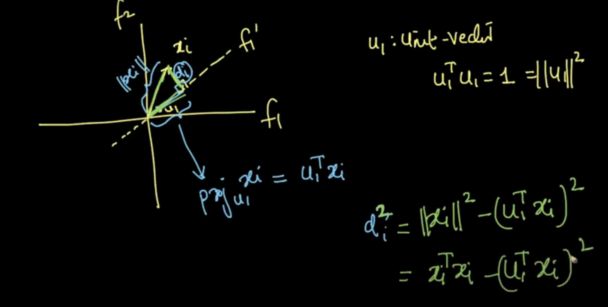
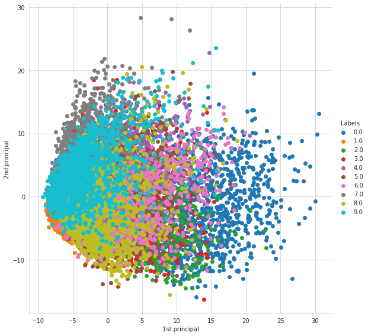

#Dimensionality reduction and Visualization

We can visualize using 2D and 3D plots. For 4D, 5D and 6D, we can leverage pair plot. As **n** increases, we can't use pair plot. So, we'll reduce the dimensionality of the data using PCA, t-SNE and visualize it.

_**Column Vector:**_
All the $i^{th}$ data's features will be represented as a column vector of size d x 1
[$x_{i1}, x_{i2}, ... , x_{id}$]. It is 'd' dimensional column vector. By default, we'll see as a column vector.

$x_i\ \epsilon\ R^d$ , we'll assume that $x_i$ is a column vector.


_**Represent a dataset (D)**_

Collection of data points. $D\ =\ \{x_i, y_i\}_{i=1}^n$
where $x_i\ \epsilon\ R^d$ and $y_i\ \epsilon\ \{setosa, virginica, versicolor\}$
It is **d=4** dimensional, with features as [sepal length, sepal width, petal length, petal width].

_**Dataset as data-matrix**_
Represented as $n$x$d$ matrix and $Y$ ($n$x$1$) column vector with output of each datapoint. Each row corresponds to one data point and each column corresponds to one feature's value. So each row is $x_i^T$ (where $x_i$ is a column vector). It is a much followed in industry.

Another way is just reverse. It is $d$x$n$ matrix. It is followed in much research papers.

##Data Preprocessing: Feature Normalisation

X is $n$x$d$ matrix
Y is $n$x$1$ column vector


Data modeling algorithms can work best after **Column Normalization**.

**_Column Normalization:_**

_Aim:_ to get rid of scale of any feature.

Let [$a_1$, $a_2$, $a_3$ ... $a_i$ ... $a_n$] be the value of the feature $f_j$ for all the $n$ data points. $a_{max}$ be max of values annd $a_{min}$ be min of values.

$a'_i$ = $\frac{a_i-a_{min}}{a_{max}-a_{min}}\ \epsilon\ [0,1] $

New array's values be [$a'_1$, $a'_2$, $a'_3$ ... $a'_n$] => all numbers will be between $0$ and $1$.

Why? Data without normalization will add more weight to it's priority. This allow features to be in any scale (before normalization). We are bringing all values inside a unit square in the geometric scale.

**_Mean Vector:_**

Just like scalars, we'll have scale vectors across **d** features. We'll take mean of all features and put in the vector.

**_Column Standardization:_**

_Aim :_ To convert the values to follow Normal Distribution

More often used rather than column normalization. Let [$a_1$, $a_2$, $a_3$ ... $a_i$ ... $a_n$] (of any distribution) be the value of the feature $f_j$ for all the $n$ data points. Convert those to **normal distribution**.

$a'_i$ = $\frac{a_i-\bar{a}}{s}$ where $\bar{a}$ is the sample mean and $s$ is the sample standard deviation.

$mean(a'_i)_{i=1}^n=0$ and $std-dev(a'_i)_{i=1}^n=1$

Geometrically,


1. Move points to (0,0) - **Mean centering**
2. Squeeze/Expand to match the standard deviation as 1 - **Scaling**

**_Co-variance of a Data Matrix:_**

Input matrix with size $n$x$d$, will have a covariance matrix $S$ of size $d$x$d$.

$S_{ij}$ = $cov(f_i,f_j)$
$cov(f_i,f_i)$ = $var(f_i)$ as we have seen in prob & stat
$cov(f_i,f_j)$ = $cov(f_j,f_i)$

So the matrix $S$ will have diagonal matrix values as variances of the corresponding features and it is symmetrix matrix.

Let X be column standardized. So, mean($f_i$)=0 and std($f_i$)=1. This will affect the covariance formula as dot product of those 2 features.
$cov(f_1,f_2)=\frac{\sum_{i=1}^n{(x_{1i}-\mu_1)(x_{2i}-\mu_2)}}{n-1}$ = $\frac{\sum_{i=1}^n{(x_{1i})(x_{2i})}}{n-1}$ = $\frac{f_1^T.f_2}{n-1}$

After columns standardization,
$S$ = $\frac{1}{n-1} (X^T)(X)$

**MNIST Database:**
Dataset of hand written numerical digits with 28x28 pixels each. 60k datapoints and 10k test data points. Objective is to classify the written character,

X - 2D array of grayscale value of the numbers.


We'll do row-flattening to get our each data point as a single column vector. This vector will have $784$x$1$ dimension. We'll put the transpose of it in the input vector.

So, the dimension of X is $60k$x$784$ This is 784 dimensional dataset. How do we visualize it? using t-sne, by converting 784 dimension to 2 dimension.

## PCA (Principal Component Analysis)

It is very basic and old.

For dimensionality reduction from $d \rightarrow d'$ such that $d'$< $d$ . And also for data visualization by reducing $d$ to $2$.

Example convering $2d$ to$1d$. The concept will hold good for higher dimensions.
X is $n$x$2$. The features are black shades of hair and height of hair. Spread (variance) of black shades will be very low and we can ignore it by choosing only the height of the hair. So $X$ will become $X'$ only with height of hair (since it has wide variance). Here I am keeping the features with more spread (variance).

Assume an $X$ with column standardization done for the 2 features. Here variance is 1 for both features.


Find $f'_1$ where the variance is more and $f'_2$ perpendicular to the other. We want to find a direction $f'_1$ such that the variance of $x_i$'s projected onto $f'_1$ is maximal.

Let $f'_1$ be $u_1$. We just need to find the direction of that. $u_1$ is unit vector.


$x'_i$ is the project of $x_i$ onto $\vec{u}$.
$x'_i$ = $proj_{u_1}x_i$ = $\frac{u_1\ .\ x_i}{||u_1||}$ = $u_1^T x_i$

we can find the **mean vector** in the direction of $\vec{u_1}$ as
$\bar{x'}$ = $u_1^T\ \bar{x}$ where $\bar{x}$ is the mean vector.

Now task in hand is find $u_1$ such that variance($proj_{u_1}x_i$) is maximum
**variance**($proj_{u_1}x_i$) = $\frac{1}{n} \sum_{i=1}^n (u_1^T x_i - u_1^T \bar{x})^2 $

since the data is standard normalized, mean is 0, which means $u_1^T \bar{x}$ is 0.
**variance**($proj_{u_1}x_i$) = $\frac{1}{n} \sum_{i=1}^n (u_1^T x_i )^2 $
Now maximize that (i.e) $max_{u_1}\ \frac{1}{n} \sum_{i=1}^n (u_1^T x_i )^2 $ such that $u^Tu=1$ and $||u||=1$

This is **Variance maximization PCA** and an optimization problem.

### Alternative formulation of PCA: Distance minimization




$min_{u_1} \sum_{i=1}^n (x_i^Tx_i - (u_1^Tx_i)^2) $ such that $u^Tu=1$ and $||u||=1$

This is **Distance minimization PCA** and an optimization problem.

##Eigen values and Eigen vectors (PCA): Dimensionality reduction

Solution to our optimization problems.

X has dimension $n$x$d$ and they are column standardized. $S$ is covariance matrix of dimension $d$x$d$.

Eigen values ($\lambda_1$, $\lambda_2$ ... $\lambda_d$)
Eigen vectors ($V_1$, $V_2$ ... $V_d$)

If I compute eigen values of $S$, we'll get $d$ eigen values and corresponding eigen vector $V_i$ for each $\lambda_i$.

Let's assume that $\lambda_1$ $\geq$ $\lambda_2$ $\geq$ ... $\geq$ $\lambda_d$.

_Definition of eigen value and vector :_ If I can find a $\lambda$ such that $\lambda_iV_i$ = $SV_i$, then $\lambda_i$ is eigen value and $V_i$ is eigen vector. The eigenvalues in PCA tell you how **much variance** can be explained by its associated eigenvector.

Property of eigen vector is that they are all **perpendicular** to each other (i.e.) $V_i \perp V_j$. So $V_i^TV_j=0$

Now, $u_1$=$V_1$ = eigen vector of $S$ corresponding to the largest eigen value $\lambda_1$. But why? (we'll see it later)


Let's say $X\ \epsilon R^{10}$, so we'll have 10 eigen values and vectors such that $\lambda_1$ $\geq$ $\lambda_2$ $\geq$ ... $\geq$ $\lambda_{10}$ in the order of maximum variance. This is the **geometric representation**.


From above image, consider 2 lambda's $\lambda_1$ and $\lambda_2$, if $\frac{\lambda_1}{\lambda_1+\lambda_2}=\frac{3}{5}=0.6$ and we chose to remove $\lambda_2$, then we will lose 40% of information. So, we can see how much of variance explained by the eigen vector.

### PCA for Dimensionality Reduction and Visualization


Consider the case where I want to reduce from $d$=100 to some $d'$ where $d < d'$ where I will **preserve the 99% of variance**. I can do till what eigen value I'll get 0.99

$\frac{\lambda_1+\lambda_2+...\lambda_{d'}}{\sum_{i=1}^{100} \lambda_i}$

Then we can choose $d'$ components/features

###Visualizing MNIST

[https://colah.github.io/posts/2014-10-Visualizing-MNIST/](https://colah.github.io/posts/2014-10-Visualizing-MNIST/)


784 dimensions are reduced to 2 dimensions. 1's and 0's are grouped together. We can see grouping of data.


**"we can't interpret what are those 2 dimensions" : we can't interpret whether these features belong to the already existing features or they are derived from a number of other existing features to form 2 new features that capture most of the Data variance.**

**_Limitations of PCA:_**
We'll lose so much data when we project the data onto the vector direction of major spread.. Check the image with many cases.


We can also use PCA to reduce dimensions to smaller number.

### Python (visualization)

```
from sklearn import decomposition
from sklearn.preprocessing import StandardScaler

data = pd.read_csv('/content/drive/MyDrive/AAIC/Datasets/mnist_train.csv')
X = data.drop('label', axis=1)
Y = data['label']

s_data = StandardScaler().fit_transform(data)

pca=decomposition.PCA(n_components=2)
pca_data = pca.fit_transform(s_data)
final_data = np.vstack((pca_data.T, labels)).T #since the shape of labels is (N,), vstack will convert that to (1,N)df = pd.DataFrame(data=final_data, columns=["1st principal", "2nd principal", "Labels"])
sns.set_style("whitegrid")
sns.FacetGrid(df, hue='Labels', size=8).map(plt.scatter, '1st principal', '2nd principal').add_legend()
plt.show()
```



### Python (Dimensionality reduction)

```
pca = decomposition.PCA()
pca_data = pca.fit_transform(s_data)

variance = pca.explained_variance_ #all the variance values

#variance
cum_variance = np.cumsum(variance/sum(variance))

fig, axes = plt.subplots(nrows=1, ncols=2, figsize=(10, 5))
axes[0].plot(lambdas, np.arange(len(lambdas)) , color='green', label='Eigen values' )
axes[0].set_xlabel('784 features')
axes[1].plot(np.arange(len(var_ratio)), cum_variance , color='red', label='%variance explained')
axes[1].set_xlabel('784 features')
plt.legend()

plt.show()

```


## What is t-SNE (t-distributed Stochastic Neighbourhood Embedding)?

One of the best dimensionality visualization of data. We also have multidimensional scaling, sammon mapping, graph based tech.

PCA preserves the global shape of the data, ignoring the local shapes. But t-sne preserves the local structure.


### Neighborhood of a point

$x_i$ is the point and the circle represents the neighbourhood $N(x_i)$ of that point

$N(x_i)$ = {$x_j$, such that $x_i$ and $x_j$ are geometrically close}


### Embedding

For every point in higher dimension, if I can find a point in lower dimension, it is called embedding.


### Geometric intuition of t-SNE

In d-dim, $N(x_1)=\{x_2, x_3\}$ and $N(x_4)=\{x_5\}$. While mapping to lower dimension, each point's neighbourhood distance should be preserved. Distance between 2 neighbourhood won't be preserved in the lower dimension.


_Mathematical Formulation_ is fairly advanced.


### Crowding Problem

Consider a square in 2D to be mapped to 1D.


$N(x_1)=\{x_2,\ x_4\}$
$N(x_3)=\{x_2,\ x_4\}$
We can't place $x_4$ properly. Sometimes it is **impossible** to preserve distances in all the neighbourhoods. It is called **crowding problem**.

### How to apply t-SNE and interpret its output

Ref : [https://distill.pub/2016/misread-tsne/](https://distill.pub/2016/misread-tsne/)

Iterative method, which will stop eventually when clusters are no more moving. In each step, it'll do the embedding.

_**Parameters :**_
Steps - `int` - no of iterations. More iteration more better. We can stop when the clusters are not moving.
Perplexity - `int` - it is no of neighbours to be preserved for each point.
Epsilon - `int` - how much one should change the cluster from one step to another. It is an optimization parameter.

_Notes_
- Always run t-sne with **multiple perplexity values** to understand actual shape
- If perplexity=no of data point, it is a **mess**.
- Run with different steps and perplexity till the cluster's shape isn't **stabilized**.
- t-SNE is a **stochastic/probabilistic algorithm** as we may find slight different cluster for the same steps and perplexity. So run many times with same step and perplexity.
- **Cluster size in t-SNE plot doesn't matter** (i.e.) the spread of the data doesn't matter as long as they are in cluster.
- **Distance between clusters** doesn't mean anything.
- Random noise doesn’t always look random. They may try to cluster with each perplexity (especially smaller values). They may have some meaning.
- For topology, you may need more than one plot (i.e) if set of points inside another set of points, we need more than one plot for confirmation.

_Steps:_
1. Run the steps till the clusters/shape stabilize
2. Try with multiple perplexity values $2\leq p\leq n$
3. Re-run with same steps and perplexity to confirm the cluster separation or stability

There’s a reason that t-SNE has become so popular: it’s incredibly flexible, and can often find structure where other dimensionality-reduction algorithms cannot. Unfortunately, that very flexibility makes it tricky to interpret. Out of sight from the user, the algorithm makes all sorts of adjustments that tidy up its visualizations. Don’t let the hidden “magic” scare you away from the whole technique, though. The good news is that by studying how t-SNE behaves in simple cases, it’s possible to develop an intuition for what’s going on.

&nbsp;&nbsp;&nbsp;&nbsp;&nbsp;&nbsp;&nbsp;&nbsp;&nbsp;&nbsp;&nbsp;&nbsp;&nbsp;&nbsp;&nbsp;_***It'll cluster points based on their visual similarity***_.

### python

```
from sklearn.manifold import TSNE

s1000 = s_data[0:1000,]
l1000 = labels[0:1000]

def do_tsne(s, l, perp=30, iter=1000):
  model = TSNE(n_components=2, perplexity=perp, random_state=0, n_iter=iter)
  tsne_data = model.fit_transform(s)
  tsne_data = np.vstack((tsne_data.T, l)).T
  tsne_df = pd.DataFrame(data=tsne_data, columns=("Dim_1", "Dim_2", "label"))
	
  sn.FacetGrid(tsne_df, hue="label", size=6).map(plt.scatter, 'Dim_1', 'Dim_2').add_legend()
  plt.title('With perplexity = 50')
  plt.show()
  
do_tsne(s1000, l1000, 50)
```


## Interview questions

You are given a train data set having 1000 columns and 1 million rows. The data set is based on a classification problem. Your manager has asked you to reduce the dimension of this data so that model computation time can be reduced. Your machine has memory constraints. What would you do? (You are free to make practical assumptions.)

[https://www.analyticsvidhya.com/blog/2016/09/40-interview-questions-asked-at-startups-in-machine-learning-data-science/](https://www.analyticsvidhya.com/blog/2016/09/40-interview-questions-asked-at-startups-in-machine-learning-data-science/)

Is rotation necessary in PCA? If yes, Why? [https://google-interview-hacks.blogspot.com/2017/04/is-rotation-necessary-in-pca-if-yes-why.html](https://google-interview-hacks.blogspot.com/2017/04/is-rotation-necessary-in-pca-if-yes-why.html)

You are given a data set. The data set contains many variables, some of which are highly correlated and you know about it. Your manager has asked you to run PCA. Would you remove correlated variables first? Why?[https://www.linkedin.com/pulse/questions-machine-learning-statistics-can-you-answer-saraswat/](https://www.linkedin.com/pulse/questions-machine-learning-statistics-can-you-answer-saraswat/)
