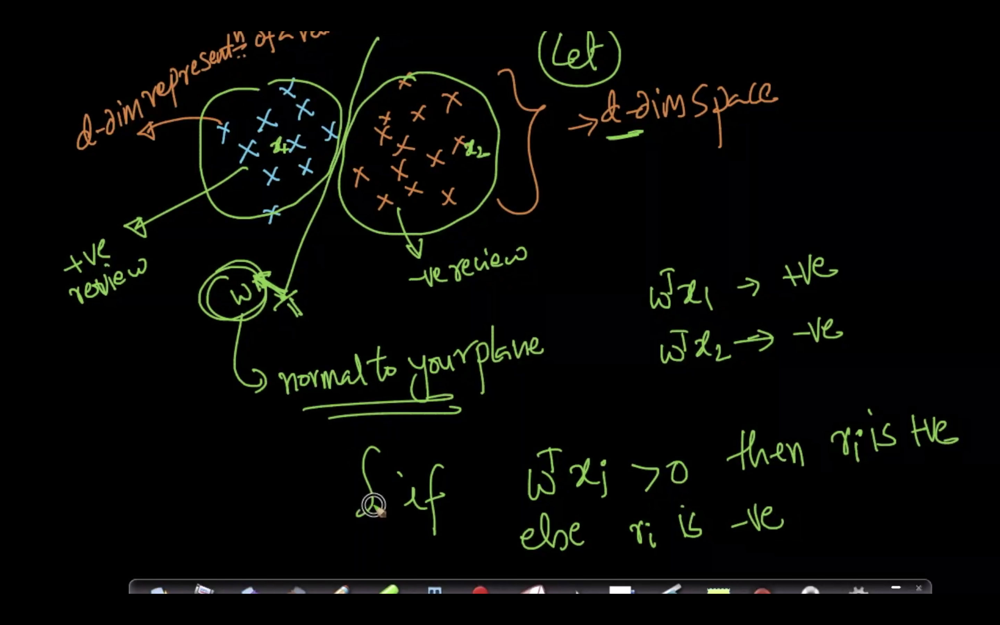
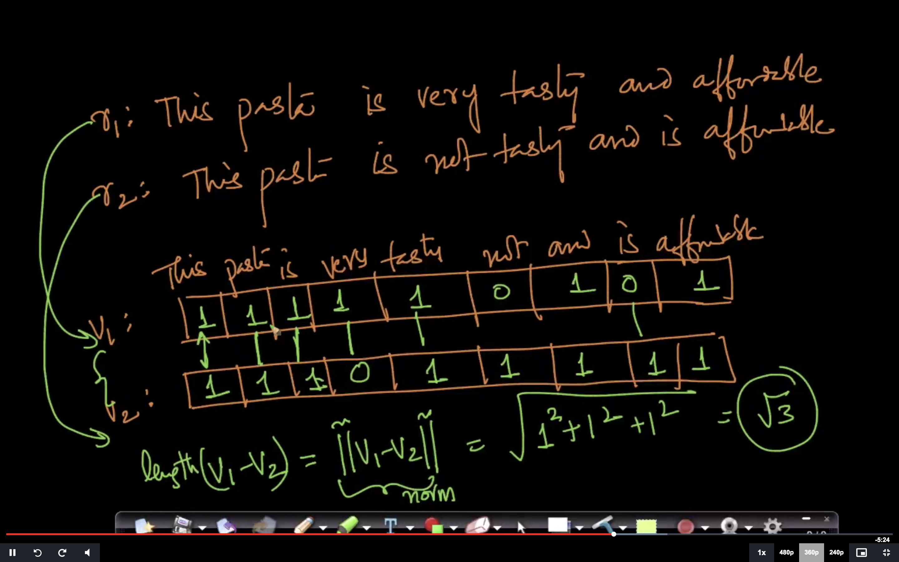
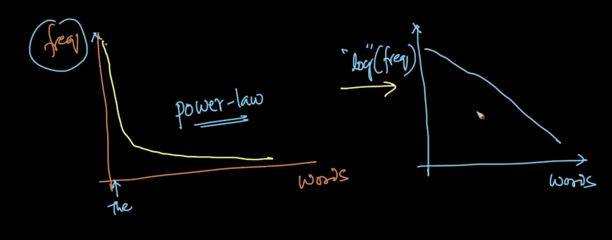
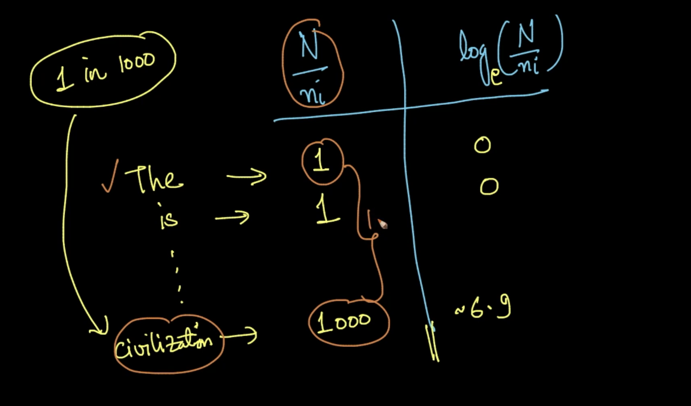
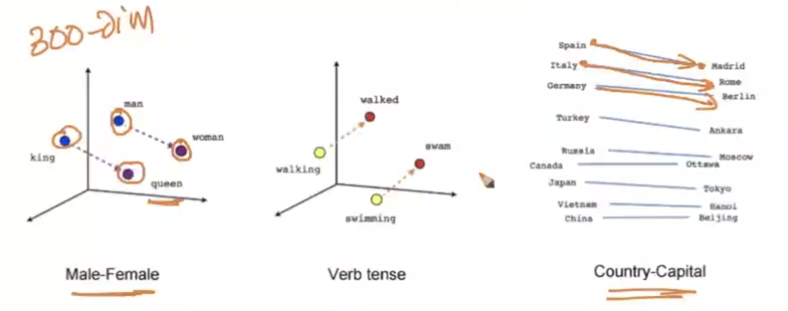
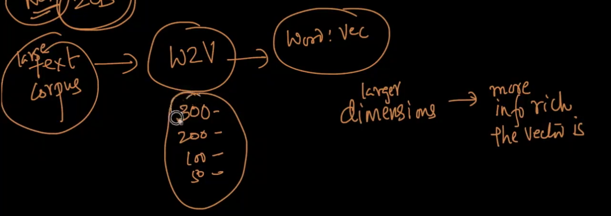
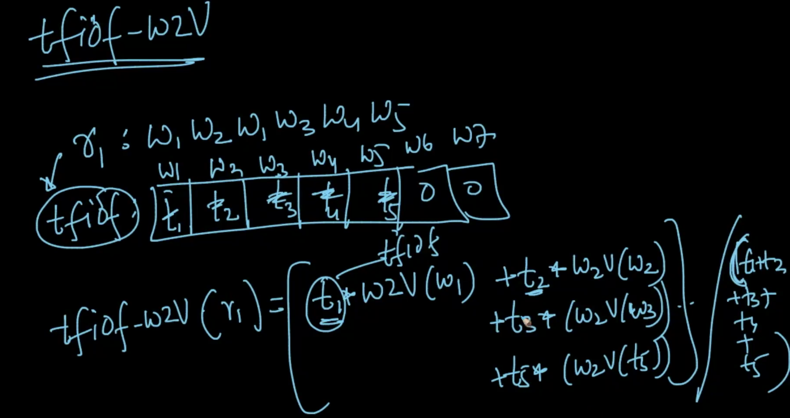

#Real world problem: Predict rating given product reviews on Amazon

It is based on amazon food review data.

## Text Preprocessing

1. Removing stop-words.
2. Make all words lowercase.
3. Stemming.
4. Lemmitization.
5. Tokenization.

We can use fields 'Text' and 'Summary' for better analysis.

From Linear Algebra, we know that, if we have any input as vector, we can leverage all the mathematical learned in linear algebra.

How to convert simple text, words and sentences to numerical vectors?

Convert **Review** text to **d-dim** vector. Then we can draw **hyperplane** to do the classification.

Text $\rightarrow$ $d$-dim vector, the **rules** are
> Suppose reviews $r_1$, $r_2$, $r_3$ has vectors $v_1$, $v_2$, $v_3$ correspondingly. If $r_1$ and $r_2$ are more similar **semantically** than $r_1$ and $r_3$, then the distance between $v_1$ and $v_2$ should be less than distance between $v_1$ and $v_3$. It means that similar points are closer.
>(i.e.) If sem($r_1$, $r_2$) > sem($r_1$, $r_3$), then dist($v_1$, $v_2$) < dist($v_1$, $v_3$)

Find {Text $\rightarrow$ $d$-dim vector}, such that similar text must be closer geometrically.

Each review is a **document**. And collection of documents is called **corpus**.

Such techniques are
1. Bag of Words (BoW)
2. tf-idf
3. Word2Vec

## Bag of Words (BoW)

Lets
$r_1$ : This pasta is very tasty and affordable
$r_2$ : This pasta is not tasty and is affordable
$r_3$ : This pasta is delicious and cheap
$r_4$ : Pasta is tasty and pasta tastes good

Steps :
1. Constructing a **dictionary** (set of all the words in your reviews). $d$-unique words across all reviews or document.
2. Each word is a different dimension, with $d$ dimensions for a document. For each review, we'll construct a vector with $d$ dimension with value as the **count of the corresponding words**. Let's say for $r_1$, the value is **1** for the index of the words "this", "pasta", "is", "very", "tasty", "and" & "affordable" and it'll be available in $v_1$. $v_1$ will be very sparse with most of the elements are *0*.

Now, we converted **text** to **vector**. If 2 documents are similar semantically, the resultant vectors must be closer.

_Correction:_ **is** will occur only once. And the count will be put in the cell. So distance varies.

The length is very close. But their meanings are extremely opposite.

**Binary/Boolean BoW :** We'll put **1** if a number occurs else **0**. It'll return the **no. of differing words**.

Also, the trivial words like **is**, **this**, **and** etc are not important. They are called **stop** words.

After removing those, the $v_i$ vectors will be small and more meaningful. Also we are throwing away some information. In english, **not** is a stop word. But removing it will cause problem.

###Stemming

**Tasty**, **tasting**, **tasteful** - instead of having them as 3 words in BoW, convert each of these words into their common form **tast** and replace those words with this. So many algorithms to do this like *Porter stemmer* and *snow ball stemmer*.

### Lemmitization
Lemmatisation is the algorithmic process of determining the lemma of a word based on its intended meaning. Unlike stemming, lemmatization depends on correctly identifying the intended part of speech and meaning of a word in a sentence, as well as within the larger context surrounding that sentence, such as neighboring sentences or even an entire document. **Tasty**, **tasting**, **tasteful** will be converted to **taste**

Read : [https://blog.bitext.com/what-is-the-difference-between-stemming-and-lemmatization/](https://blog.bitext.com/what-is-the-difference-between-stemming-and-lemmatization/)

### Tokenization
Breaking a sentence into words. We use "**space**" to separate sentence into words. But in case of word "New York", it is not possible as it is **language dependent** and **context dependent**. **Tasty** and **delicious** are synonyms.
We can make use of **Word2Vec** to achieve this synonyms.

**BoW** doesn't take the semantic meaning into the consideration.

### uni-gram, bi-gram, n-grams.

$r_1$ : This pasta is very tasty and affordable
$r_2$ : This pasta is not tasty and is affordable

After removing stop words (this, is, not, very, and), $v_1$ and $v_2$ are exactly the same. Then we'll consider the both are similar but in reality, they are not.

We can fix it by 'bi-gram' or 'tri-gram' as unigram BoW discard the sequence of information. In **unigram**, each word will be considered a dimension. In **bi-gram**, pair of words will form a dimension. So 'This pasta', 'pasta is', 'is very', 'very tasty' and so on will form dimensions. Inn **tri-gram**, take 3 consecutive words as one dimension and it follows for **n-gram**. Other than, unigram, others will retain some of the sequential information.

If **there are repeated words**, the dimensions in `#n-gram` $\geq$ `#tri-gram` $\geq$ `#bi-gram` $\geq$ `#uni-gram`.

Eg :
**horse is a horse, of course, of course. accept  it**
Here there are repeated words
unigrams --> horse, of, course, a, is, it, accept --> #7
bigrams --> horse is, is a , a horse, horse of, of course, course of, course accept, accept it --> #8
trigrams --> horse is a, is a horse, a horse of, horse of course, of course of, course of course, of course accept, course accept it --> #8

## tf-idf (term frequency- inverse document frequency) BoW

This method doesn't take the semantic meaning into the consideration.

Let's assume we have $N$ documents/reviews.

**Term frequency** of word $W_i$ occuring in the document/review $r_j$ is
$TF=\frac{\#\ of\ times\ W_i\ occurs\ in\ r_j}{total\ \#\ of\ words\ in\ r_j}$

$D_c$ is set of all the below reviews. It is **corpus**
$r_1$ is $W_1$, $W_2$, $W_3$, $W_2$, $W_5$
$r_2$ is $W_1$, $W_2$, $W_4$, $W_3$, $W_5$, $W_6$
...
$r_N$

$TF(W_2,r_1)=\frac{2}{5}$

$0\ \leq\ TF\ \leq\ 1$, so it is like probability of finding a word in the document.

**IDF** : If a word occurs in many documents, then IDF is low. If a word is a rare or low frequency, then IDF is high.

$IDF(W_i, D_c)$ = $log(\frac{N}{n_i})$ where $n_i$ is the no of documents which has the word $W_i$

$n_i\ \leq\ N\ \Longrightarrow\ \frac{N}{n_i}\geq1\ \Longrightarrow\ IDF=log(\frac{N}{n_i})\geq0$
As $n_i$ increases, $\frac{N}{n_i}$ and $log(\frac{N}{n_i})$ both decreases.

**It means that if a word occurs more frequently in the corpus, then the $IDF$ value is smaller.**
(i.e.) if $n_i\uparrow$, $IDF\downarrow$. Also if $n_i\downarrow,IDF\uparrow$

Usually in **BoW**, we'll fill the vector with the count of words.
But now, we'll fill **index** corresponding to the word $W_i$ with **$TF(W_i, r_j)*IDF(W_i,D_c)$** in the document $r_j$. It gives more weightwage to the most frequent words in a document and less weightage to the common words in the corpus.

**More importance to the rarer word in the corpus and to the frequent word in a document.**

It still doesn't take into account the semmantic meaning of the word.

###Why use log in IDF?

As per Zipf's law, the common words in english will occur much more and rarer words will be less. It follows **power-law** distribution.

Instead of giving weightage 1000 to the word **civilization**, we are just giving $6.9$ .

`Both BoW and tf-idf convert a full text/document into a sparse vector.`

## Word2Vec

Takes the **semantics into the consideration**. It is the state of the art technique. It learns relationships automatically from raw text.

Given a **word**, it'll be converted to **d-dimensional dense vector** (typically d will be 100,200,300). Note that, here word is converted to a vector not a sentence or document.

Take 3 words "tasty", "delicious", "baseball". As Word2Vec knows English, it'll return 3 vectors $v_1,v_2$ and $v_3$ respectively such that the distance between first 2 are closer and $v_3$ is far.

1. So, given any 2 semantically similar words, Word2Vec converts them to 2 vectors with minimal distance.
2. Relationships are satisfied. Take words man, woman, king and queen, their vectors $v_{man}$, $v_{woman}$, $v_{king}$ and $v_{queen}$, then ($v_{man}$-$v_{woman}$) vector is parallel to ($v_{king}$-$v_{queen}$) vector. Same applicable for country-capital, verb tense, gender and so on. 

As corpus size increases, the d-dimensions will also increase with information rich vectors.

Intuitively, it works like if the neighborhood of the word $W_i$ is similar to the word $W_j$, then $v_i$ is similar to $v_j$
(i.e) $N(W_i)\approx N(W_j)$  $\Longrightarrow$ $v_i\approx v_j$

### Using sentences, how to convert using word2vec?
Using Avg-Word2Vec, tf-idf weighted Word2Vec weighing strategies.

**_Avg-Word2Vec_**
$r_1$ : $W_1$ $W_2$ $W_1$ $W_3$ $W_4$ $W_5$ 

Then $r_1\rightarrow v_1$ is $\frac{W2V(W_1)+W2V(W_2)+W2V(W_1)...W2V(W_5)}{n_1}$

This is averaging all the vectors. It is not perfect. It is well enough.

**_tf-idf weighted Word2Vec_**

Compute the **tf_idf** for $r_1$, then multiply each corresponding value with the $W2V(W_i)$

$tfidf_w2v(r_1)=\frac{\sum_{i:words}t_i*w2v(W_i)}{\sum_{i:words}t_i}$