#Classification And Regression Models : K-Nearest Neighbors

In training phase, the algorithm learns and it'll be applied over the cross validation data set. Then check the accuracy. Based on that, choose the hyperparameters

Each matrix row is the transpose of the $x_i$ (which is a column vector representing the features of that particular data). So $i^{th}$ row is $x_i^T$

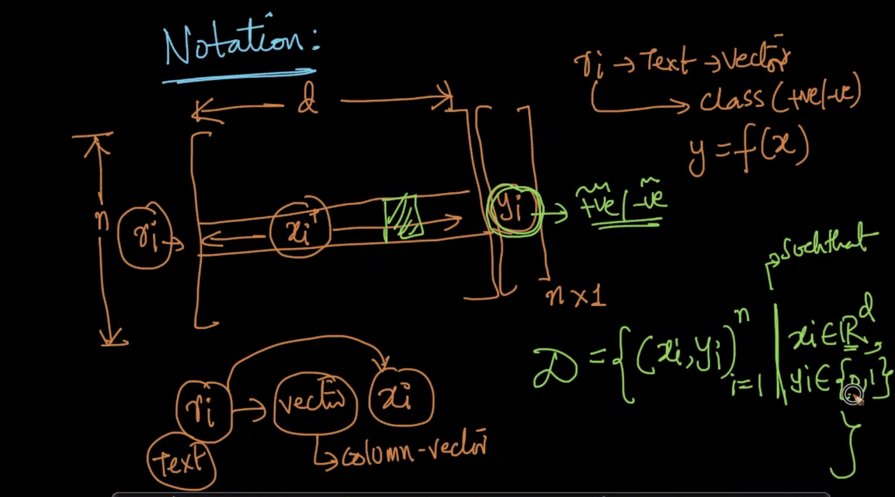

_*How Classification works?*_
In Amazon fine food reviews case, given a new review, determine/predict if the review is positive or not. It is **binary classification** or **2-class classification**.
$y=f(x)$ where $x$ is the query review text and $y$ is either $+ve$ or $-ve$.
Typically $y$ will have some classes.

Data : $D=\{(x_i,y_i)_{i=1}^n$ such that $x_i\ \epsilon\ R^d, y_i\ \epsilon\ \{0,1\}$

In MNIST dataset, it is **10-class classification**.

_*How Regression differs from Classification?*_
Consider the case, where I was given *_weight_*, _*age*_, _*gender*_, _*race*_, predict the **height**, which is a real number. Here there are no classes.

Data : $D=\{(x_{i:weight},x_{i:age},x_{i:gender},x_{i:race},y_i)_{i=1}^n$ such that $x_i\ \epsilon\ R^d, y_i\ \epsilon\ R^d$

## K - Nearest neighbours for classification

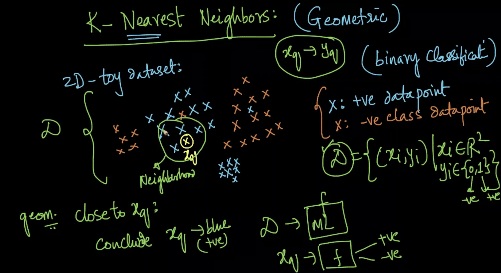

For the query point $x_q$, we check the points in it's proximity and find which class it might belong to.

Steps:
1. Find **k-nearest** points (in terms of distance) to $x_q$ in $D$.
2. Let's say **k=3**, so we'll have 3 $y$ points $\{y_1,y_2,y_3\}$. We'll use majority vote. If the majority vote is $+ve$, then $y_q$ is $+ve$. So better to take **k** as **odd** number to take majority vote.

###Failure cases

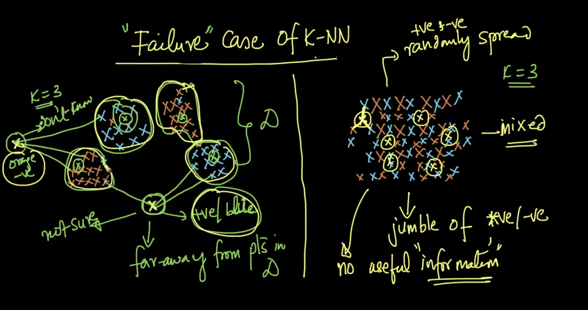

1. Fails when $x_q$ is **far away** from the rest of the points. We are not sure of it's class label. In that case, it is better to say **don't know about the class**.
2. When the data is not at all grouped (i.e) randomnly spread, then we can't make use of this algo.

### Distance measures: Euclidean(L2) , Manhattan(L1), Minkowski, Hamming, Cosine

Let $x_1$ = ($x_{11},x_{12}$) and $x_2$ = ($x_{21},x_{22}$)

**Distances** are between 2 points and **norms** are for 2 vectors.

_**Euclidean distance :**_

$\sqrt{(x_{21}-x_{11})^2 + (x_{22}-x_{12})^2}$ = $||x_2-
x_1||_2$ , where underscore 2 is $L_2$ norm
In n-dimensions, where $x_1\epsilon \ R^d$ and $x_2\epsilon \ R^d$, euclidean distance is $||x_1-x_2||_2=\sqrt{\sum_{i=1}^d(x_{1i}-x_{2i})^2}$

**_Manhattan distance:_**

It's similar to walking around the block to reach some buildings. You can't cross the block because in between buildings will be there.

$||x_1-x_2||_1\ =\ \sum_{i=1}^d |x_{1i}-x_{2i}|$ It is $L_1$ norm.

Where to use it? For continuous variable (but not for categorical variable)

**_Minkowski distance:_**

We have seen $L_1$ and $L_2$ norm distance. Minkowski distance is $L_p$ norm distance, where $p>0$.

$||x_1-x_2||_p$ = $(\sum_{i=1}^d|x_{1i}-x_{2i}|^p)^{1/p}$

$p=1$ : Manhattan distance
$p=2$ : Euclidean distance

Where to use it?

**_Hamming distance:_**

It is between 2 boolean vectors (like binary BoW vectors). It is just the **number of locations/dimensions where the boolean value differ**

$x_1$ = [$0,1,0,0,1$]
$x_2$ = [$1,1,0,0,0$]

Hamming dist( $x_1$, $x_2$) = 2

In case of string vectors, we'll count the no of alphabets changed in particular position.

Used in Gene code sequence.
Where to use it? For categorical variable (but not for continuouscontinuous variable)

**_Cosine Distance & Cosine Similarity_**

When we think about 2 points, if the distance increases, then the similarity decreases and vice versa.

$1-cos\_sim(x_1,x_2)=cos\_dist(x_1,x_2)$
$cos\_sim(x_1,x_2)=cos(\theta)=\frac{x_1.x_2}{||x_1||_2||x_2||_2}$ where $\theta$ is the angle between 2 vectors.

if $x_1$ and $x_2$ are very similar, then $cos\_sim(x_1,x_2)=+1$ and when they are dissimilar, it is $-1$.

If the angle between two vectors is zero, then they are **similar**. It is based on that concept.

$(eucl\_dist)^2=2*(1-cos\_sim)$ 
$(eucl\_dist)^2=(cos\_dist)$ 
derived from the expansion of the eclidean distance (**if both are unit vectors**)

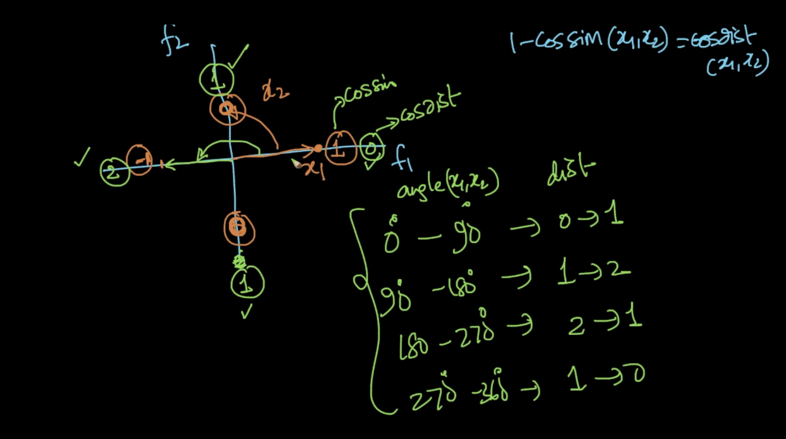

---

### How good KNN is?
Let's use the Amazonn food review example. $x_q$ is the query and find $y_q$ as polarity.

Find some k nearest neighbours and take the majority vote. To check how well it works, let's divide the dataset $D$ (size $n$) into $D_{train}$ size $n_1$ (with 70%) and $D_{test}$ size $n_2$ (with 30%).

count = 0
For each point $pt$ in $D_{test}$:
&nbsp;&nbsp;&nbsp;&nbsp;&nbsp;&nbsp;Make $x_q=pt$
&nbsp;&nbsp;&nbsp;&nbsp;&nbsp;&nbsp;Use $D_{train}$ and $K-NN$ to predict $y_q$
&nbsp;&nbsp;&nbsp;&nbsp;&nbsp;&nbsp;if $y_q$ == $y_{pt}$:
&nbsp;&nbsp;&nbsp;&nbsp;&nbsp;&nbsp;&nbsp;&nbsp;&nbsp;count += 1
accuracy = $\frac{count}{n_2}$

0 $\leq$ accuracy $\leq$ 1

_Conclusion :_ K-NN on amazon find food reviews using $D_{train}$ gives accuracy of $x$ percentage

###Space and time complexity

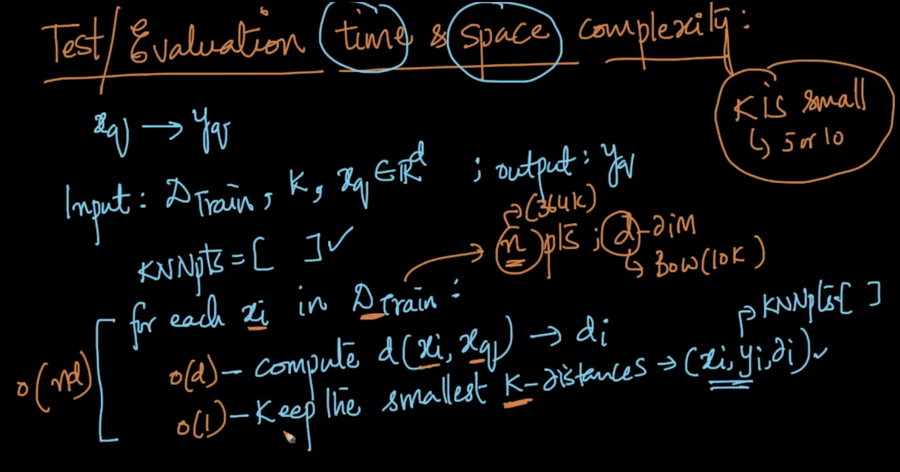

Time Complexity is $O(nd)$ as $k$ nearest comparison is much smaller. If $d\ll n$, then complexity is $O(n)$. For Amazon fine food review case, the no of data is $364k$ with $100k$ dimensions, it'll add upto $36B$ computation.

Space complexity : We need to save $D_{train}$ in memory. Complexity is $O(nd)$. For Amazon fine food review case, the no of data is $364k$ with $100k$ dimensions, it'll add upto $\sim 36GB$ (without sparse matrix).

This complexity is a lot. It is a **big limitation** of KNN. That's why KNN is **not used extensively**. We'll use **kd-tree**, **LSH**.

###Decision surface for K-NN as K changes
$k$ is the hyper parameter.

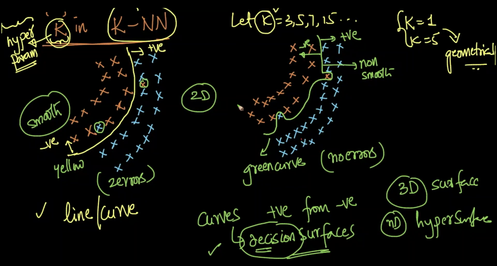

The lines/curves which separate 2 different group of points are called **decision surfaces**

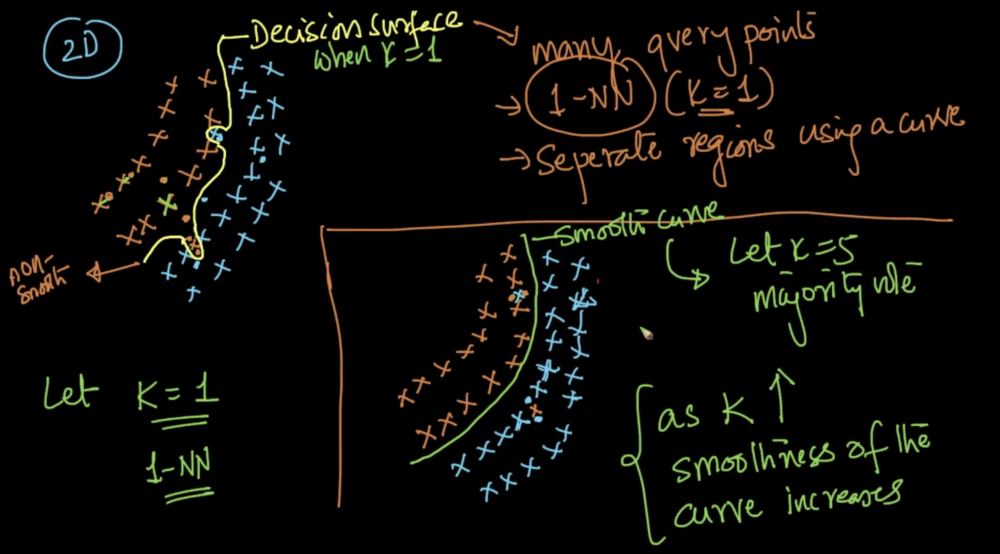

In K-NN, the smoothness of the decision surface increases as **k** increases.
What is k=n? We'll **always** get the class of the group which has higher data.

From above example,
$k=1$ $\rightarrow$ **overfitting** (accomodates all small errors to fit the model)
$k=5$ $\rightarrow$ **correct hyper param**
$k=n$ $\rightarrow$ **underfitting** (under working to find the proper hyperplane/surface)

###Need for Cross validation
|k|Train|accuracy on $D_{test}$|
|---|---|---|
|k=1|$D_{train}$|0.78|
|k=2|"|0.82|
|k=3|"|0.85|

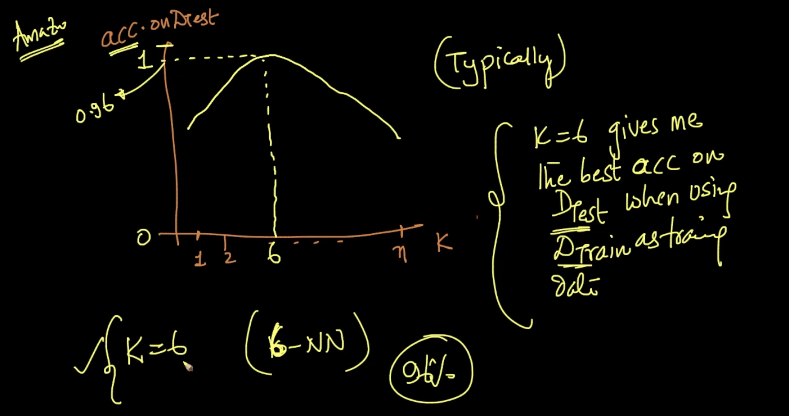

Using $D_{train}$ and **6-NN**, we are getting accuracy of 0.96. But the small problem here is that for **future unseen problem**, how accurate this model is going to predict? If the model works **well on future unseen problems**, then the model is said to be **well generalized**. Only with $D_{test}$ we can't assure that our model will be **96%** accurate with future unseen problems. So, follow like below.

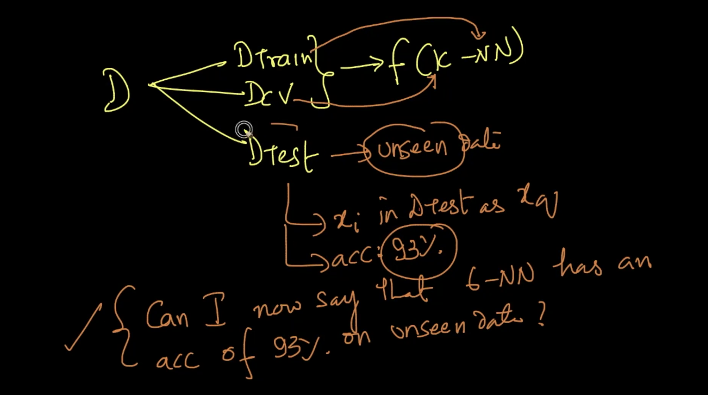

Note : **_Use cross validation set to find the hyperparameters of the model and use test set to find the accuracy_**.

Usually we'll have $D_{train}$ with 60% data, $D_{cv}$ with 20% data and $D_{test}$ with 20% data. Not a hard rule for this.

Now, we can say that using $D_{train}$ as training data, we find **6-NN** to have a **_generalization accuracy_** of 93% on future unseen data.

### K-fold cross validation
In the above data split, we used only 60% to find **NN**. But is there a way to use 80% data (20% data remain unseen) to find **NN**. Because more data is better for learning. We can use **k-fold cross validationn**, this **k** is not same as in **k-nn**.

*_Steps:_*
1. Split $D$ into 80% $D_{train}$ and 20% $D_{test}$. With that 80% data, we need to find both **nn** and **k (hyperparameter)**.
2. Randomnly breaking $D_{train}$ into 4 parts.
3. Run validation as below

|k|$D_{train}$|CV|accuracy on cv|
|---|---|---|---|
|k=1|$D_1$,$D_2$,$D_3$|$D_4$|$a_4$|
|k=1|$D_1$,$D_2$,$D_4$|$D_3$|$a_3$|
|k=1|$D_1$,$D_3$,$D_4$|$D_2$|$a_2$|
|k=1|$D_2$,$D_3$,$D_4$|$D_1$|$a_1$|
|k=2|$D_1$,$D_2$,$D_3$|$D_4$|$a_4$|
|k=2|$D_1$,$D_2$,$D_4$|$D_3$|$a_3$|
|k=2|$D_1$,$D_3$,$D_4$|$D_2$|$a_2$|
|k=2|$D_2$,$D_3$,$D_4$|$D_1$|$a_1$|

$a_{k=1}=\frac{a_1+a_2+a_3+a_4}{4}\ \forall\ k=1$

For $k=1$, we need only one accuracy to map in graph. So we can get the average of $a_1$, $a_2$, $a_3$ and $a_4$ as $a_{k=1}$. Use this for k=1. Repeat the same for $k=2$ and find $a_{k=2}$ and so on. This is **4-fold cross validation**. Here we are making use of all data for the training. But **it'll increase the time by 4 times for 4-fold cv**.

How to find the proper **k-fold** number? Typically, we'll apply **10-fold cross validation** (no scientific reason).

###Visualizing train, validation and test datasets

* $D_{train}$ and $D_{cv}$ points do not overlap perfectly (when the data is randomnly sampled)
* If there are **many points** in the $+ve$/$-ve$ points from $D_{train}$ in a region, then it is very likely to find **many points** from $D_{cv}$ from that region.
* Similarly, if there are **less points** in the $+ve$/$-ve$ points from $D_{train}$ in a region, then it is very likely to find **less points** from $D_{cv}$ from that region. These are points are basically noise/outliers.

###How to determine overfitting and underfitting?
Using **k-fold cv** or **cv**, we can find hyperparameter **k** which will be neither overfit or underfit. But how can we be really sure that we are not underfitting or overfitting?

$accuracy=\frac{\#\ correctly\ predicted\ points}{Total\ \#\ points}$
$error = 1 - accuracy$

We need to maximize **accuracy** and minimize **error**.

**Train error** is we use the $D_{train}$ data itself to find the accuracy & error rather than $D_{cv}$ .
. Training Data $\rightarrow$ $D_{train}$
. Accuracy/Error on $\rightarrow$ $D_{train}$

**Validation error** is we use the $D_{train}$ data to train and $D_{cv}$ to find the accuracy & error.
. Training Data $\rightarrow$ $D_{train}$
. Accuracy/Error on $\rightarrow$ $D_{cv}$

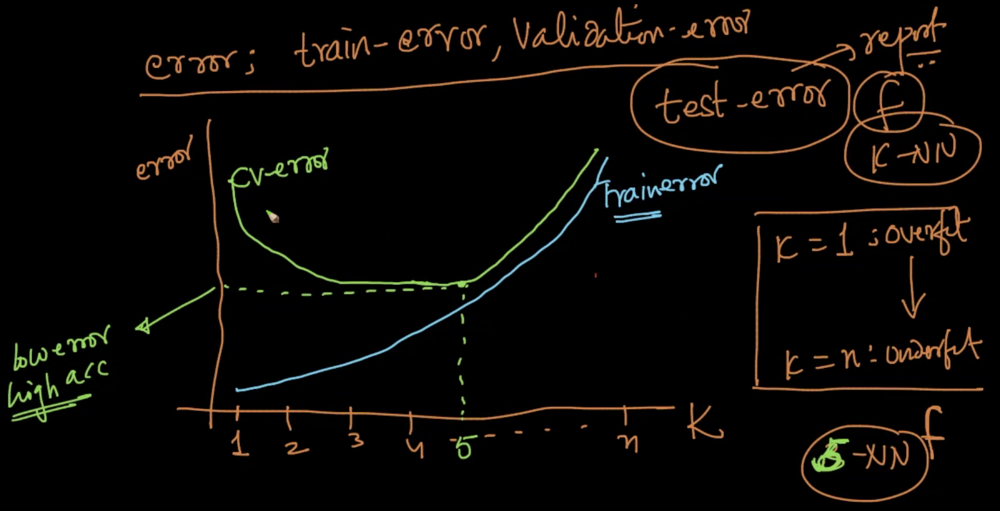

Train error **high** and CV error **high** $\longrightarrow$ **underfit**
Train error **low** and CV error **high** &nbsp;$\longrightarrow$ **overfit**

###Time based splitting
Better than random splitting for amazon food reviews problem.

1. Sort the reviews in ascending order based on time added.
2. Take the first 60% for train, 20% for cv and 20% for test.

With time goes on, the products and reviews change. If I can give accuracy based on that, it'll hold good for future reviews too. But not the same for random splitting. Whenever time is available and behaviour changes in time, then **time based splitting is suitable**.

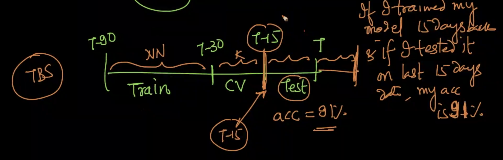

### weighted k-nn (for classification)

For query point $x_q$ in **5-nn**

|$x_i$|$y_i$|$d_i$ from $x_q$|$w_i=\frac{1}{d_i}$|
|---|---|---|---|
|$x_1$|$y_1=-ve$|$d_1=0.1$|10|
|$x_2$|$y_2=-ve$|$d_2=0.2$|5|
|$x_3$|$y_3=+ve$|$d_3=1$|1|
|$x_4$|$y_4=+ve$|$d_4=2$|0.2|
|$x_5$|$y_5=+ve$|$d_5=4$|0.5|

For $x_q$, $x_1$ is very close compared to $x_3$,$x_4$,$x_5$. So we have to give more importance to $x_1$. So give more weights to $x_1$

One way to find is $w_i$ = $\frac{1}{d_i}$

Then, $(10+5)>(1+0.2+0.5)$, so $y_q$ is $-ve$ opposite of majority vote

## K - Nearest neighbours for Regression

1. Given $x_q$, find k-nearest neighbours ($x_1$,$y_1$), ($x_2$,$y_2$) ... ($x_k$,$y_k$)
2. Instead of taking majority vote, we'll take the $mean(y_i)_{i=1}^k$ or $median(y_i)_{i=1}^k$

For some of the classification algorithms, we can extend the algo to regression.
##Voronoi diagram

Diagram with k-nn concept (k=1)

In mathematics, a Voronoi diagram is a partition of a plane into regions close to each of a given set of objects. In the simplest case, these objects are just finitely many points in the plane (called seeds, sites, or generators). For each seed there is a corresponding region, called Voronoi cells, consisting of all points of the plane closer to that seed than to any other. The Voronoi diagram of a set of points is dual to its Delaunay triangulation.

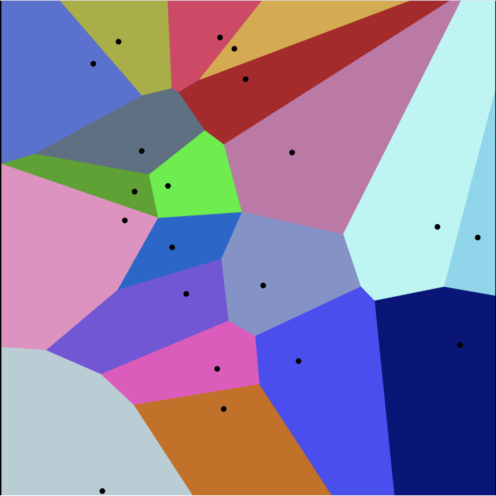

##kd-tree

KNN takes $O(n)$ when k,d are small. We can use **kd-tree* for optimization (based on binary search tree)

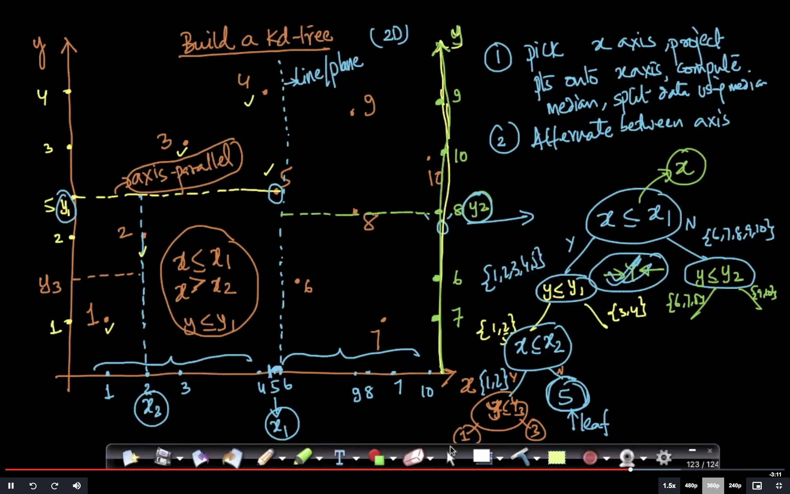

It is breaking up the space into axis parallel lines/planes/hyperplanes. We'll build the tree iterating each dimension once and repeating again, till we reach leaf nodes.

In **2D**, we'll **axis parallel lines** to split and we'll get **rectangles**.
In **3D**, we'll **axis parallel planes** to split and we'll get **cuboids**.
In **nD**, we'll **axis parallel hyperplanes** to split and we'll get **hypercuboids**.

Read : [https://www.wikiwand.com/en/K-d_tree](https://www.wikiwand.com/en/K-d_tree)

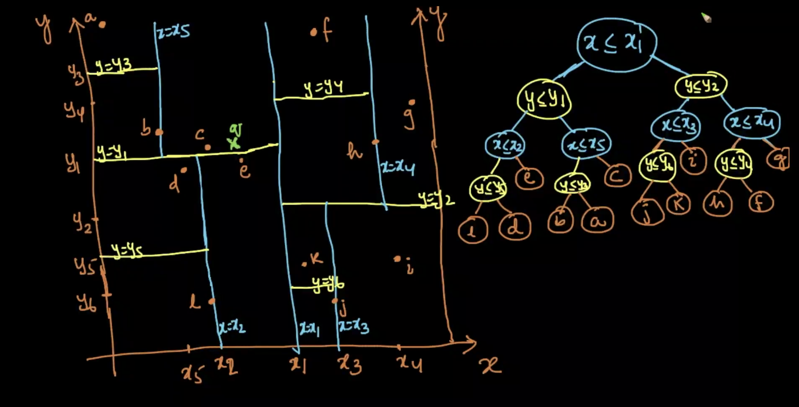

1. Take the query point $q:(x_q,y_q)$, we'll apply the kd-tree.
2. For 1-NN, we can easily find by navigating the tree that $c$ **could be a** neighbour of $x$.
3. We'll draw a **hypersphere** with the **distance** $d$ **between c and q** as radius annd **q as center**.
4. Now that hypersphere intersects $y=y_1$, so we'll do the backtracking to the $y\leq y_1$ node
5. Navigate down from that node, we see that $x\leq x_2$ is false, so $e$ **could be my neighbour**. Find the distance $d'$ from point $q$ and $e$.
6. $d'<d$, so we'll ignore $c$ and draw **new hypersphere** using $q$ and $e$.
7. It intersects $y\leq y_1$ node and since we have already done the backtracking for this, we need not do it again. We'll conclude that **e is now 1-NN**.

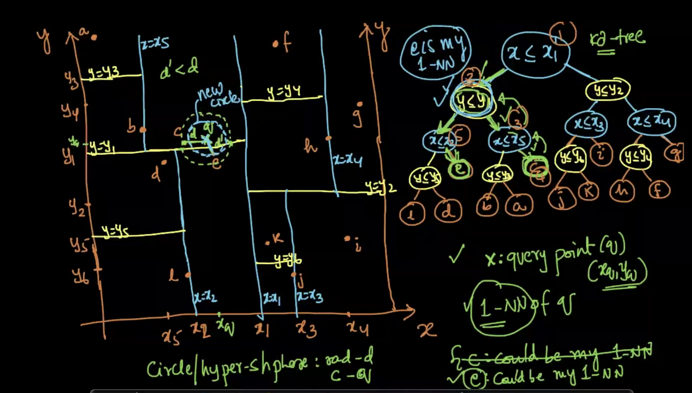

Read this [https://gopalcdas.com/2017/05/24/construction-of-k-d-tree-and-using-it-for-nearest-neighbour-search/](https://gopalcdas.com/2017/05/24/construction-of-k-d-tree-and-using-it-for-nearest-neighbour-search/)

**_Time Complexity for 1-NN:_**
Best case scenario for # of comparisons : $O(lg(n))$
Worst case scenario for # of comparisons : $O(n)$

**_Time Complexity for k-NN:_**
Best case scenario for # of comparisons : $O(k * lg(n))$
Worst case scenario for # of comparisons : $O(k*n)$

_TODO :_ Need to use max heap for finding k neighbours. Check it afterwards for learning purpose on how to do this. Ref: [https://stackoverflow.com/questions/34688977/how-do-i-traverse-a-kdtree-to-find-k-nearest-neighbors](https://stackoverflow.com/questions/34688977/how-do-i-traverse-a-kdtree-to-find-k-nearest-neighbors)

Space complexity is still $O(n)$ considering dimensions $d$ is small.

### Limitations

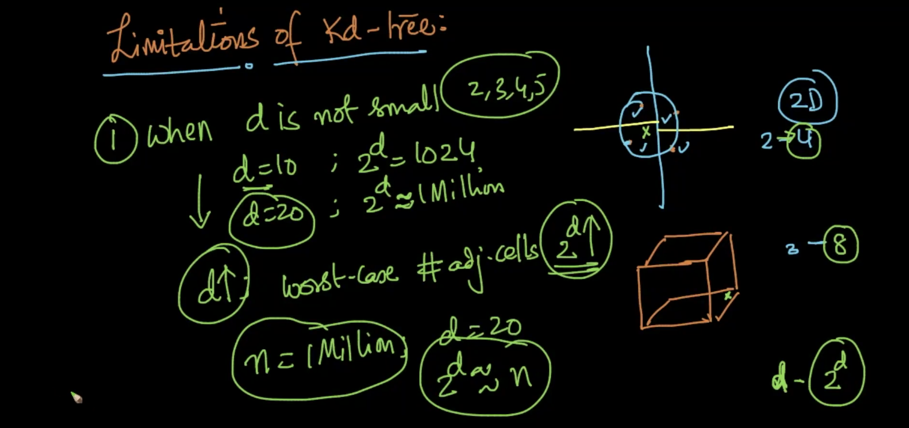

1. When $d$ is not small, then if a hypersphere cuts all the lines, then we have to check for $2^d$ adjoining cells. Even when $d=10$, we have to check for $1024$ adjoining cells.

	Time complexity for 1-nn : $O(2^d*lg(n))$ it is worse than $O(n*log(n))$

2. $O(log(n))$ holds good only when the data is uniformly distributed.

It is recommended for computer graphics. We want to find the nearest points as it is only 2D.

### Variations of KD-Tree

1. Implicit k-d tree
2. min/max k-d tree
3. Ball tree
4. Relaxed k-d tree

##Locality Sensitive Hashing (LSH)

Works good when $d$ is large.

LSH $\longrightarrow$ We want to find a hash function $h(x)$ such that the neighbours of $x$ will go to the same bucket of the hash of $x$. It is a **randomized algorithm** (**not always give the correct answer, answer with high probability** ).

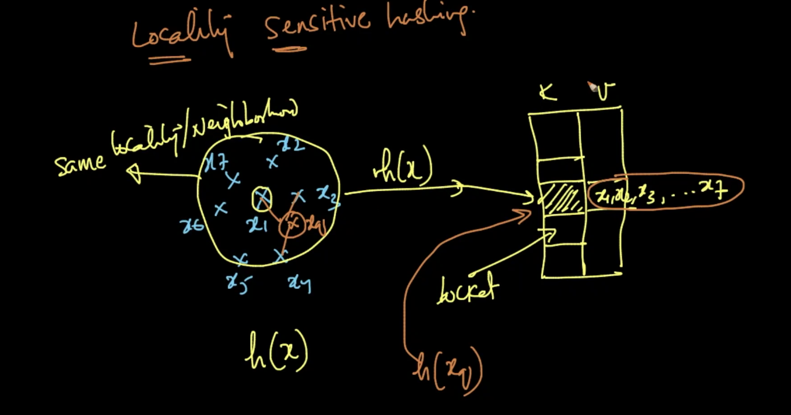

It works even when **d is large**

### LSH for cosine similarity

If 2 points ($x_1$, $x_2$) are very close ($\theta$ between them is very small), then they are very similar to the points (say $x_3$, $x_4$) which are very close. The close points $x_1$, $x_2$ will go to the same bucket.

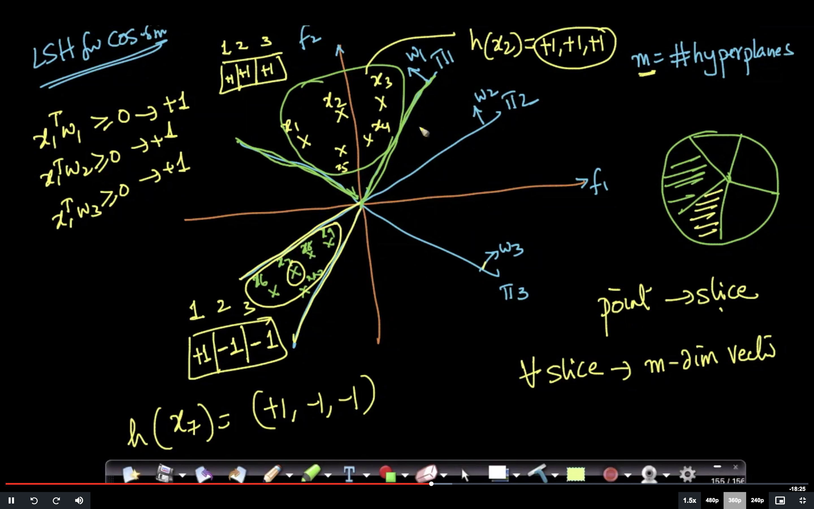

We are drawing **m** hyperplanes ($\pi_1$, $\pi_2$, $\pi_3$) in the space and take $m$ **unit normal vectors** ($m_1$, $m_2$, $m_3$) to those planes. These hyperplanes are generated using normal distribution $N(0,1)$

Then apply $x_i^Tm$ (scalar) for each point in each hyperplane. If the point is above the hyperplane, then the value is $+ve$ otherwise it'll be $-ve$.

So for a point, we'll have **m-dimensional** vector with sign of the value applied. It'll work as hash value.

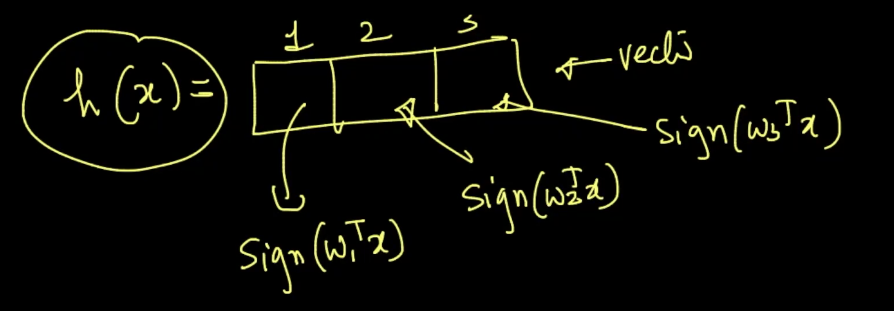

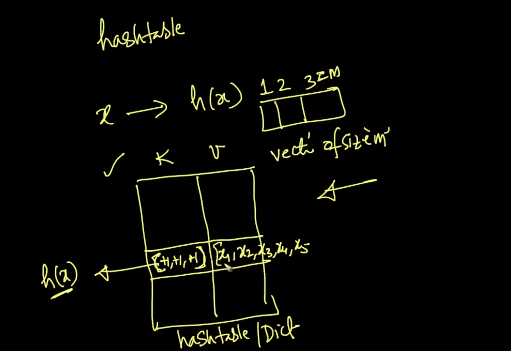

Time to construct this hash table : $O(mdn)$
Space is atleast $O(n)$

Given a query point $x_q$, construct $h(x_q)$. Use this as key in the hashtable/dict to get the value. They **could be** the nearest point and find the cosine similarity of those points and get **k** nearest neighbours.

Time complexity for querying : $O(md+n'd)$ where $n'$ elements in the bucket (assuming $n' < n$). If we assume, $n'=d$, then it is $O(md)$

So, typically we'll set $m=log(n)$. Time complexity becomes $O(d*log(n))$.

**_Limitations_**:
We could miss nearest points on both sides of the hyperplane.

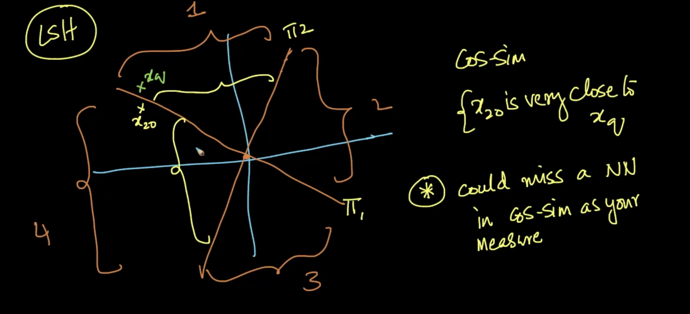

So, we'll have new set of m hyperplanes and get another hash table. And repeat it for **L times** (typically small).
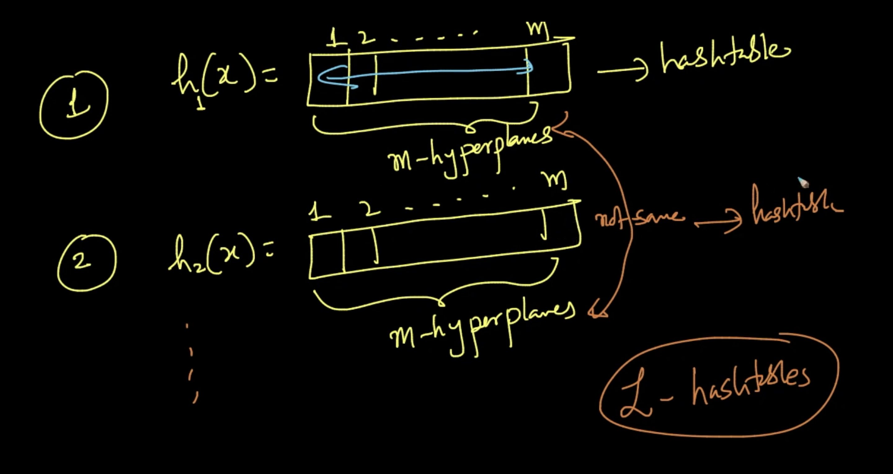

In the final query poinnt $x_q$, we'll have a union of all the **values** in all **L-hashtables**

Time complexity for querying : $O(mdL)$

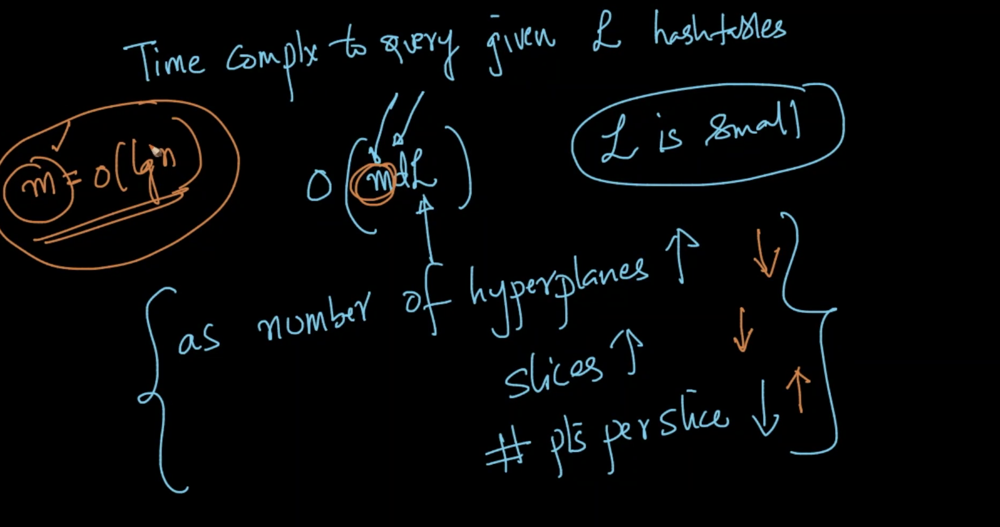

### LSH for euclidean distance

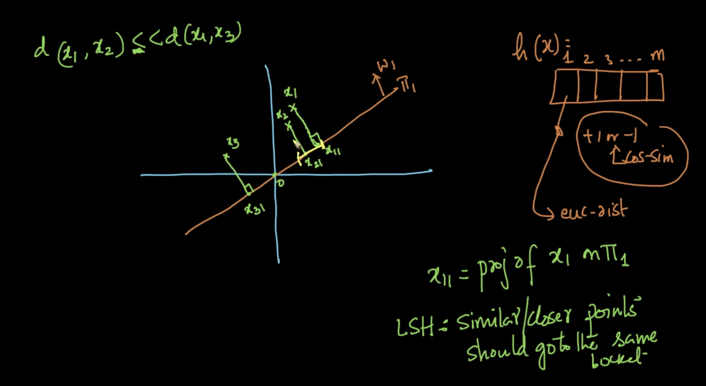

We'll divide the $\pi$ into segments.
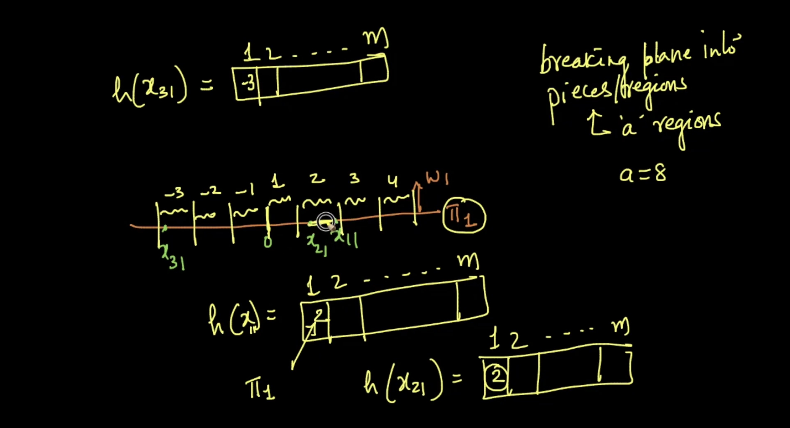
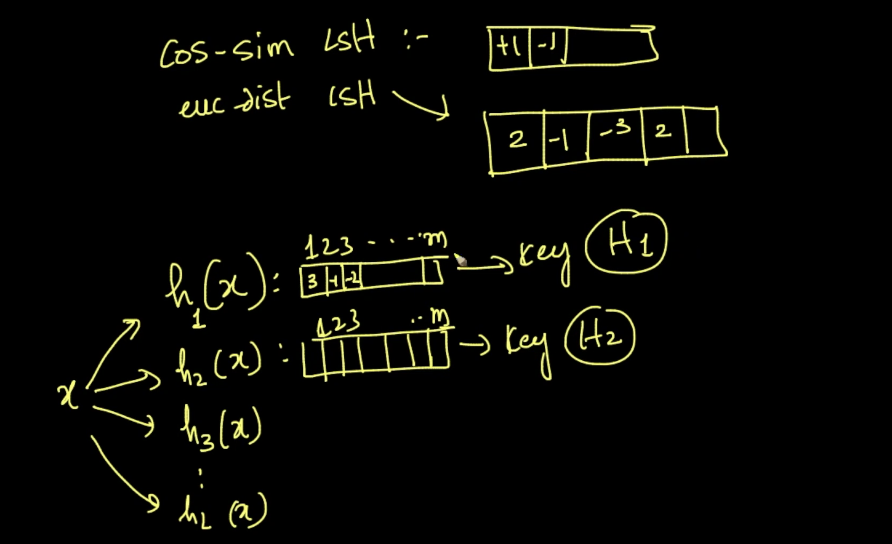

The two points which are in same group will be projected in the same segment/region.

####Edge cases:
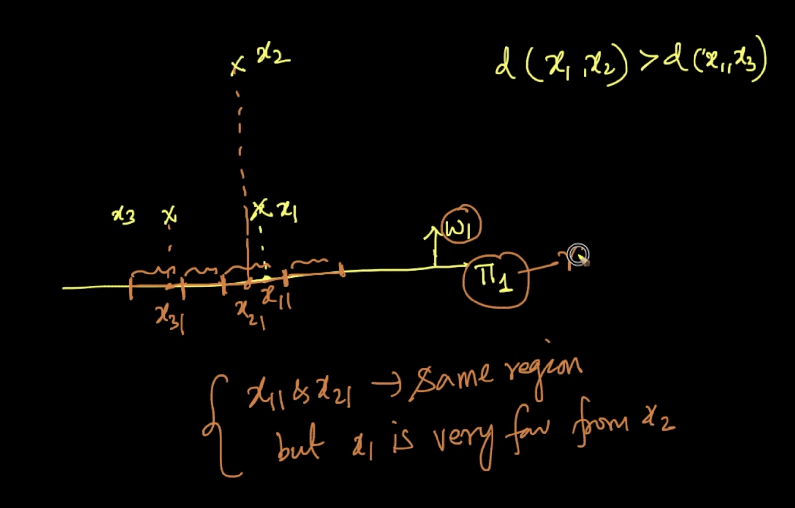

## Probabilistic class label

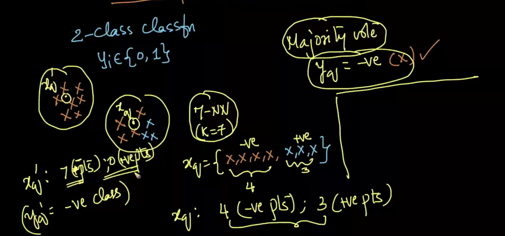

Consider these 2 cases, where one query point $x_q$ with 4 -ve and 3 +ve points and another query point $x_q'$ is surrounded by same class. For the second point, we can say that it is $y_q'$ -ve point. But not for first point as -ve $y_q$  & it is not fair.

**Instead we can give answer as probability**,
$P(y_q=-ve) = \frac{4}{7}$
$P(y_q'=-ve) = \frac{7}{7}$

## Interview questions
In k-means or kNN, we use euclidean distance to calculate the distance between nearest neighbours. Why not manhattan distance ?([https://www.analyticsvidhya.com/blog/2017/09/30-questions-test-k-nearest-neighbors-algorithm/](https://www.analyticsvidhya.com/blog/2017/09/30-questions-test-k-nearest-neighbors-algorithm/))

How to test and know whether or not we have overfitting problem?([https://www.appliedaicourse.com/course/applied-ai-course-online/lessons/how-to-determine-overfitting-and-underfitting/](https://www.analyticsvidhya.com/blog/2017/09/30-questions-test-k-nearest-neighbors-algorithm/))

How is kNN different from k-means clustering?([https://stats.stackexchange.com/questions/56500/what-are-the-main-differences-between-k-means-and-k-nearest-neighbours](https://www.analyticsvidhya.com/blog/2017/09/30-questions-test-k-nearest-neighbors-algorithm/))

Can you explain the difference between a Test Set and a Validation Set?([https://stackoverflow.com/questions/2976452/whats-is-the-difference-between-train-validation-and-test-set-in-neural-netwo](https://www.analyticsvidhya.com/blog/2017/09/30-questions-test-k-nearest-neighbors-algorithm/))

How can you avoid overfitting in KNN?([https://www.appliedaicourse.com/course/applied-ai-course-online/lessons/how-to-determine-overfitting-and-underfitting/](https://www.analyticsvidhya.com/blog/2017/09/30-questions-test-k-nearest-neighbors-algorithm/))

[https://www.analyticsvidhya.com/blog/2017/09/30-questions-test-k-nearest-neighbors-algorithm/](https://www.analyticsvidhya.com/blog/2017/09/30-questions-test-k-nearest-neighbors-algorithm/)
