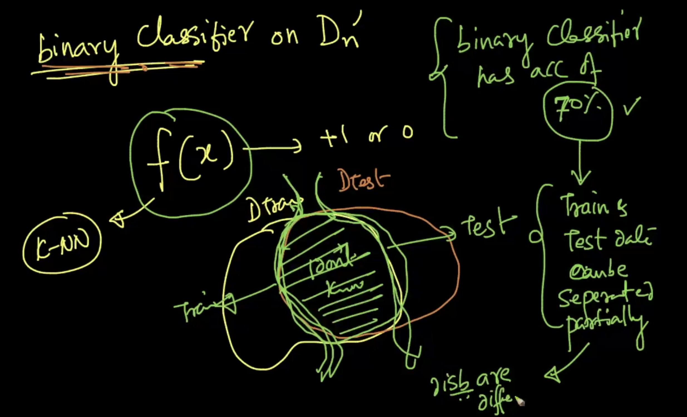

#Classification algorithms in various situations

<script src="https://code.jquery.com/jquery-3.6.0.min.js" ></script>
<script src="../toc.js" ></script>
<div id='toc'></div>

## Imbalanced vs balanced dataset

Consider **2-class classification** with $n_1$ $+ve$ points and $n_2$ $-ve$ points in dataset $D_n$.

if $n_1\sim n_2$ : Balanced dataset
if $(n_1\ll n_2)$ or $(n_1\gg n_2)$ : Imbalanced dataset
if $(n_1=5\%\ of\ n)$ or $(n_2=5\%\ of\ n)$ : Severely Imbalanced dataset. For KNN, severly imbalanced dataset will cause problems.

We can get **very high accuracy** with the imbalanced dataset. It's because that if the model is more prone to the majority class and it'll contribute to the more accuracy.

### How to work around this?

1. **Undersampling** : $D_n$ with 1000 points, $n_1=100$ (+ve) and $n_2=900$ (-ve). Use sampling technique to create a new dataset such that $n_1'=100$ annd $n_2'=100$. So, new dataset $D_n'$ is of size $200$. As we lose much data in $n_1$, the model _may not work well_. **Throwing away data must be avoided**
2. **Oversampling** : $D_n$ with 1000 points, $n_1=100$ (+ve) and $n_2=900$ (-ve). We'll create a new dataset with $800$ more data points in $n_1$ (by the method of **repeating**). So, new dataset $D_n'$ is of size $1800$. Or we can create **artificial or synthetic points**, with new points within the smaller region (using **extrapolation**).
3. **class weight** : $D_n$ with 1000 points, $n_1=100$ (+ve) and $n_2=900$ (-ve). Here we'll give **more weight to minority class** and less weight to the majority class. $w_1=9$ and $w_2=1$ (just the ratio). So whenever we find $+ve$ point, we'll count it as 9 rather than 1 (due to the weight). It is similar to **repeating the points**


_***OVERSAMPLING IS PREFERRED OVERALL***_

## Multiclass classification

Example is MNIST database where $y_i\ \epsilon\ \{0,\ 1,\ 2\ ...\ 9\}$

Consider **7-NN** with **c-classes** and for $x_q$ the result is $[0,6,1,...0]_{c}$. We can take majority vote and say that $x_q$ belongs to class $c_2$. In probabilistic classifier, $P(q=c_2)=6/7$ and $P(q=c_3)=1/7$.

Not all classifiers will work easily as KNN to classify multiclass. _So can we convert the multiclass classification problem into binary class classification_?

$y_i\ \epsilon\ \{1,2,3\ ..\ c\}$ for the dataset $D_n$
1) $D_n\ \longrightarrow\ \{x_i,y_i | y=1\}$ or $\{x_i,y_i | y\neq1\}$ It is a binary classifier
2) $D_n\ \longrightarrow\ \{x_i,y_i | y=2\}$ or $\{x_i,y_i | y\neq2\}$
3) $D_n\ \longrightarrow\ \{x_i,y_i | y=3\}$ or $\{x_i,y_i | y\neq3\}$
And so on. It goes upto $c$ classes with **c-binary classifiers**. It is **one vs rest multiclass classification**. Time and space complexity will increase as usual.

##k-NN, given a distance or similarity matrix

Consider a case where we can't convert an input into vector (like pharma medicals). But we can pharmacist to know the similarity of 2 medicals (say $s_i,s_j$). They can say it. So we can create a matrix with size $n$x$n$ (from $s_0$, $s_1$, $s_2$ to $s_{n-1}$ as rows and columns). Fill that matrix. Now it'll give how similar each medical is to each other. $S_{ij}$ represent the similarity of 2 medicals $s_i$ and $s_j$. We can take the **inverse of those values in the matrix as distances** (because as similarity increases, the distance between the vectors decreases and vice versa). Now, we can apply **knn** on that matrix.

## Train and test set differences
In Amazon find food reviews, we did **time based splitting** for train_test_split, because the products may improve over time and new categories will be added, old categories will be removed. So it is essential to have train and test dataset from same kind of distribution for our model to work.

To check this, we'll create 2 datasets.
1. With $D_{train}$ and $y_i=1$ and $x_i=(x_iy_i)$
2. With $D_{test}$ and $y_i=0$ and $x_i=(x_iy_i)$
3. Do the binary classification between them.

If they are separable with **good accuracy**, then it means that the **features are changing over time** and they are not stable. Find **good features** for the model to work with.

But if they have **less accuracy**, then it means that **the distributions of train and test dataset is very similar** and we can't separate them. Our model will work good on it.





## Impact of outliers
model(f) $\simeq$ decision surface

If **k is small**, it is very prone to outliers and the accuracy will be more. So if 5 k's have same accuracy (k=1,2,3,4,5), then we can choose the highest k (k=5) among them as it is less prone to outliers.

Or, remove the outliers using **Local Outlier Factor (LOF)**.

### Local Outlier Factor

**_Simple solution :_** Mean distance to knnn


$x_1$ and $x_2$ are outliers and distant from the clusers $c_1$ and $c_2$. The avg distance of **5-NN** for $c_1$ cluster points is $d_1$, for $c_2$ cluster points is $d_3$, point $x_1$ is $d_2$ and point $x_2$ is $d_4$.

Steps :
1. For every point $x_i$, compute it's **(k=5)-NN**
2. Compute avg distance from $x_i$ to it **5NN**
3. Sort $x_i's$ based on the avg distance. If the avg distance is higher, then it is an outlier.

But this solution won't work as it'll remove $x_2$ and the cluster $c_2$. And this won't declare $x_1$ as outlier. Instead we'll find the **local density**.

----

###some terms

**kth distance**, $k\_distance(x_i)$ = distance to the $k_{th}$ nearest neighbour (obtained from KNN) of $x_i$ from $x_i$. It'll be the element which is further way in the k neighbours.

**Neighbourhood**, $N_{k=5}(x_i)$ = Neighbourhood of $x_i$ = {$x_1$, $x_2$, $x_3$, $x_4$, $x_5$}

**Reachability-Distance(A,B)**, $reachability\_distance(x_i,x_j)=max(k\_distance(x_j), dist(x_i,x_j))$
If $x_j$ belongs to the neigbourhood of $x_i$, then we'll have the reachability distance as $k\_distance(x_j)$, otherwise we'll have value as $dist(x_i, x_j)$. At the end, we'll have a max value.


**LRD (i.e) Local reachability-density(A)**
$lrd(x_i)=(\sum_{x_j\epsilon\ N(x_i)}\{\frac{reach\_dist(x_i, x_j)}{|N(x_i)|}\})^{-1}$ where $|N(x_i)|$ represents the no of neighbour elements for $x_i$ and it need not always be $k$ because we can have 2 elements at same distance from the point. The denominator terms is almost like average reachability distance of $x_i$ from it's neighbours.

So **LRD** is **inverse of average reachability distance of** $x_i$ **from it's neighbours**.


**Local outlier factor(**$x_i$**)** = $\frac{\sum_{x_j\ in\ N(x_i)}lrd(x_j)}{|N(x_i)|}$*$\frac{1}{lrd(x_i)}$
LOF is large if $lrd(x_i)$ is small or first term multiplier is large (i.e.)  (lrd) density is small for the point $x_i$ compared to it neighbours.
So, if LOF is large, it is **outlier** otherwise it is **inlier**.


**_Steps_**
1) Find LOF of all points
2) remove the points which has high LOF. And how many points will be depending on us. It is a subjective decision. Usually in all applications, outlier will be in **5% range**.

Since there is no range for LOF values, so there is **no interpretability or hard to interpret**.

```
x_pve = np.linspace(1,10,10)
y_pve = [x%4 for x in x_pve]
x_nve = np.linspace(11,20,10)
y_nve = [x%4 for x in x_nve]
class_p = [1 for x in range(len(x_pve)+1)]
class_n = [-1 for x in range(len(x_nve)+1)]

## Outlier
x_pve = np.concatenate((x_pve, 40), axis=None)
y_pve = np.concatenate((y_pve, 3), axis=None)
x_nve = np.concatenate((x_nve, -11), axis=None)
y_nve = np.concatenate((y_nve, 0), axis=None)

X = np.concatenate((x_pve, x_nve))
Y = np.concatenate((y_pve, y_nve))
C = np.concatenate((class_p, class_n))

data = np.array([[x,y,c] for x,y,c in zip(X,Y,C)])

fig, axes = plt.subplots(1,1)
knn_plot(data, axes, k_val=1)
plt.show()
```


```
lof = LocalOutlierFactor(n_neighbors=3)
fp = lof.fit_predict(data[:,0:2])
print(fp)
print(lof.negative_outlier_factor_)
filtered_data = data[np.where(fp == 1)]
fig, axes = plt.subplots(1,1)
knn_plot(filtered_data, axes, k_val=1)
plt.show()
```


## Impact of Scale & Column standardization

Scale difference : 2 features in a data is in different range (like one feature in range 0-100 and another one in 0-1). It affects many parameters like euclidean distance.

Column standardization :
Say for a row '$x_{i}$' and it's feature $a$ , $a'=\frac{a-\mu_a}{\sigma_a}$

## Interpretability

Training : $D$ $\longrightarrow$ $f$
Black box model Prediction : $x_q$ $\rightarrow$ $f$ $\rightarrow$ $y_q$ (class label)

Say it is for cancer prediction, doctor can't simply conclude that the patient has cancer or not. He **needs reasoning** (like feature 4's value is very high and feature 6's value is very low).

Interpretable model prediction : $x_q$ $\rightarrow$ $f$ $\rightarrow$ $y_q$ (class label and reasoning)

In KNN with k=7, we can say reasoning as "all 7 neighbours has the value 1". So KNN is interpretable when k is reasonably small.

**Interpretability is important for all classification techniques.**

## Feature Importance and Forward Feature selection

10 features $f_1$ to $f_{10}$ with $n$ points

**Feature importance** : sorting features by their importance. Helps in understanding a model better for it's interpretability.

In KNN, can we get importance of features? We can't get it.

Given any model, we can use the technique **forward feature selectionn** technique to find the top features among **d features**.

We have split the data into test & train dataset and choose to use **KNN** (but not yet done)

_Step 1:_
{$f_1$, $f_2$, $f_3$, ... $f_d$}
Use only $f_1$ to build model and get the **test accuracy** $a_1$
Then use only $f_2$ to build model and get the **test accuracy** $a_2$
...
Then use only $f_d$ to build model and get the **test accuracy** $a_d$

The feature which gives the highest accuracy, will be more important. Say $f_{10}$

_Step 2:_
Use only $f_1$ & $f_{10}$ to build model and get the **test accuracy** $a_1$
Then use only $f_2$ & $f_{10}$ to build model and get the **test accuracy** $a_2$
...
but not $a_{10}$
...
Then use only $f_d$ & $f_{10}$ to build model and get the **test accuracy** $a_d$

The feature which gives the highest accuracy, will be more important. Say $f_{5}$. SO we choose $f_{10}$ and $f_5$ are top 2 features.

Keep repeating it **d** times. **At each stage, we are asking, given that I already have some features which new features will add most value to my model.**

**In backword feature selection, we'll remove the least important feature which drops the accuracy**.

It is _***very time consuming***_.

##Handling categorical and numerical features

features = {weight, hair color, country, age}
predict = {height}

**weight** :
Numerical feature. So we can leave it as such

**hair color** :
Categorical feature : set {black, brown, golden, grey, red}. Convert it to a numeric value.
We can give number 1,2,3,4,5. But we are introducing order between them like 1<2 or 4>2.
So we'll use **one hot encoding**. We'll create 5 binary features/vector. When one feature takes value 1, others will take 0. With this, there is no comparison between different values of hair color.

In case the feature is categorical and they are on **logical order**. Say for reviews very good, good, avg, bad, worst as values in the feature, we can convert them to numeric 5,4,3,2,1 correspondingly.

**Country:**
Categorical feature. We may have 200 values in this. We'll create 200 features. This increases the dimension. In this case, **One hot encoding** will create **sparse and large vector**.
**Instead we can replace this feature with the _average value of height_ or _distance from India_, of that particular country in that row.** But this depends on each use case and domain knowledge.

##Handling missing values by imputation

It is very common in all the cases.

1) **Imputation** : Replace value with something else (mean, median, mode). Mode is the most frequent values. Do it based on the class label (i.e) take mean/median for that particular class and populate it.

2) **New missing value feature:** For the features with missing values, **fill it with imputation** method. And for that feature, **create new boolean feature with value 0/1**. If a particular row doesn't have that feature, we'll fill it up with 1 else 0.

3) **Model based imputation** : Ignore $y$, use regression/classification model to find the missing values of that particular feature by having training set as non empty rows and test set as missing rows. **KNN** is best used for this.

## curse of dimensionality

When $d$ (dimensionality) is high

1) **_ML :_**
Consider 3 boolean features, we have $2^3=8$ combination of data
Consider 10 boolean features, we have $2^{10}=1024$ combination of data

So as dimensionality $\uparrow$, the data required to make a well trained model **increases exponentially**, because we need data in all possible combinations.

***Hughes phenomenon :***
When size of dataset is fixed as $n$, **the predictive power decreases as dimensionality increases**.

2) **_Distance Functions :_**
Especially euclidean distance. Intuition of euclidean distance in 3D is not valid in higher dimensions.

$dist\_min(x_i) = min_{x_j \neq x_i} \{euclidean\_dist(x_i,x_j)\}$
$dist\_max(x_i) = max_{x_j \neq x_i} \{euclidean\_dist(x_i,x_j)\}$

$\frac{dist\_max(x_i)-dist\_minn(x_i)}{dist\_min(x_i)}>0$ in 1D, 2D, 3D

as $d$ increases, by calculus, **above value tends to zero**. It is because those points in higher dimension are **equally distant from each other**. KNN doesn't work so good in higher dimension. Instead we can use **cosine similarity** (as it is less affected in higher dimension compared to the euclidean distance).

In case of **sparse data**, higher dimension won't affect that much as the dense data.

3) **_Overfitting & Underfitting:_**

As dimensionality $\uparrow$, overfitting $\uparrow$ in KNN.

Pick most useful features using **forward feature selection** or use **PCA** or **t-sne**.

##Bias-Variance tradeoff

In KNN, $k=1$ it is overfitting.
In KNN, $k=n$ it is underfitting.

Generalization error is the error on future unseen data. Mathematicians told that
**Generalization error =** $Bias^2+variance+irreducible\ error$ for the model $m$

$Bias^2\ \rightarrow$ due to **simplifying assumptions** (**underfitting**)
$variance\ \rightarrow$ how much a model changes when training data changes. Small changes in training dataset, result in very different model. It is a **high variance (overfit) model**.
$irreducible\ error\rightarrow$ we can't reduce the error further for a given model

We need to find the right balance by **bias variance trade off**.

### Intuitive understanding
train error $\uparrow$ , it has more Bias (underfit) $\uparrow$
train error $\downarrow$ & test error $\uparrow$, it has more variance (overfit) $\uparrow$. Or training data changes lightly, model changes leading to overfit problem.

##best and worst case of algorithm

**KNN is Good** when
1. dim $d$ is small. Runtime is low when d is low
2. When we know what distance measure works good for the type of the data we have. For genome data, we can use hamming distance.
3. If someone gives us similarity/distance matrix, we can use it.

**KNN is bad** when
1. we need Low latency system (i.e.) we can predict fast.
