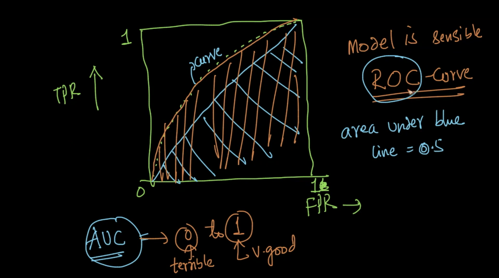
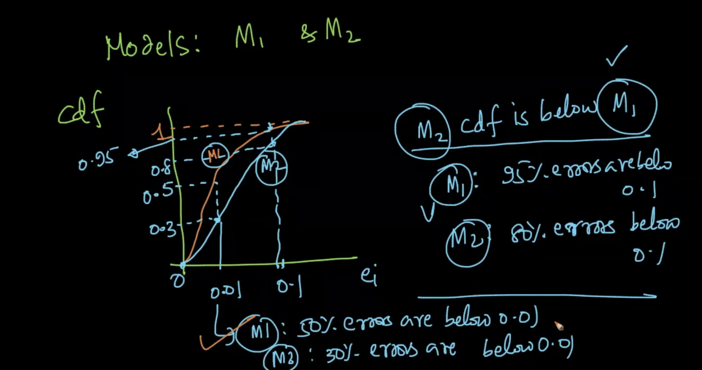

#Performance measurement of models

# For Classification
## Accuracy

Accuracy = $\frac{\#\ correctly\ classified\ points}{Total\ \#\ points}$

$0\leq value\leq1$, with $0$ being bad and $1$ being good. It is taken as percentages.

**_Problems with accuracy:_**
1) With **imbalanced dataset** and not well trained model (which gives output of the large population), we'll get high accuracy, but it is not the case.

2) If 2 models returns the probability score (like below), they have both the same $\hat{y}$ and we knnow that $m_1$ is better than $m_2$. But the accuracy measure can't say this conclusion. So, it can't process **probability scores**.

|x|y|$m_1$|$m_2$|$\hat{y_1}$|$\hat{y_2}$|
|---|---|---|---|---|---|
|$x_1$|1|0.9|0.6|1|1|
|$x_2$|1|0.8|0.65|1|1|
|$x_3$|0|0.1|0.45|0|0|
|$x_4$|0|0.15|0.48|0|0|

## Confusion matrix
Can't process **probability scores**.

|**pred** $\downarrow$ \\ **actual**$\rightarrow$|0|1|
|---|---|---|
|0|a (TN)|b (FN)|
|1|c (FP)|d (TP)|

$a$ is the no of predictions we got for the actual class '0' how of the data we **correctly** classified as '0' (**True Negatives (TN)**)
$b$ is the no of predictions we got for the actual class '1' how of the data we **incorrectly** classified as '0' (**False Negatives (FN)**) (ie) wrongly predicted as **negatives**
$c$ is the no of predictions we got for the actual class '0' how of the data we **incorrectly** classified as '1' (**False Positives (FP)**)
$d$ is the no of predictions we got for the actual class '1' how of the data we **correctly** classified as '1' (**True Positives (TP)**)

It can be extended to **c-classes**

All the **principle diagonal elements must have high values** and others (**off diagonal elts**) to be small values for a **model to be a good one**.

Total no of positives **P** = **TP** + **FN**
Total no of negatives **N** = **TN** + **FP**

True positive Rate (TPR)/**Sensitivity** = $\frac{TP}{P}$ $\longrightarrow$ probability that an actual positive will test positive
True Negative Rate (TNR)/**Specificity** = $\frac{TN}{N}$ $\longrightarrow$ probability that an actual negative will test negative
False Positive Rate (FPR) = $\frac{FP}{N}$  $\longrightarrow$ probability that a true negative will be missed by the test
False Negative Rate (FNR) = $\frac{FN}{P}$ $\longrightarrow$ probability that a true positive will be missed by the test

Why they are important?

Let's take dataset with 900 $-ve$ and 100 $+ve$ points.

|**pred** $\downarrow$ \\ **actual**$\rightarrow$|0|1|
|---|---|---|
|0|850 (TN)|6 (FN)|
|1|50 (FP)|94 (TP)|

P = 100
N = 900

TPR = 94% $\uparrow$
TNR = 94.44% $\uparrow$
FPR = 5.55% $\downarrow$
FNR = 6/100 = 6% $\downarrow$
So, with TPR & TNR $\uparrow$ and FNR & FPR $\downarrow$, the **model is good**.

### With dumb model

|**pred** $\downarrow$ \\ **actual**$\rightarrow$|0|1|
|---|---|---|
|0|900 (TN)|100 (FN)|
|1|0 (FP)|0 (TP)|

TPR  = 0%
TNR = 100%
FPR = 0%
FNR = 100%

TPR is very small and so model is dumb.
We can use this for **imbalanced dataset**.

### Precision, Recall & F1-score

For Information retrieval. Eg. In the search result, we need **precision** of the matching result. We can only about the **positive class**

Precision, $Pr=\frac{TP}{TP+FP}$, $0\leq Pr \leq 1$
It states that **Of all the points the model predicted to be positive, what percentage of data are originally posistive?** It cares only about the positive class.

Recall (or TPR or Sensitivity), Re = $\frac{TP}{P}$, $0\leq Re \leq 1$
It states that **Of all the actual positive points, how many of those points are correctly predicted by the model?** It cares only about the positive class.

We want **precision** and **recall** to be high. **F1-score** is based on both of them.

**F1-score** = $\frac{2}{(\frac{1}{pr}+\frac{1}{re})}$= $2*\frac{pr*re}{pr+re}$

It is the harmonic mean.

F1-score is $\uparrow$ if precision is $\uparrow$ and recall is $\uparrow$. Good way to measure the performance. We can't interpret this value but high value is good.

##Receiver Operating Characteristic Curve (ROC) and AUC - for binary classification

|$x$|$y$|$\hat{y}$|
|---|---|---|
|$x_1$|1|0.95|
|$x_2$|1|0.92|
|$x_3$|0|0.80|
|$x_4$|1|0.76|
|$x_5$|1|0.71|

After sorting the $\hat{y}$, we'll apply thresholding ($\tau_1$)

Above that threshold, assign all the $\tilde{y}_{\tau_1}$ as $1$ ($+ve$)

|$x$|$y$|$\hat{y}$|$\tilde{y}_{\tau_1}$|
|---|---|---|---|
|$x_1$|1|0.95|1|
|$x_2$|1|0.92|0|
|$x_3$|0|0.80|0|
|$x_4$|1|0.76|0|
|$x_5$|1|0.71|0|

calculate $TPR_1$ & $FPR_1$ for this $\tau_1$. Repeat the same for the next $\hat{y}$ value 0.92 .

|$x$|$y$|$\hat{y}$|$\tilde{y}_{\tau_1}$|$\tilde{y}_{\tau_2}$|
|---|---|---|---|---|
|$x_1$|1|0.95|1|1|
|$x_2$|1|0.92|0|1|
|$x_3$|0|0.80|0|0|
|$x_4$|1|0.76|0|0|
|$x_5$|1|0.71|0|0|

calculate $TPR_2$ & $FPR_2$ for this $\tau_2$

Repeat this for all points.

Plot the graph with $FPR$ in $x-axis$ and $TPR$ in $y-axis$.

**Disadvantages:**
1. Area under AUC doesn't work well for imbalanced data
2. AUC is not dependent $\hat{y}$ score instead they rely on the sorted values. So two models may result in the same order of the data.
3. For a random binary model (i.e random class for a x), then ROC of the model is diagonal with AUC as 0.5
4. AUC below 0.5 means, it is very worst model. Now, we can swap/switch the values of $\hat{y}$ which will result in AUC greater than 0.5

Read this [https://developers.google.com/machine-learning/crash-course/classification/roc-and-auc](https://developers.google.com/machine-learning/crash-course/classification/roc-and-auc)

Hear this : [https://soundcloud.com/applied-ai-course/why-auc](https://soundcloud.com/applied-ai-course/why-auc)

_**Pros on:**_
1. AUC is **scale-invariant**. It measures how well predictions are ranked, rather than their absolute values.
2. AUC is **classification-threshold-invariant**. It measures the **quality of the model's predictions** irrespective of what classification threshold is chosen.

**_Cons on:_**
1. Scale invariance is **not always desirable**. For example, sometimes we really do need well calibrated probability outputs, and AUC won’t tell us about that.
2. **Classification-threshold invariance is not always desirable**. In cases where there are wide disparities in the cost of false negatives vs. false positives, it may be critical to minimize one type of classification error. For example, when doing email spam detection, you likely want to prioritize minimizing false positives (even if that results in a significant increase of false negatives). AUC isn't a useful metric for this type of optimization.

##Log-loss

It uses the **probability scores**.

For Binary classification :

|$x$|$y$|$\hat{y}=p$|- log loss term|
|---|---|---|---|
|$x_1$|1|0.9|0.0457|
|$x_2$|1|0.6|0.22|
|$x_3$|0|0.1|0.0457|
|$x_4$|0|0.4|0.22|

Given a test set of n points,

$log\_loss=\frac{-1}{n}\sum_{i=1}^n(log(p_i)*y_i + log(1-p_i)*(1-y_i))$ with values ranges from $0\ to\ \infty$

If $p_i$ close to 1, log loss term of that input is very low and vice versa. It penalizes for the small deviations in the probabilities. 

We want **log loss to be small & close to zero** and we **can't interpret** the value of log loss. It is because of the below graph

### For multiclass

$log\_loss=\frac{-1}{n}\sum_{i=1}^n\sum_{j=1}^clog(p_{ij})*y_{ij}$ where $y_{ij} = 1$ if $x_i$ is the class label $c_j$ otherwise 0

-----

# For Regression

Here $y\ \epsilon\ R^d$

## R^2 or co-eff of determination

Error, $e_i=y_i-\hat{y_i}$
$|e_i|$=0 (i.e) it is good. Greater the value of $e_i$, it is bad.

having error as $e_i$ is not meaningful as we did in binary classification.

Mean Squared error (MSE) = $\frac{1}{n}\sum_{i=1}^ne_i^2$

Sum of squares, $SS_{total}=\sum_{i=1}^n(y_i-\bar{y})^2$ where $\bar{y}$ is the mean of $y$

Residue error, $SS_{res}=\sum_{i=1}^n(y_i-\hat{y_i})^2$

$R^2=1-\frac{SS_{res}}{SS_{total}}$

_Case 1 :_ When $SS_{res}=0$, $R^2=1$ .. Very good model
_Case 2 :_ When $SS_{res}<SS_{total}$, $0 \leq R^2\leq 1$ .. Closer to 1, model is better. closer to 0, model is bad.
_Case 3 :_ When $SS_{res}=SS_{total}$, $R^2=0$ Model is same as **simple mean model**. In the simple mean model, we'll predict for all values of $x_i$ as $y_i$ and return $\bar{y}$ when queried for $x_i$
_Case 4 :_ When $SS_{res}>SS_{total}$, $R^2 < 0$. It means that the model is worse than the simple mean model.

Problem here is that, **if we have outliers, it'll affect the $SS_{res}$. It is not robust to outliers**. So we can use MAD

##Mean Absolute Percentage Error (MAPE)

MAPE = $\frac{1}{n} \sum_{i=1}^n|\frac{e_i}{y_i}|$

What happens when $y_i=0$, we can replace $y_i$ with $\bar{y}$
Modified MAPE = $\frac{1}{n} \sum_{i=1}^n|\frac{e_i}{\bar{y}}|$ = $\frac{\sum_{i=1}^n|e_i|}{\sum_{i=1}^ny_i}$ (after simplifying)

##Median absolute deviation (MAD)

For an $x_i$, we have $y_i$, $\hat{y_i}$, $e_i$.

Consider the random variable $e_i$
Median($e_i$) = central value of all errors
MAD($e_i$) = $median(|e_i-median(e_i)|)$

**MAD is small, means error is low**

##Distribution of errors

For each $x_i$, we have $y_i$, $\hat{y_i}$, $e_i$.

We can use PDF & CDF of $e_i$'s to see how the errors are distributed.

Few errors are large values, most of the errors are of small values (closer to 0) $\implies$ model is good

From CDF, 99% of all errors are less than 0.1.

Model $M_1$ is better than the model $M_2$ as most of the error are of low value (as evident from **CDF**)
