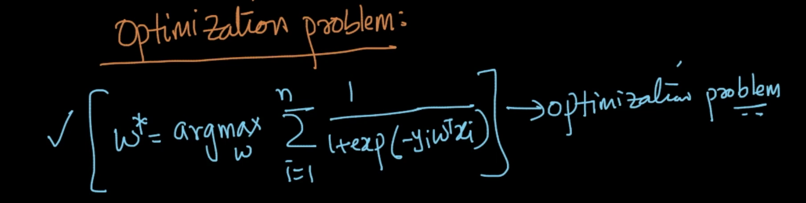

# Logistic Regression

<script src="https://code.jquery.com/jquery-3.6.0.min.js" ></script>
<script src="../toc.js" ></script>
<div id='toc'></div>

It is a classification technique. Geometrically very elegant algo. We can interpret it using Geometry, probability and loss-function.


$\pi$ = $w^TX+b$ = 0 (b=0 if the hyperplane passes through the origin)
$X,w\ \epsilon\ R^d$ and $b$ is scalar

***Logistic regression assumes that the data is almost or fully linearly separable***

Now our task is to find the best hyperplan which separates the +ve (y=1) and -ve (y=-1) classes.


$d_i$ = $w^Tx$ > 0 as $x_i$ is in the same direction of $w$ and $w$ is a unit vector
$d_j$ = $w^Tx$ < 0 as $x_j$ is in the opposite direction of $w$

Based on the decision surface (hyperplane)
if $w^Tx>0$, then $y_i=1$ (mean $x$ is a +ve point)
else if $w^Tx<0$, then $y_i=-1$ (mean $x$ is a -ve point)

$y_i * w^Tx_i$ is a **signed distance**, we'll use it.

For
$y_i$ = 1 and $w^Tx_i>0$
(or)
$y_i$ = -1 and $w^Tx_i<0$

$y_i * w^Tx_i>0$ Then they are **correctly classified points**

But consider
$y_i$ = 1 and $w^Tx_i<0$
(or)
$y_i$ = -1 and $w^Tx_i>0$

$y_i * w^Tx_i<0$ Then they are **misclassified points**

Our goal is to maximise($w$) $\sum_{i=1}^Ny_i*w^Tx_i$ for the given dataset.
Optimal w, $w^*=\underset{w}{argmax}(\sum_{i=1}^Ny_i*w^Tx_i)$. It is a _**math optimization problem**_.


##Sigmoid function: Squashing


5 +ve and 5 -ve points are correctly classified. Only one -ve point is misclassified


5 +ve and 1 -ve points are correctly classified. 5 -ve points is misclassified. Accuracy is very less.


But our $\pi_1$ is the correct one and our signed distance fails in this one due to the **extreme outlier point** and it's max distance.
So, maximise($w$) $\sum_{i=1}^Ny_i*w^Tx_i$ is **wrong**.

So we'll do **squashing**.
What if signed distance is **large**, then we'll change it to a **smaller value**. But in case of small signed distance, keep it as it is.
$\sum_{i=1}^Ny_i*w^Tx_i$ $\rightarrow$  $\sum_{i=1}^Nf(y_i*w^Tx_i)$

This functionn $f(x)$ will take care of squashing. We can use the **sigmoid function** to achieve this.

$f(x)= \sigma(x)=\frac{1}{1+e^{-x}}$
$\sum_{i=1}^Ny_i*w^Tx_i$ $\rightarrow$  $\sum_{i=1}^Nf(y_i*w^Tx_i)$ $\rightarrow$  $\sum_{i=1}^N\sigma(y_i*w^Tx_i)$

This sigmoid function has **good probabilitistic interpretation** and **easily differentiable** (which is necessary for the optimization problem).
**Example:**
1. If the point is on the hyperplane, then sigmoid value is 0.5. It means that the probability of that being on one side is 50%
2. If that point is so much distance from the plane, it's probability is 99.999% bcoz $\sigma$ value gives 0.99999 value

If $y*w^Tx$ > 0, then it is +ve class otherwise -ve class.
We'll apply $\sigma(y*w^Tx)$ to find the **probability** of a class.



**Monotonic function** is such if x increases, g(x) also increases.
If g(x) is a monotonic function, then for $f(x)$ which could be any function (not necessarily be monotonic).
$\underset{x}{argmin}\ f(x)$ = $\underset{x}{argmin}\ g(f(x))$
$\underset{x}{argmax}\ f(x)$ = $\underset{x}{argmax}\ g(f(x))$

So, $w^*$ = $\underset{w}{argmax} \sum_{i=1}^Nlog(\sigma(y_i*w^Tx_i))$ because $log(x)$ is a monotonic function
= $\underset{w}{argmax} \sum_{i=1}^Nlog{\frac{1}{1+exp(-y_i*w^Tx_i)}}$
= $\underset{w}{argmax} \sum_{i=1}^N-log({1+exp(-y_i*w^Tx_i))}$

By Math, $argmax\ f(x)$ = $argmin\ -f(x)$
$w^*$ = $\underset{w}{argmin} \sum_{i=1}^Nlog({1+exp(-y_i*w^Tx_i))}$ where $log(1+exp(-y_i*w^Tx_i))$ is the **loss term**.
If we solve further, we'll get it as $argmax$ of sum of signed distances. But since they are prone to outliers, we are using the above equation for our **optimization problem** to find our optimal weight vector $w^*$. We'll write it as $w$

###Weight vector

vector, $w$ $\epsilon$ $R^d$. It is called **weight vector** because for each feature, it'll add a weight in $w^Tx$ calculation.

For query $x_q$, if $y*w^Tx_q$ > 0, then it is +ve class otherwise -ve class.
We'll apply $\sigma(y*w^Tx_q)$ to find the **probability** of a class.

_Interpretation:_
1. If $w_i$ is +ve, $x_q$ $\uparrow$, then $w_i*x_q$ $\uparrow$,  then $\sigma(w_i*x_q)$ $\uparrow$, $P(y_q=+1)$ $\uparrow$
2. If $w_i$ is -ve, $x_q$ $\uparrow$, then $w_i*x_q$ $\downarrow$,  then $\sigma(w_i*x_q)$ $\downarrow$, $P(y_q=+1)$ $\downarrow$ and $P(y_q=-1)$ $\uparrow$

##L2 Regularization: Overfitting and Underfitting
Let $z_i$ = $\frac{y_i*w^Tx_i}{||w||}$
$w^*$ = $\underset{w}{argmin} \sum_{i=1}^Nlog({1+exp(-z_i))}$

Always $exp(-z_i)$ > 0, so $log$ term is always > 0.
So minimal value of the full equation is zero. But when will it occur.

If $z_i \rightarrow \infty$, $exp(-z_i)\rightarrow 0$ then $log(1+exp(-z_i))\rightarrow 0$

If we pick $w$ such that
1. all points are correctly classified
2. $w$ is large $\rightarrow z_i\rightarrow\ \infty$
Then it is the best $w$. But this will **overfit the data**.

<br>
So, $w^*$ = $\underset{w}{argmin} \sum_{i=1}^Nlog({1+exp(-z_i))}+\lambda * w^Tw$
= $\underset{w}{argmin}$ (loss term + regularization term).
$w^Tw=||w||_2^2$ (L2 Norm distance)
Hence the "L2 regularization". WHen $w$ is large, we'll overfit the data, so we are adding the **regularization term** at the end. This will reduce the overfitting the data because if $w$ becomes large then first term (loss term) is zero and the regularization term becomes infinity. We need to minimize this term (which is our main objective from the beginning). So **need to find balance between the two terms**.

We need to find the proper value of $\lambda$ hyper parameter.
Case 1 : $\lambda$=0 $\rightarrow$ Overfit
Case 2 : $\lambda$=large value $\rightarrow$ Underfit


##L1 regularization and sparsity
Alternative to L2 regularization. Instead of L2 norm, we'll use L1 norm $||w||_1=\sum_{i=1}^d|w_i|$

$w^*$ = $\underset{w}{argmin} \sum_{i=1}^Nlog({1+exp(-z_i))}+\lambda * ||w||_1$
If we use this, all the unimportant feature's $w_i$ becomes 0. It has a very big advantage which is **sparsity**.


**Sparsity**
$w=<w_1, w_2, ... w_d>$
if many $w$'s are zero, then it is sparse. But why in L1 norm? We'll see it later.

We'll also use **elastic-net** where
$w^*$ = $\underset{w}{argmin} \sum_{i=1}^Nlog({1+exp(-z_i))}+\lambda_1 * ||w||_1+\lambda_2 * ||w||_2^2$


##Probabilistic Interpretation: Gaussian Naive Bayes

[https://www.cs.cmu.edu/~tom/mlbook/NBayesLogReg.pdf](https://www.cs.cmu.edu/~tom/mlbook/NBayesLogReg.pdf)
Refer section 3.1

Logistic Regression = Gaussian Naive bayes + Bernoulli

$w^*$ = $\underset{w}{argmin} \sum_{i=1}^N-y_ilog(p_i) + (1-y_i)log(1-p_i) + regularization\ term$
where $p_i=\sigma (w^Tx)$ and $y_i\ \epsilon \{0,1\}$

##Loss minimization interpretation


We'll use differentiation to solve optimization problem in calculus. So the loss function has to be a continuous to be solvable.

But in our case, error is either 1 or 0 and there is no value for $z_i=0$. So we can't minimize the function (using differentiation) but rather we can approximate it. We can make use of **logistic loss function**.


But it is not compulsory to make use of it.

We can also make use of **hinge loss function** and we get **SVM**.
We can also make use of **exponential loss function** and we get **AdaBoost**.
We can also make use of **squared loss function** and we get **Linear Regression**.


##Hyperparameter Search: Grid search and random search

Overfitting : $\lambda=0$
Underfitting : $\lambda=\infty$

It is a real number. So possible values are **infinity**.

We can make use of **Grid Search(Brute Force)**. We'll test $\lambda$ as [0.001, 0.05, 0.01, 0.5, 0.1, 1, 2, 3, 10, 100, 1000]. Plot the **train and cv error** and get the best hyperparam.

In case of elastic net, we'll set possible values for $\lambda_1$ and $\lambda_2$ and we'll run through all combinations.

As the no of hyperparameters increase, the model needs to be trained increases exponentially.

So we'll use the **randomized search** from the list of possible combinations of hyper parameters and find the best combo of hyper parameters. It is **faster** and **as good as gridsearch**.


##Column Standardization

$x_i=\frac{x_i-\mu}{\sigma}$

Mean centering and scaling.

for the same reason as we have seen before.


##Feature importance and Model interpretability

we have features : $[f_1,\ f_2\ ...\ f_d]$ with corresponding value of weight vector $[w_1,\ w_2,\ ...\ w_d]$

Assuming all features are **independent**, we can find the **feature independence** using $|w_i|$'s.

**case 1 :** $w_i$ is **positive & large**, then it's contribution to $w^Tx$ is **large** because $P(y_q=+ve)$ is higher
**case 2 :** $w_i$ is **negative & large**, then it's contribution to $w^Tx$ is **large** because $P(y_q=-ve)$ is higher


So, we can find the importance using $|w_i|$ of the list of features.


###Collinearity of features
what if the features are **not independent** and we **can't make use** of $|x_i|$ for the feature importance.

Consider $f_i$ and $f_j$ are dependent with
$f_i$ = $a*f_j+b$
Then $f_i$, $f_j$ are **colinear**

Consider $f_i$, $f_j$ and $f_k$ are dependent with
$f_i$ = $a*f_j+b*f_k+c$
Then $f_i$, $f_j$, $f_k$ are **multicolinear**


**The weight vector's value will be in the same linear relation as of the dependent features. So weight vector can't be used for feature importance.**

### How to check if the features are multi colinear or not?
**Pertubation technique.**

Find the weight vectors
$w=<w_1, w_2 ... w_d>$.

Then to all $x_{ij}$ add $\epsilon$ (small noise term), we are pertubating the value. Fit the model and find the weight vectors again.
$\tilde{w}=<\tilde{w_1}, \tilde{w_2} ... \tilde{w_d}>$.

If they **differ significantly**, then the features are **colinear** and we **can't make use** of $w_i$ for the feature importance.

Even we can make use of **forward feature selection**.

###Variance Inflation factor (VIF)

How to remove the unwanted multicolinear features? Using **VIF**

Using a single feature as $y$ and others as $x$s, find the linear model. Find the performance metric $R^2$. Then find the corresponding,
$VIF=\frac{1}{1-R^2}$

Compare all the $VIF$ values. If the VIF is large, then we can remove it. Basically for a feature, it is followed that if $VIF>5$, we can **remove it**.

```
#Pseudocode
for i,xi in enumerate(X):
	newX = all_column_except_xi
	newY = xi
	model = LinearRegression(newX,newY)
	y_pred = model.predict(newX)
	r2 = metrics.r2(newY,y_pred)
	vif[i] = (1/(1-(r2*r2)))
	
Remove features with vif > 5 (or check the higher VIF features)
```


##Train & Run time space & time complexity

Training LR (using Stochastic Gradient Descent) : $O(nd)$ with $n$ features and $d$ dimensions

Run time :
Space : $O(d)$ for saving the weight vector
Time : $O(d)$ for finding the value

If $d$ is **very very small**, it is **so good**. It is very **memory efficient**.

If $d$ is **very very large**, still it is good by using **L1 regularization** (as we will have removed unwanted features) for the proper $\lambda$ (after the bias-variance trade off). It is importannt for **low latency systems**


##Real world cases
We have hyper plane separating the points linearly.

### Imbalanced dataset
In case of imbalanced data, we'll do under/over sampling.


Here we can see that the model will try to find a hyperplane as distant as possible from the set of points to adjust with the data points of the majority class.

###Outliers
1. It can be handled using the **sigmoid** function.
2. People will find the $w^Tx$ after finding $w$. Remove the points which are farther. Then train and get the new $\tilde{w}$


###Missing values
We'll do the base techniques

###Multiclass
1. We'll do **one vs rest** methods.
2. MaxEnt models (extension to LR)
3. SoftMax classifier (deep learning)
4. Multinomial LR


What if we have similarity matrix?
Actually it won't work. But we have a model named **kernel LR** and it can be used.


##Non-linearly separable data & feature engineering


How do we know which transform to apply?
We need to visualize and take decision.

Another example


###Typical transformations
1. $f_1*f_2$, $f_1^2$, $f_1^3$, $f_1^2f_2$
2. Trigonometric functions
3. For boolean features : using logical operators
4. Other math functions : Log, exp, sigma etc.


###The most important in AI/ML is
1. Feature Engineering
2. Bias variance tradeoff
3. Data analysis and data visualization


##Extensions to Logistic Regression: Generalized linear models(GLM)


If we do different guesses, the model would vary to solve different problems.

Ref : Part III of [http://cs229.stanford.edu/notes2020spring/cs229-notes1.pdf](http://cs229.stanford.edu/notes2020spring/cs229-notes1.pdf)
