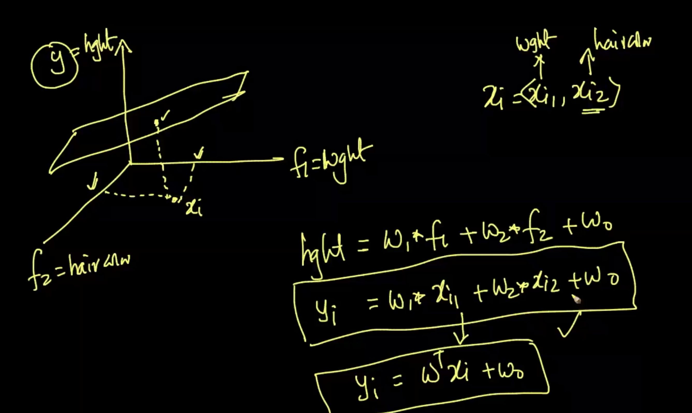
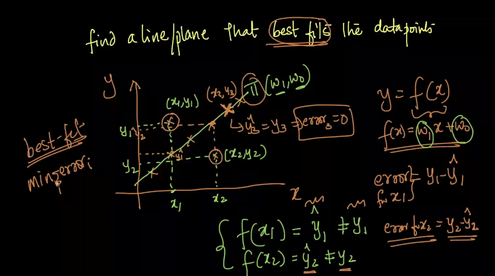
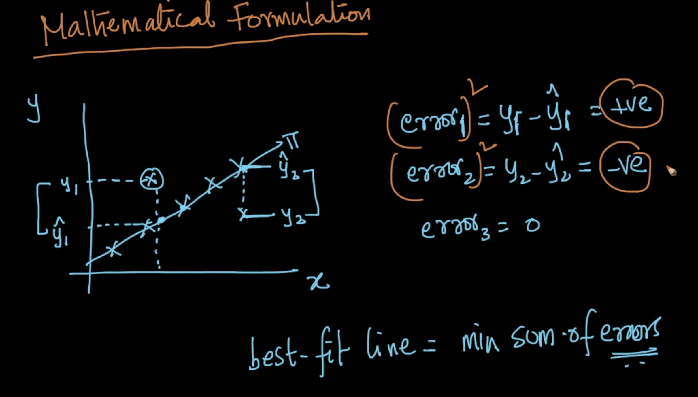
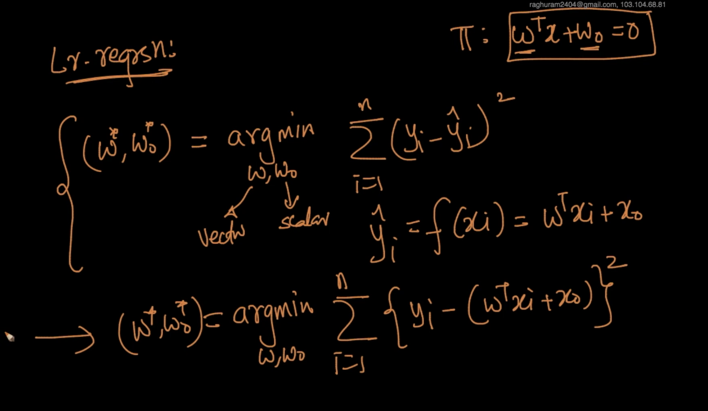
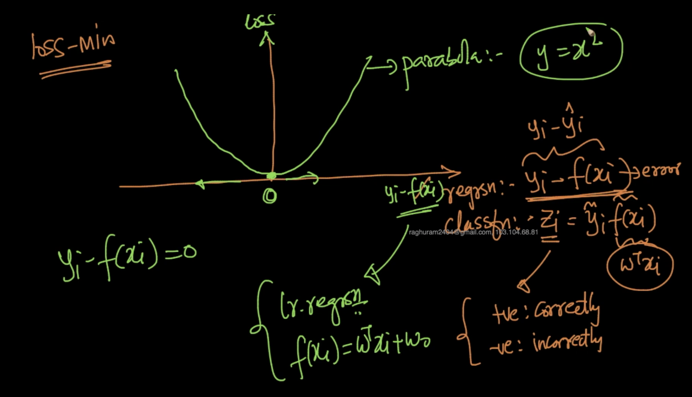
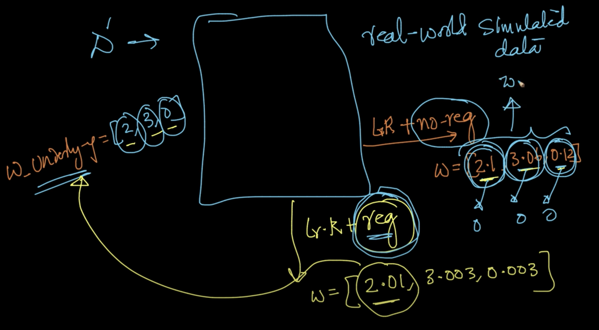

# Linear Regression

Actual Regression technique. Given $x_i$ and $y_i\ \epsilon\ R^d$ for n-data points, predict the value numerical $y_q$ for the $x_q$. Here, **find a line/plane/hyper plane** which **best fits the data as well as possible.**

## Mathematical Formulation

Linear regression : **Ordinary least squared**

Similar to logisitic regression, here we are **changing our error term** to solve our usecase. Error term, which is the loss term, is the sum of the squared errors. This loss is **squared loss**.

Find a $\vec{w}$ and $w_0$ such that we minimize the error
$\underset{w,w_0}{argmin}\sum_{i=1}^n(y_i-(w^Tx_i+w_0))^2$
This is an **optimization problem**.

We need to apply **regularization too** by having L2 reg or L1 reg or elastic net.

$\underset{w,w_0}{argmin}\sum_{i=1}^n(y_i-(w^Tx_i+w_0))^2+\lambda ||w||_2^2$ (for L2 regularization)

By loss minimization interpretation:

###Why to have regularization?
Consider a real linear related data with the below relation

$y_i=2*f_1\ +\ 3*f_2\ +\ 0*f_3$

When we use linear regression without any regularization, we may get these weights as **[2.12, 3.4, 0.42]**. It will cause the **overfit**.

This is because of the fact the all the real world input are not being sent as it is. For example, if a person's height is 174.78cm, it'll be entered as 174cm. So, when we have the **regularization** term, it'll **pull the weights down** to the closer one.

### Regularization
* L1 (makes the weight vector sparse)
* L2

##Real world Cases

1. Imbalanced data : Up/Down sampling
2. Feature importance and interpretability : if the features are not multi colinear, we can make use of the abs value of the weights.
3. Feature Engineering & transformation.

### Outliers
There is no control like Logistic Regression. Because it'll affect the squared error.

1. Find $w$ and $w_0$ using the $D_{train}$
2. Calculate the distance of all points using those $w$ and $w_0$
3. Then remove the farthest points
4. Train the model with the new datapoints

It is the **RANSAC** model. It can be used in usecases of many model.
