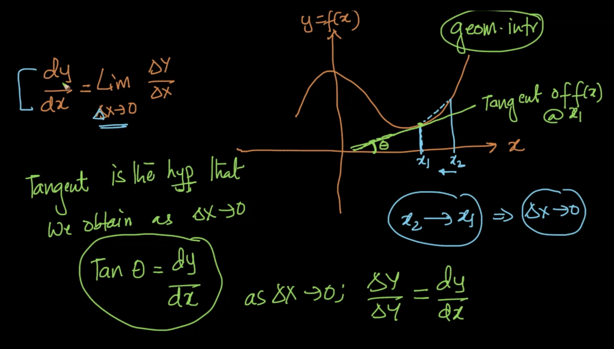
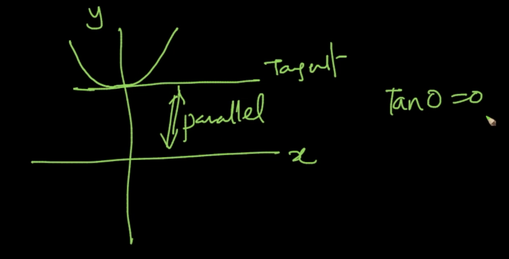
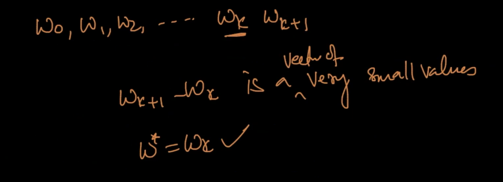
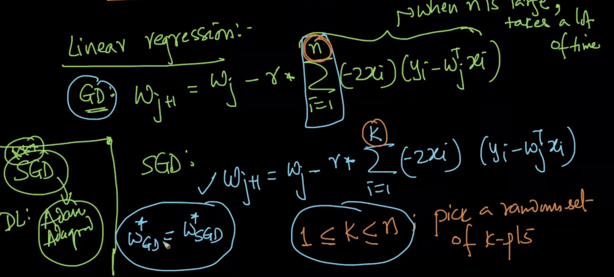

# Solving Optimiation Problems

We have seen it till now for PCA, linear and logistic regression. We'll use the basics of differentiation (scalar and vector) and concepts of maxima & minima.

## Single Variable Calculus (Scalar)

## Maxima and Minima

**At minima and maxima, the slope becomes zero.**

##Vector calculus: Grad

Solving this is very hard. So we'll use **Gradient Descent** to solve it without solving for $\frac{d(f(x))}{dx}=0$.

##Gradient descent: geometric intuition

##Learning rate

##Gradient descent for linear regression

There is a problem with this in case of **large dataset**.

##SGD algorithm

Correction : $k << n$

##Constrained Optimization & PCA

Correction : $S=Cov(X) =\frac{X_T*X}{n}$

##Logistic regression formulation revisited

##Why L1 regularization creates sparsity?

The speed at which the $-r*(2*w_{ij})$ is small for $L2$ but constant $1$ for $L1$ (making sparsity for L1 reg)

