#Decision Trees

##Geometric Intuition of decision tree: Axis parallel hyperplanes

|Model |type|
|---|---|
|KNN|**instance based method**|
|Naive Bayes| **Probabilitistic based**|
|Logistic regression, Linear Regression, SVM|**geometric & hyperplane based**|
|Decision tree| **nested if else classifier**|

We can take the **EDA** we have done for the **iris dataset** and we thought that if a petal length some **a**, then it's class is (say) **setosa**. So we can write it as **nested if else condition**.

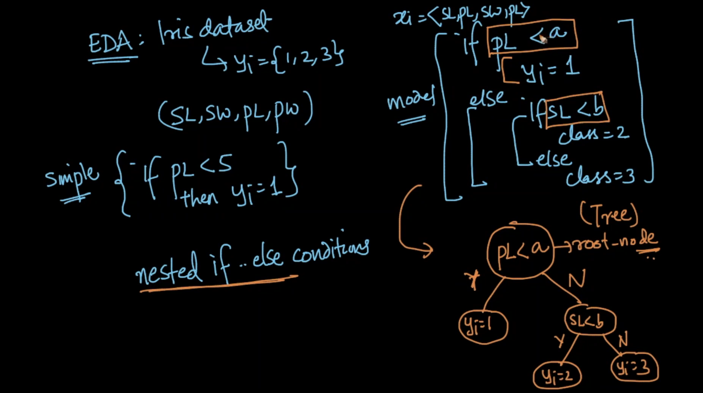

Converted the nested if else of decision we have taken, into a diagram as a **tree**. Non-leaf nodes are all **decisions**. The **leaf nodes** of the tree are the answer $y_i$ for the query $x_q$

So, it is **highly interpretable**.

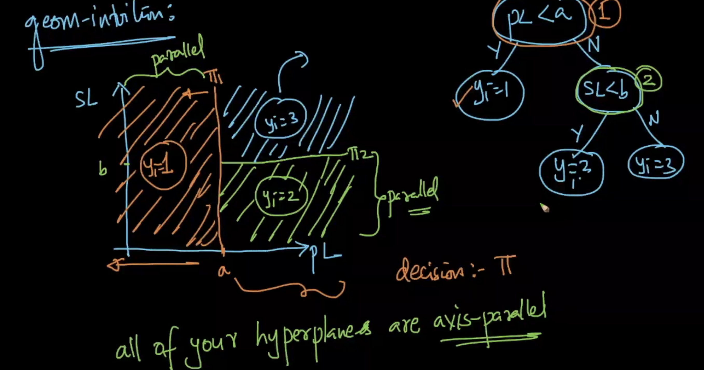

Corresponding to every decision, we'll have a **hyperplane**. For example: if we write as $pl<a$, we are separating the $pl$ space (like we have done for the KD-Tree with the median as hyperplane to separate). All of the hyperplane we got are **axis parallel to the corresponding feature**.

So, decision tree is a **geometrically** a set of axis parallel hyperplane separating the space into hypercuboids (in higher dimension) and **programatically** a set of nested if else statements.

###Simple example : Play Tennis
Ref : [https://homepage.cs.uri.edu/faculty/hamel/courses/2015/spring2015/csc481/lecture-notes/ln481-018.pdf](https://homepage.cs.uri.edu/faculty/hamel/courses/2015/spring2015/csc481/lecture-notes/ln481-018.pdf)

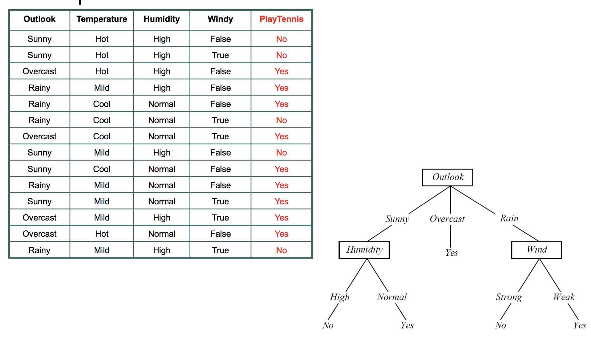

Big challenge is how to construct this decision tree?

##Building a decision Tree

$D_{train}\longrightarrow\ Decision\ Tree$

###Entropy

It is a concept from Physics and Information theory (we'll use this).

Take the random variable $Y\rightarrow\{y_1,y_2,\ ...\ y_k\}$ ($k$ possible values for the variable)
So, entropy of that random variable is
$H(Y)=-\sum_{i=1}^kP(y_i)log_b(P(y_i))$ where $b=2$ or $e$(which is 2.718) and $P(y_i) = P(Y=y_i)$
 

Eg: Let $Y$="Play Tennis", so {$Yes,No$}
So, P(y=$Yes$)=9/14 and P(y=$No$)=5/14
$H(Y)=-\sum_{i=1}^kP(y_i)log_b(P(y_i))$
&nbsp;&nbsp;&nbsp;&nbsp;&nbsp;&nbsp;&nbsp;&nbsp;&nbsp;&nbsp;$=\frac{-9}{14}lg(\frac{9}{14})+\frac{-5}{14}lg(\frac{5}{14})$
&nbsp;&nbsp;&nbsp;&nbsp;&nbsp;&nbsp;&nbsp;&nbsp;&nbsp;&nbsp;$=0.94$

####Properties
Let $Y\rightarrow\{y+,y-\}$
Case 1: 99% +ve points and 1% -ve points, $H(Y)=0.0801$
Case 2: 50% +ve points and 50% -ve points, $H(Y)=1$
Case 3: 0% +ve points and 100% -ve points, $H(Y)=0$

For the balanced dataset, we have entropy as **1** (and entropy's max value is 1 based on below image for 2 class case). When any one of the classes dominate (in either side of 0.5 in x-axis), we are approaching towards **zero**

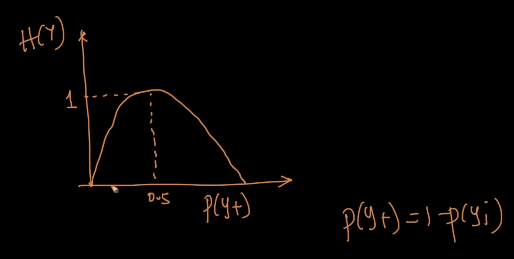

Sameway for multiclass $Y\rightarrow\ \{y_1,y_2,\ ..\ y_k\}$. If they are all equiprobable, then we have $H(y)$=$1$ (i.e.) maximum value and near to $0$ if one class dominates other.

We can analyse $H$ value from PDF.
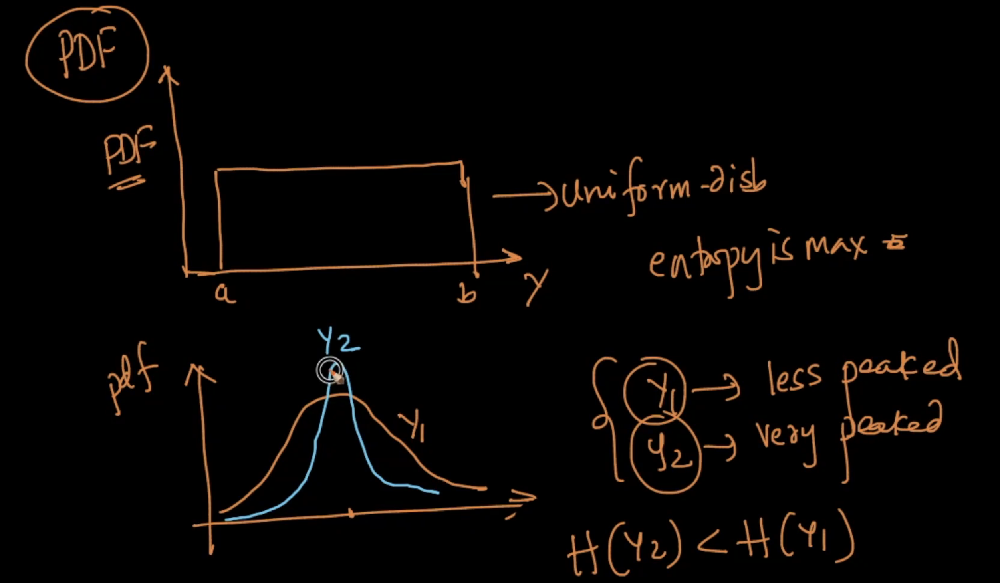

As per above image,
If the PDF is uniform, then $H$ is maximal as the $y_i$ values are equi probable.
For a less peaked gaussian, it's entropy is more than the more peaked gaussian.

More peaked $\longrightarrow$ Less entropy

###Kullback-Leibler (KL) Divergence

Also called as **relative entropy**.

Compute the distance between the 2 PDFs or PMFs. We have already studied KS-Statistics to know if it works or not.

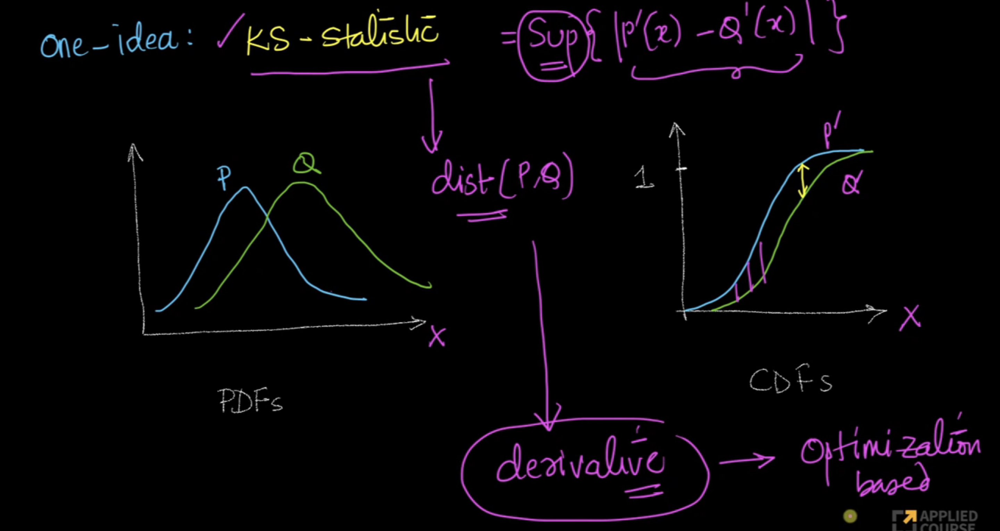

It may behave like the distance between 2 PDFs. But we can't differentiate the KS-Statistic and we can't use it for any optimization based machine learning models.

If our $Y$ is a PDF and $\hat{Y}$ is a PDF, we can use the KL divergence.

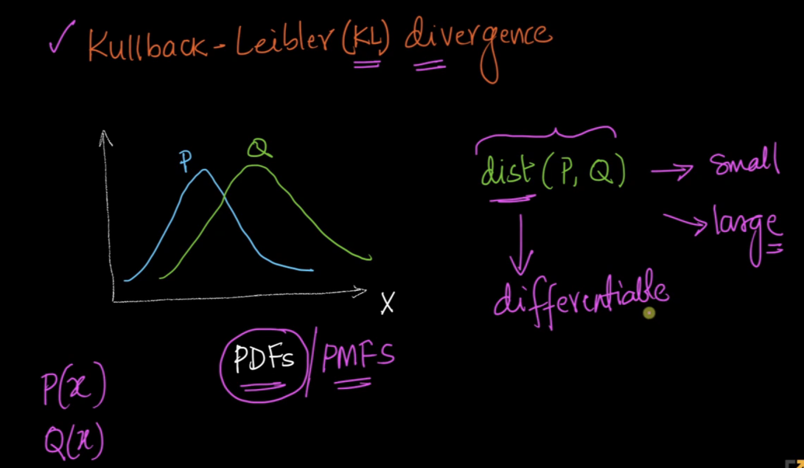

$D_{KL}(P||Q) = \sum_{x}P(x)log(\frac{P(x)}{Q(x)})$ for discrete random var (PDFs)
$D_{KL}(P||Q) = \int_xP(x)log(\frac{P(x)}{Q(x)})$ for continuous random var (PMFs)

More dissimilar $\rightarrow$ the more divergent the distributions are.

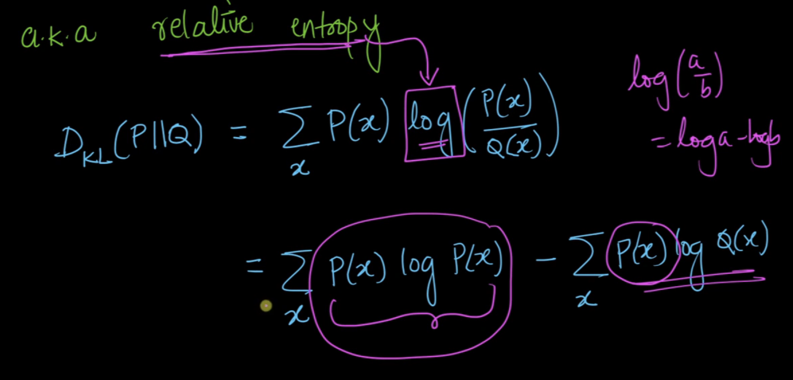
How derived based on relative entropy.

The above functions are all **differentiable** unline **KS-Statistic**.

###Information Gain

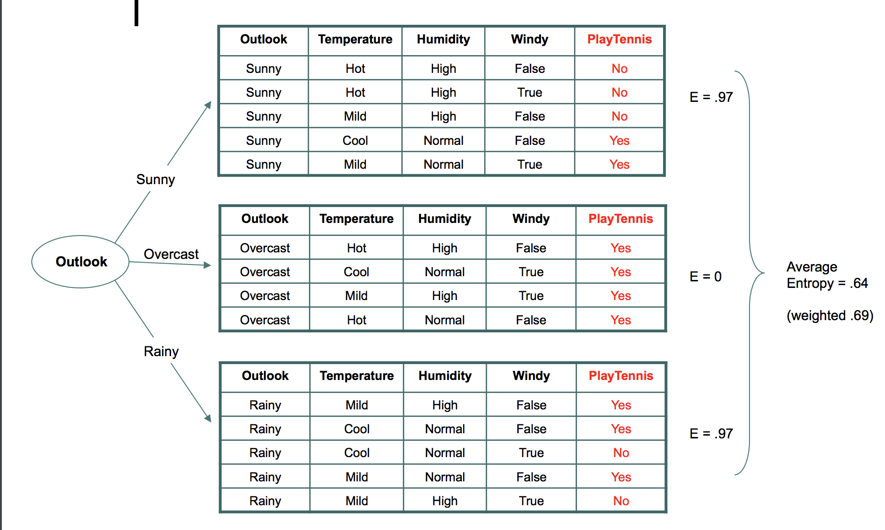

$Y\overset{var}{\longrightarrow}\{y_1,\ y_2\ ...\ y_k\}$
$var$ will divide the Dataset $D$ into $k$ individual datasets {$D_1,D_2\ ...\ D_k$} as random variable $Y$ has $k$ discrete values.

$Information\ Gain,\ IG(Y, var)=H(D)-(\sum_{i=1}^k\frac{|D_i|}{|D|}*H_{D_i}(Y))$
(i.e) Information_Gain = [Entropy(parent)] – [Weighted Average Entropy of child nodes]

As per our tennis example, we already have our entropy for the dataset. Now, we'll separate our dataset based on the feature **outlook** into 3 different datasets and we'll calculate entropy for those separately.

At root (i.e. for our original full dataset), we have entropy as $0.94$. When start breaking the dataset with the feature **overlook** as $D_1$,$D_2$,$D_3$ datasets. We'll have entropies as
For $D_1$, $H=0.97$
For $D_2$, $H=0$
For $D_3$, $H=0.97$

$IG(Y,outlook) = 0.94-(\frac{5}{14}*0.97+\frac{4}{14}*0+\frac{5}{14}*0.97)=0.247$

By breaking up the data, we are gaining some information. Refer to the Dataset where outlook is **overcase**, at that time entropy is 0, so the answer is **Yes**

###Gini Impurity
Gini impurity ($I_G(Y)$) is similar to entropy but it has some advantages.
$I_G(Y)=1-\sum_{i=1}^kP(y_i)^2$

where the random variable $Y$ will have $k$ discrete values.

Let $Y\rightarrow\{y+,y-\}$
Case 1: 99% +ve points and 1% -ve points, $I_G(Y)=0.0198$ where as $H(Y)=0.0801$
Case 2: 50% +ve points and 50% -ve points, $I_G(Y)=0.5$ where as $H(Y)=1$
Case 3: 0% +ve points and 100% -ve points, $I_G(Y)=0$ where as $H(Y)=0$

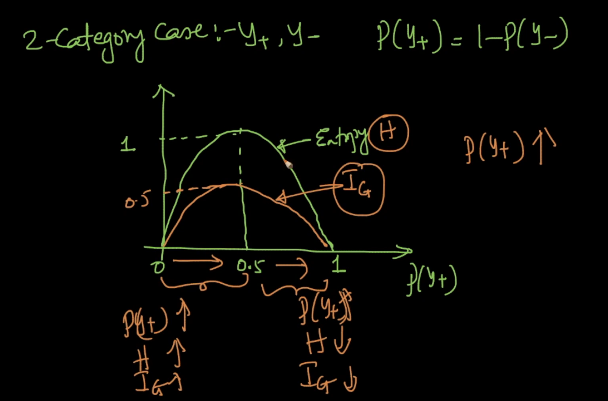

Both works same but the rate of change based on $P(y+)$ differs. Why to use it then? Because **computing logs (in entropy) will take time in computer rather than power of 2 (in Gini)**, so we preferred Gini impurity as both behaves same.

##Construction of DT

### For categorical features

1. Find the entropy of the dataset
2. We can find the IG for all the features by splitting the dataset based on the corresponding feature. Now that we have IG values for all features, use the one with the max value. Eg: Among $IG(Y,outlook)$, $IG(Y,temp)$, $IG(Y,humidity)$ and $IG(Y,windy)$, choose the feature which has more IG value.
3. We get 3 datasets $D_1$, $D_2$ and $D_3$ based on the feature **outlook**. $D_2$ is the pure node as we have $y$ as **yes**. If so, stop building tree for $D_2$ dataset. Continue from step 2 again for $D_1$ and $D_3$ using other features. Note that we can use features any number of time in a tree.

When to stop building the tree?
1. When we find the pure node
2. When there are fewer data in an inner node (eg: 20 datapoints available in a node for the 10k data point's dataset)
3. When the depth of the tree is too much.

When there is no pure node at the leaf, we'll take the **majority vote**.

####What if there are many values for a categorical feature?

Like zipcodes of 1000 distinct. When we try to split it, we'll have 1000s of sub datasets with small data in each sub dataset which is useless.

Instead of using it as a categorical feature, we'll convert it to a numerical feature.

For each value $p_i$ in the feature $f$, we'll convert that to $P(y=1|p_i)$

$P(y=1|p_i) = \frac{\#\ of\ data\ points\ with\ y=1\ and\ f=p_i}{\#\ of\ data\ points\ with\ f=p_i}$

Now we can follow the procedure similar to that of the numerical feature (as below)

### For numerical features

The most important in Decision Tree is to split a node using $IG$ (using entropy or Gini impurity).

1. We'll sort the values in each numerical feature
2. For each feature, we'll set each unique numerical value as the splitting threshold. Then compute the $IG$ for each threshold. So, if a feature has 10k unique numerical values in 10k data points, we may have to iterative those points one by one and we calculate the corresponding $IG$. Take the threshold numerical value which gives the max $IG$. If there are **d** dimension/features, we have to repeat this **d** times. Then choose the feature and it's threshold which give the cumulative max $IG$. It is actually time consuming.
3. With the feature which has the cumulative max $IG$ with a threshold, build the tree. Then repeat step 2 (with all features other than the chosen one).

But there are other ways to make DT work well for the numerical features.

## Feature Standardization

Decision Tree is not a distance based method. If we have a real valued feature, we'll sort the feature at that time we'll check each value as threshold. So **no need to do feature standardization**.

##Overfitting and underfitting

When the depth increases,
- possibility of having few datapoints (say 20 data points from a 10k data points) in the leaf node is more.
- **interpretability of the model decreases**.

When the depth is very low
- Say depth=1, we may **not have pure nodes** and we'll say result as the majority points' class. It is called **decision stump**.

**Hyperparameter**: - depth of the tree
1. **Higher the depth** : **Overfitting** (as we are writing too much if check for that output or we may have only one point in the leaf node)
2. **Lower the depth** : **Underfitting**

Usually depth will be **5 to 10**, for better interpretability.

##Train and Runtime complexity

Training time : We build the decision tree with $O(n*log(n)*d)$ with $n*log(n)$ for sorting numerical values and $d$ is for evaluating each of the features. With the dataset with large **d**, Decision Tree is expensive.

Space Complexity : After training, it'll be converted to nested if else condition and it is space efficient. **No of internal nodes + leaf nodes**.

Testing time complexity : $O(k)$ where $k$-max depth of tree
Works well and fast for large dataset with lesser **d** with low latency.

We'll see Random Forest and GBDT where **d** is larger.

##Regression using Decision Trees

Instead of using IG (Information gain), we'll use the **mean squared error and median absolute deviation** for the regression.

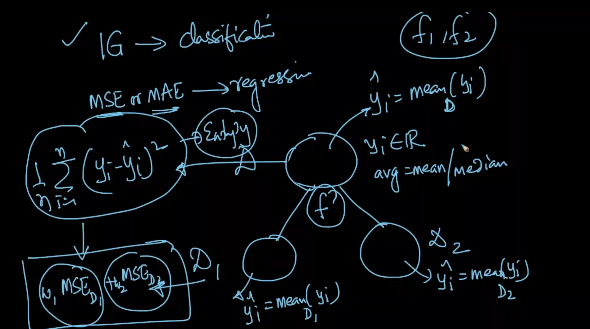

We'll use either **mean/median** for the comparison in each node.

1. At root, we'll calculate the MSE
2. Then before splitting, for each feature, we'll calculate the **weighted MSE** for the 2 datasets on splitting the original dataset with this feature. Then we'll use the feature which gives the **less weighed MSE** to split the root node.
3. The continue the same for those 2 separated datasets.

Even here all the conditionns are axis parallel. We never get the smooth curves.

##Cases

1. Imbalanced data : Balance it using under/over sampling. Class weight. Otherwise, it'll affect the entropy or MSE calculation.
2. large **d** : Time complexity to train the Decision tree as we have to compare IG or MSE for each and every level of the tree.
3. One Hot Encoding : It is not needed for categorical feature as it'll increase the dimensions. Even if it has many discrete values, convert them to numerical features as discussed.
4. Similarity Matrix : Can't work with it as we need features' values.

**Decision Surfaces** - THey are axis parallel hypercuboids in both classification & regression.

**Feature iteraction** - When we reach the leaf node, we can see the multiple decision being taken based on different features. That's called feature iteraction. It is not available in other models. In others, we'll do feature transformation.

**Feature importance** - For every feature, what is the reduction in entropy or Gini Impurity due to the corresponding feature? We can sum up all the reductions in entropy due to the feature. This way we can find the feature importance.

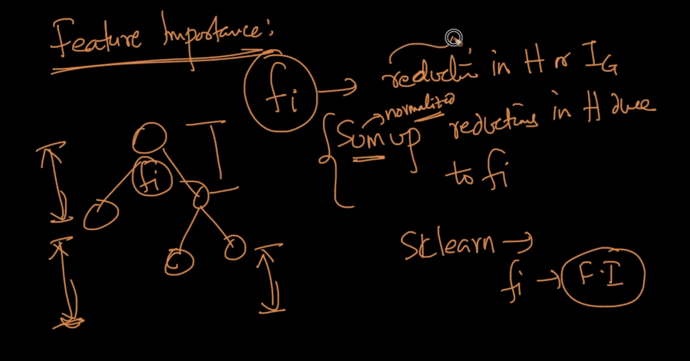

**Outliers** will case DT to have more depth and it'll lead to overfit causing **tree unstability**.

###Multi Class classification
No need to do anything different, as our entropy and IG's formula works with n-number of classes.
