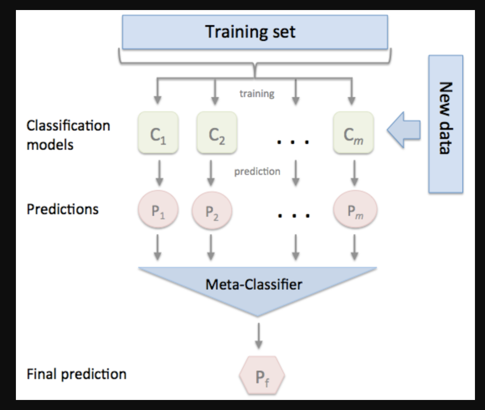

#Ensemble Models


<script src="https://code.jquery.com/jquery-3.6.0.min.js" ></script>
<script src="../toc.js" ></script>
<div id='toc'></div>

Ensemble $\longrightarrow$ typically group of things.. In ML, it is **multiple modules used together**

Let $m_1$, $m_2$, $m_3$ ... $m_k$ are **k** base models. We'll combine all of them intuitively to form a **powerful model** $m$. $m_i$ could be expert in one area and all the models are better in **k** areas. The more different these **m** models are, the more creatively (or) more better we can combine them.
<br />

Types or Strategies to build ensemble models
1. Bagging or Bootstrapped Aggregation
2. Boosting
3. Stacking
4. Cascading

We can use this method to solve most of the problems.

#Bagging

Short form of **_B_ootstrap _Agg_regation**. Popular bagging model is **random forest** and it is used extensively. We'll have low bias, high variance base models.

From the original dataset $D_n$ (with $n$ points),
1.We'll do sampling (with replacement) $m$ points and create a new dataset $D_n^1$ with $m$ data points and we'll create a model $m_1$.
2.Then we'll repeat this again to create another dataset $D_n^2$ and create a new model $m_2$.
3.We'll continue this upto $D_n^k$ and create the model $m_k$.

These samples $D_n^1$,$D_n^2$,etc.. are called **bootstrap samples** or **row sampling**. Bagging is actually creating bootstrap samples.

So each model is built on **different samples** of the original data using $D_n^i$ of size $m$ datapoints ($<n$).


The aggregation could be
1. **majority vote** for **classification**
2. **mean** or **median** for **regression**

When a query point $x_q$ comes, we'll take the result of $k$ models and take aggregation in runtime.

### What if some data are changed?

What if $D_n$ changes a bit (say 10% of points are changes)? Then only some of datasets will change and only some of those $k$ models will get affected. So, our overall resullt doesn't change much.

This shows that **bagging** can reduce the **variance** in the model (because of the bootstrapping the data and taking aggregation of $m$ models) but the **bias** will remain low. So we are using **randomization in many aspects** (like random forest) to deal with the variance.


##Random Forest and their construction

Random - bootstap sampling with replacement.
Forest - group of decision trees.

In Random forest, we'll do modelling using decision trees.

```
Random Forest = Bagging + Decision Trees + Column Sampling
Random Forest = Decision Trees + Row Sampling + Column Sampling + Aggregation
```

Column Sampling is nothing but Features Bagging with replacement.

So each sampled dataset $D_n^i$ is of size $(m$x$d')$ where
- $m$ is the no of rows $m<n$ $\Rightarrow$ $\frac{m}{n}$ is the row sampling ratio.
- $d'$ is the no of features (columns) $d'<d$ $\Rightarrow$ $\frac{d'}{d}$ is the column sampling ratio.


These $k$ models will be so much different from each other.

In Random forest, each $m_i$ is a decision tree with **reasonable depth**. These models can be of **low bias and high variance** as RF will take care of the variance.


For each model with the dataset $D_n^i$, we have the remaining set of points ($D_n-D_n^i$) called **out of bag samples/points** while $D_n^i$ are **in bag samples**. We can use them for the **cross validation**. So any library will return the **oob error**.


###Bias Variance Trade off

model $M=agg(m_1,\ m_2,\ ...\ m_k)$

RF tend to have very low bias, because the base models/learners $m_i$ are low bias models to start with.

When $k\ \uparrow$, variance $\downarrow$ because bootstrapping the data will deal with the variance.
When $k\ \downarrow$, variance $\uparrow$ because bootstrapping the data less no of times won't deal with the variance much.

Bias will remain low as the base models. So **Bias**($M$) $\approx$ **Bias**($m_i$)


If the row/col sampling ratio goes down, then the correlation of the data is not maintained. So, we'll get a low variance model. Or we'll keep row.S.R as 50% and col.S.R as 20% (not a hard fast rule).


So hyperparameters are **k**, **row.S.R** and **col.S.R**. Only **k** is mostly used.

###Run time complexity

**k** is the no of decision trees

**_Train time :_** $O(nlog(n)d * k)$
If the system has 4 cores, then we can do the training parallely without depending on another model. It is called **trivially parallelizable**. So we can training in much faster way. For large amount of data with reasonable no of features, we can train 1000s of trees very very fast.
Space complexity : $(DT*k)$

**_Runtime :_** $O(depth*k)$
Depth could be around 10 to 20.
Also this is also parallelizable.

Good in terms of performance due to if checks and parallelizable concepts.

### Extremely randomized trees

When we have a real valued feature, instead of trying all the values to find a threshold to split the corresponding dataset, we'll check the random set of possible values. Then choose the threshold.


```
Random Forest = Bagging
+ Decision Trees
+ Column Sampling
+ Randomization when selecting threshold
```


###Cases

Most of the cases of decision trees applicable for Random forest as well. Only some of them varies.

1. In DT, we'll control the depth of the tree. But in RF, we'll control the **k** (no of models)
2. Feature Importance : In DT, it is calculated based on where all $f_i$ is used and take the aggregation of the overall reduction of the entropy (or) gini impurity because of $f_i$. In RF, it is overall reduction of entropy or gini impurity across all the base models because of $f_i$

---
#Boosting


We'll have high bias and low variance models (like low depth/shallow decision trees) with **more training error**. Then we'll **additive combine** to reduce that bias while keeping our variance low.

```
Boosting = high bias/low variance model + additive combine
```

How the bias is getting reduced by boosting?

0. For the dataset $D_n$, we'll find a high bias model $m_0=y=h_0(x)$. Find the simple difference error $\forall$ $i's$, with $error_i=y_i-h_0(x_i)$. So for each point in training data, we have $\{x_i$, $y_i$, $error_i\}_{i=1}^n$
1. Find the model $m_1\ =\ h_1(x)$ with the data as $\{x_i,\ error_i\}_{i=1}^n$ where $error_i=y_i-h_0(x_i)$. The model at the end of stage 1 is $F_1(x)=\alpha_0h_0(x)+\alpha_1h_1(x)$. Find $\alpha_0$ and $\alpha_1$.
2. Find the model $m_2\ =\ h_2(x)$ with the data as $\{x_i,\ error_i\}_{i=1}^n$ where $error_i=y_i-F_1(x_i)$. The model at the end of stage 1 is $F_2(x)=F_1(x)+\alpha_2h_2(x)$. Find $\alpha_2$.
3. At the end of stage $k$, final model $F_k(x)=\sum_{i=0}^k\alpha_ih_i(x)$. It is an **additive weighted model**. Each of the base model is trained to fit the **residual error** where $error_i$ is the residual error at the end of previous stage.


$F_k(x)=\sum_{i=0}^k\alpha_ih_i(x)$

Our final model is just the summation of all the basic models. As each model evolves from $F_i(x)$ to $F_{i+1}(x)$, training error reduces and the high bias reduces because of training on the residual error of the previous stage. At the end, **we'll have the very low residual error leading to solve the high bias problem**.

Implemented by the algorithms
1. **Gradient Boosting Decision Tree (GBDT)**
2. **AdaBoosting**

##Residual

Residual at the end of stage $k$, $error_i=y_i-F_k(x)$


So, $-\frac{\partial L}{\partial F_k(x_i)} = 2*(y_i-F_k(x_i))$
which means that the **negative derivative/gradient of the loss function is almost equal to** (ignoring the 2) **(or) proportional to the residual**. negative grad is also called **pseudo residual**.


Usually we'll find $h_i(x)$ using $\{x_i, err_i\}$ where $err_i=F_{i-1}(x)$. So instead of residual, what if we use the **pseudo residual**. This way this method can be applicable to **any of the loss function** and that is the **power of gradient boosting**.

Eg :
In Random Forest, we can't minimize the hinge loss function as we'll minimize the entropy.
In Gradient boosting, we can minimize the hinge loss or any loss function as long as the loss function is differentiable.

Check this video on how log loss can also works with this method [https://youtu.be/qEZvOS2caCg](https://youtu.be/qEZvOS2caCg), [https://stats.stackexchange.com/questions/219241/gradient-for-logistic-loss-function](https://stats.stackexchange.com/questions/219241/gradient-for-logistic-loss-function)

##Gradient Boosting


Here we need shallow decision trees as the base learner.


###Regularization by shrinkage
As per wikipedia, the eqn is

$F_M(x)=h_0(x)+\sum_{m=1}^M\gamma_mF_m(x)$ where $M$ is the no of base model (same as of $k$).

as $M$ increases, variance could increase leading to **overfitting**.

By shrinkage, we introduce $\nu$ (a new hyperparameter) as the learning rate as $F_m(x)=F_{m-1}(x)+\nu\ \gamma_mh_m(x)$ with $0<\nu\leq1$
as $\nu$ reduces, we are giving less importance to the older models, so **overfitting/variance reduces**
as $\nu$ increases, **overfitting/variance increases**

When we apply GBDT, we can easily overfit. So careful with the hyperparam with $M$ and $\nu$ with CV data and grid/random search.


###Train and Run time complexity
For GBDT with $M$ base models.
Train : $O(nlog(n)d*M)$ and it is not parallelizable as GBDT is a sequential algorithm.

1. The computation of pseudo residuals (r_im) is O(d) per point. So, for a dataset of size n, computing pseudo residuals is O(nd) per iteration. Total time-complexity is O(ndm)

2. The computation of gamma_m's is very fast as it is a simple one-dimensional optimization problem where we are trying to find the best gamma_m which is a scalar. This is often a constant time step in practice.

So, overall, the constriction of the M decision trees sequentially takes more time O(n lgn d M) than the above two steps which sum up to O(n*d*m+const). Since lg(n) is an additional term in the constriction of the M decision trees, O(n lgn d M) + O(n d m+const) = O(n lgn d M)


Runtime :  $O(depth*M)$
Space : $O(M trees + M\ \gamma's)$

Can be used for **low latency systems**.


###Code

SKlearn `sklearn.ensemble.GradientBoostingClassifier` (GBDT+Row sampling) (very slow).
Look for the input params:
1. `loss` :
2. `subsample` : If less than 1, then that much percentage of data is used for training the base tree. Similar to row sampling concept
3. `max_depth` : Should be low to build a shallow tree

For best implementation, use the `XGBoost` (GBDT+Row sampling+Col Sampling). Make the model so best. Use [XGBRegressor](https://xgboost.readthedocs.io/en/latest/python/python_api.html) for regression, it gives options
colsample\_bytree (Optional[float]) – Subsample ratio of columns when constructing each tree
colsample\_bylevel (Optional[float]) – Subsample ratio of columns for each level.
reg\_alpha (Optional[float]) – L1 regularization term on weights (xgb’s alpha).
reg\_lambda (Optional[float]) – L2 regularization term on weights (xgb’s lambda).

##Adaboost

Adaptive Boosting. Used mostly in image processing applications like face detection.

Ref : [https://alliance.seas.upenn.edu/~cis520/wiki/index.php?n=lectures.boosting](https://alliance.seas.upenn.edu/~cis520/wiki/index.php?n=lectures.boosting)

In GBDT, we used pseudo residuals.
But in AdaBoost, we'll upsample the wrongly classified points.


In Adaboost,
Stage 1 : We'll build a $h_1(x)$ and for the wrongly classified points, we'll give a weightage (like upsampling) and find $\alpha_1$ (similar to $\gamma_1$ hyperparam). This will become dataset for next stage
Stage 2 : We'll build a $h_2(x)$ and for the wrongly classified points, we'll give a much more weightage compared to stage 1 and find $\alpha_2$ (similar to $\gamma_2$ hyperparam). If the wrongly classified point are taken care by stage 1, we can ignore those.
Stage 3 : We'll build a $h_3(x)$ and for the wrongly classified points, we'll give a much more weightage compared to stage 1 & 2 and find $\alpha_3$ (similar to $\gamma_3$ hyperparam). If the wrongly classified point are taken care by stage 1 & 2, we can ignore those.
Stage 4 : If all the points are taken care we can combine them.

Here we can see that we are doing additive of all models.

---

#Stacking models

[http://rasbt.github.io/mlxtend/user_guide/classifier/StackingClassifier/](http://rasbt.github.io/mlxtend/user_guide/classifier/StackingClassifier/)



We'll build many **different well tuned models** (linearSVM, RBF_SVM, GBDT, DT, 3-KNN, 5-KNN etc) (not like low bias high variance in Bagging) in parallel. The more different, the better the whole ensemble model be.


When a query point comes, we'll find the possible output from all the good models. From that output, we'll use our own metaclassifier (i.e. the new model built to understand the output and return the good output). In bagging, we'll just take the majority vote to find the final output. Here we are **building a model to tell the output**.

Used in kaggle a lot (by creating 1000s of models) to improve the solution and the accuracy. But in real time, we may not need to create crazy amount of models, we can create reasonably different no of models.

---

#Cascading classifier

Let's say we are building a model to predict the fradulent or not credit card system's transaction $x_q$. Output labels : 0-non fraud and 1-fraud

$M_1$ is a fine tuned model predicts the probability of the labels.


We are **building the models in a cascade manner** to make sure about the results we are getting are really the one.

Even at the end of the cascade manner, **if we can't confirm the result, then the query is handled manually**.

This type of methodology is used if **the cost of mistakes are high**. Another example is finding a person is cancerous or not.


The training dataset available for the next model will not contain the data which lead the prev model to a conclusion.

We can also follow the nested cascades


#Kaggle vs Real time

|Kaggle|Realtime|
|---|---|
|Often relies on one accuracy metric like F1, AUC|Multiple metrics which are meaning based on the usecase, to take the decision for the business|
|very complex ensembles to improve 1 metric, ignoring the interpretability, training time, low latency|Care about those|
|We can learn data cleaning, pre-processing, feature engineering|Same|
